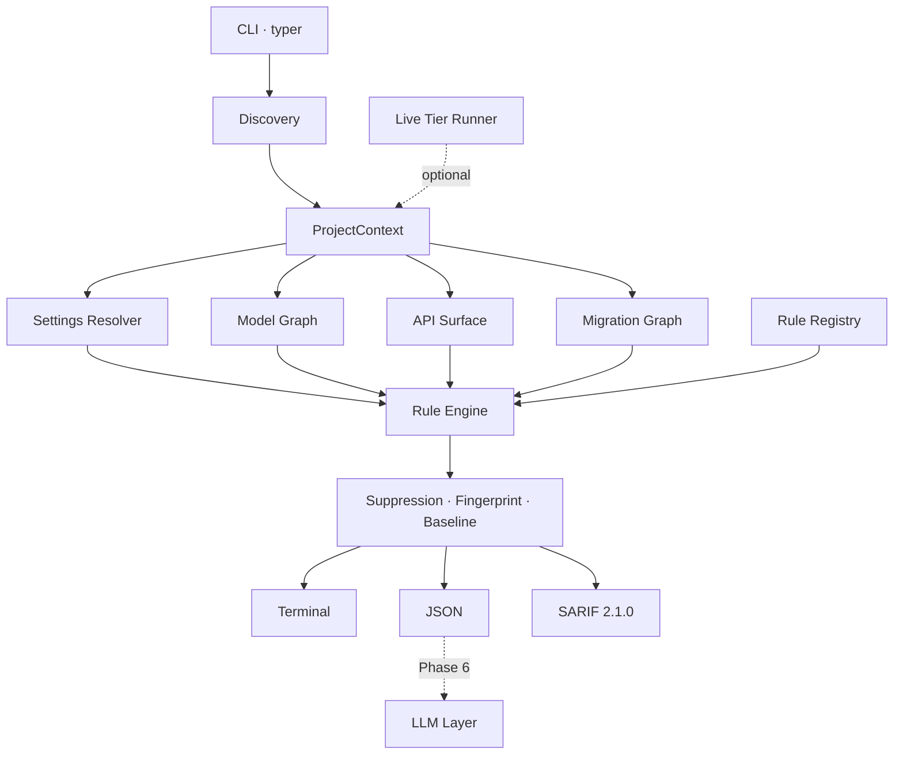

# djaudit — Full Project Plan

**Project:** `ByteForgeDevs/Django_AI_Model`
**Artefact:** `djaudit`, a Django-aware static analysis engine
**Plan version:** 1.0 · 2 August 2026
**Status:** Phase 0 complete. Phase 1 next.

---

## 1. How to read this document

This is the single authoritative breakdown of the work. It decomposes the
project three levels deep:

```
Phase   →   a shippable increment. One git branch, one pull request.
  Step  →   a coherent body of work inside a phase.
    Substep → one commit. Self-contained, tested, leaves the tree green.
```

Substeps are numbered `PHASE.STEP.SUBSTEP` — for example `1.3.2`. Those
identifiers are stable and are referenced in commit messages, so any commit can
be traced back to the plan and any plan item back to its commit.

Every substep is sized deliberately: large enough to be a meaningful unit of
review, small enough that a reviewer can hold it in their head. If a substep
turns out to need more than roughly 400 lines of diff, it should be split and
this document amended in the same pull request.

---

## 2. What we are building, restated

A **deterministic, Django-aware static analysis engine** that audits an existing
Django codebase and emits ranked, evidence-backed findings across settings
hardening, DRF authorization, ORM performance, migration safety, injection, and
SQLite/Postgres divergence.

It is **not a trained model.** No weights, no embeddings, no inference in the
detection path. The "AI" is deferred to Phase 6, where a language model is added
as an *additive consumer* of the finding schema — triage, explanation, and patch
authoring — never as the detection mechanism.

The reason is not ideological. A model trained on today's Django is wrong the
moment Django 6.1 ships, and it cannot cite a line number. An AST rule can do
both, costs nothing to run, and is unit-testable. We reach for a model only
where determinism genuinely runs out.

### Support matrix

| Dimension | Supported |
|---|---|
| Django | 6.0 (current), 5.2 LTS |
| Python | 3.12+ (Django 6.0 floor) |
| Primary database | PostgreSQL via psycopg3 |
| Secondary database | SQLite, treated as a divergence source |
| API framework | Django REST Framework 3.17 |

### Non-goals for v1

Binding. Scope creep here is the single largest risk to the project.

- No LLM, embeddings, or RAG in the detection path (Phase 6 is additive and opt-in)
- No autofix or code rewriting before Phase 6
- No runtime monitoring, middleware, or APM
- No code generation or project scaffolding
- Not a replacement for ruff, bandit, or pip-audit — we orchestrate them
- No non-Django Python, no frontend or JavaScript analysis
- No template (DTL/Jinja) analysis before Phase 5

---

## 3. Working agreement

Agreed with the project owner on 2 August 2026.

### 3.1 Branching

One branch per phase, cut fresh from `main`:

```
zambagarrah-django-audit-engine    ← Phase 0 (named before this convention existed)
phase-1-settings-hardening
phase-2-model-graph-and-drf
phase-3-performance-and-injection
phase-4-migrations-and-live-tier
phase-5-portability-and-adapters
phase-6-llm-layer
phase-7-distribution
```

Phase 0's branch predates this document and keeps its original name rather than
being force-renamed after the fact; every subsequent phase follows the
`phase-N-slug` form.

A phase branch is cut only after the previous phase's pull request is merged.
Phases are not developed in parallel — each builds directly on the last, and
parallel development would guarantee conflicts in the rule registry and the
shared context objects.

### 3.2 Commits

One commit per substep. Pushed immediately, so the pull request grows visibly
rather than arriving as a single wall of diff.

Message format:

```
<type>(<scope>): <subject, imperative, <= 72 chars>

<body: what changed and, more importantly, why. Wrapped at 72 columns.
Explains the design decision, the alternative rejected, and any
non-obvious consequence.>

Substep: <N.N.N>
Refs: docs/PROJECT_PLAN.md

Co-authored-by: Copilot App <223556219+Copilot@users.noreply.github.com>
```

`type` is one of `feat`, `fix`, `refactor`, `test`, `docs`, `chore`, `perf`,
`ci`. `scope` is the rule family (`djs`, `dja`, `djp`, `dji`, `djm`, `djx`) or
the subsystem (`engine`, `discovery`, `cli`, `sarif`, `eval`, `live`).

### 3.3 Pull requests

At the end of each phase:

1. Push the branch.
2. Open a pull request titled `Phase N — <title>`.
3. Request **Copilot code review**.
4. Assign **@Zambagarrah**.
5. The project owner reviews and merges. Work does not proceed to the next
   phase before the merge.

The pull request body states: goal, substeps delivered, rules added, quality
gate results, benchmark deltas (precision and recall, before and after), and
anything deliberately deferred.

### 3.4 The green-tree rule

Every commit must independently pass:

```bash
uv run ruff check .
uv run mypy
uv run pytest
```

Not just the branch tip. A bisect that lands on a broken commit costs more than
the discipline of keeping each one green.

---

## 4. Quality gates

Four gates run in CI on every push. All are blocking.

| Gate | What it protects | Failure means |
|---|---|---|
| **Lint** — `ruff check .` | Consistency, common bug classes | Style or correctness lint violated |
| **Types** — `mypy --strict` | Interface integrity across 30+ modules | A contract was broken silently |
| **Tests** — `pytest` | Behaviour of every unit | A regression |
| **SARIF conformance** | The CI integration itself | Code scanning would silently stop ingesting findings |
| **Recall** — `djaudit eval` on fixtures | We still detect what we claim to | A rule stopped firing, or grading drifted |
| **Precision** — real-repo benchmark | We do not cry wolf | A new rule produces false positives |

### 4.1 The precision gate must be rebuilt in Phase 1

Today the precision gate asserts **zero findings** on Healthchecks and NetBox.
That is only tenable while we detect almost nothing. The moment the `DJS` corpus
lands, these mature repositories will legitimately produce findings — some true,
some false — and a zero-findings assertion will fail for the wrong reason and be
disabled, which is how precision benchmarks quietly die.

The replacement, built in Step 1.1, is a **triaged baseline per target**: every
finding on a benchmark repository is recorded with a human verdict of
`true_positive`, `false_positive`, or `accepted_risk`. The gate then fails when

- an untriaged finding appears (something changed and nobody looked at it), or
- the false-positive rate rises above the threshold for that family, or
- a finding previously triaged `true_positive` disappears (silent regression).

This turns the benchmark from a binary tripwire into a tracked metric, which is
what it needs to be for the next six phases.

### 4.2 Definition of done for a single rule

No rule is complete until every line is true:

- [ ] Unique ID matching `^(DJS|DJI|DJA|DJD|DJP|DJM|DJX)-\d{3}$`, prefix agrees with declared family
- [ ] `RuleMeta` carries title, severity, confidence, tier, and at least one authoritative reference (Django docs, OWASP, or CWE)
- [ ] Message states what is wrong *at this location*; rationale states why it matters; remediation is concrete enough to paste
- [ ] Emits at least one `Evidence` item — never an assertion without support
- [ ] Unit tests cover: a true positive, a true negative, a **near-miss** (the shape that looks similar but is correct), and a suppression
- [ ] Represented in a fixture manifest so the recall gate covers it
- [ ] Run against both benchmark repositories, every finding triaged
- [ ] Confidence honestly reflects certainty — `tentative` when the value cannot be statically resolved, not `certain` because it looks good in a demo

---

## 5. Architecture



Three properties are load-bearing:

**The static tier never imports or executes the target.** It parses with
`ast`. This means djaudit runs on a repository whose dependencies are not
installed, and it is safe against untrusted code. The live tier is opt-in and
clearly separated.

**Severity and confidence are independent axes.** A tentative critical is not
the same as a certain low, and collapsing them into one number is precisely how
static analysis tools earn a reputation for noise.

**Fingerprints exclude line numbers.** Adding an import at the top of a file
must not invalidate a committed baseline.

---

## 6. Rule ID taxonomy

| Prefix | Family | Phase |
|---|---|---|
| `DJS` | Settings and deployment hardening | 0–1 |
| `DJA` | API / DRF authorization and data exposure | 2 |
| `DJD` | Data model design | 2 |
| `DJP` | Performance and ORM efficiency | 3 |
| `DJI` | Injection and untrusted input | 3 |
| `DJM` | Migration safety | 4 |
| `DJX` | Cross-database portability and divergence | 5 |

All seven prefixes are enforced by `RULE_ID_PATTERN`. `DJD` was added in
substep 2.6.1.

---

# Phase 0 — Engine skeleton

**Branch:** `zambagarrah-django-audit-engine` · **Status: COMPLETE**

**Goal.** A walking skeleton: every architectural seam exists and one real rule
proves the pipeline end to end.

**Why first.** The finding schema is simultaneously the SARIF contract, the
baseline format, and the future LLM seam. It is the most expensive thing in the
project to get wrong, so it is built first and pinned by tests. Equally, the
evaluation harness must exist before the first rule — otherwise there is no way
to know whether rule number twelve broke rule number three.

**Exit criteria.** CLI runs end to end, emits SARIF, scores fixtures, and runs
clean against two production Django repositories.

### Step 0.1 — Packaging and toolchain

- **0.1.1** — `uv` + hatchling, `src/` layout, Python 3.12 floor, `typer` and `rich` dependencies. *Done when:* `uv sync` succeeds and `djaudit --help` runs.
- **0.1.2** — ruff and mypy strict configuration, pytest configuration, `.gitignore`. *Done when:* all three run clean on an empty package.

### Step 0.2 — Finding schema and identity

- **0.2.1** — `models.py`: `Severity`, `Confidence`, `Tier`, `Family`, `EvidenceKind`, `Evidence`, `Location`, `Finding`. Frozen, slotted, `SCHEMA_VERSION = 1`.
- **0.2.2** — Ranking and serialisation: `.rank`, `.security_severity`, `Finding.sort_key`, `to_dict()`.
- **0.2.3** — `fingerprint.py`: snippet normalisation, `compute`, `assign`, occurrence disambiguation.
- **0.2.4** — `baseline.py`: load, save, filter, plus version and fingerprint-scheme compatibility checks.
- **0.2.5** — `suppression.py`: `# noqa: DJS-001` and `# djaudit: ignore[...]`. Bare `# noqa` deliberately not honoured.

### Step 0.3 — Rule infrastructure

- **0.3.1** — `registry.py`: `RuleMeta`, `Rule` base class, `register` decorator with ID and family validation.
- **0.3.2** — Selection and lazy loading: `all_rules`, `get`, `select`, `pkgutil`-based auto-discovery so there is no central list to forget to update.

### Step 0.4 — Project discovery

- **0.4.1** — `astutils.py`: `UNKNOWN` sentinel, module-level assignment extraction descending into `if`/`try`/`with`, literal evaluation, dotted names, star-import targets.
- **0.4.2** — `context.py`: `SettingsRole`, `SettingsModule`, `ProjectContext` with cached parsing, snippets, and locations.
- **0.4.3** — `discovery.py`: file walking with `pyvenv.cfg`-based virtualenv detection, `manage.py` location, `DJANGO_SETTINGS_MODULE` resolution.
- **0.4.4** — Two-pass settings discovery: marker-confirmed candidates, then star-import descendants. Django version detection from requirement pins.

### Step 0.5 — Execution engine

- **0.5.1** — `engine.py`: rule selection, per-rule exception isolation, suppression, fingerprinting, baseline filtering, thresholds, deterministic sort.
- **0.5.2** — `RunResult` counters so silence is always explainable.

### Step 0.6 — Reporters

- **0.6.1** — JSON reporter.
- **0.6.2** — SARIF 2.1.0 with `partialFingerprints`, `security-severity`, `precision`, `originalUriBaseIds`, and `invocations`.
- **0.6.3** — Rich terminal reporter.

### Step 0.7 — CLI

- **0.7.1** — `run`, `rules`, `version` commands with exit codes 0/1/2.
- **0.7.2** — Baseline write mode, deliberately opening thresholds so lowering a threshold later does not resurface old findings as new.

### Step 0.8 — Evaluation harness

- **0.8.1** — `evaluation.py`: `Expectation`, `Manifest`, precision/recall/F1, `must_not_report` control cases.
- **0.8.2** — `djaudit eval` command.

### Step 0.9 — First rule

- **0.9.1** — `DJS-001` DEBUG enabled, graded by settings role.
- **0.9.2** — Split-settings override detection: a base module downgraded, not dropped, when production unconditionally disables DEBUG.
- **0.9.3** — Fixture projects `vulnerable_project` and `overridden_project` with manifests.

### Step 0.10 — CI and validation

- **0.10.1** — CI workflow: quality, recall, and precision jobs.
- **0.10.2** — Precision gate script; benchmark targets pinned by SHA and cloned rather than vendored.
- **0.10.3** — Validation run against Healthchecks and NetBox.

**Delivered:** 159 tests · ruff clean · mypy strict clean · 100% precision and
recall on fixtures · 0 findings, 0 crashes, 0 parse errors across 1,866 files of
production Django in under 60 ms per repository.

---

# Phase 1 — Settings and deployment hardening

**Branch:** `phase-1-settings-hardening`

**Goal.** Make djaudit genuinely useful on a real repository. Roughly 20 `DJS`
rules, backed by a settings resolver that can see through the environment
variable indirection every production Django project uses.

**Entry criteria.** Phase 0 merged to `main`.
**Exit criteria.** Real, triaged findings on both benchmark repositories; false
positive rate measured and below 10% for the family; recall gate covering every
new rule.

**Outcome.** All three met, with room. 27 rules shipped, `DJS-001`…`DJS-027`.
Precision is **100%** on both targets — 10 findings on Healthchecks (653 files),
6 on NetBox (1213 files), all sixteen individually reviewed against the source
and recorded in `benchmarks/` with a justification, a reviewer and a date.
Recall is **100%** across five fixtures, 38 expected findings, none missed. Zero
rule errors and zero crashes on either target; NetBox audits in under a second.
1031 tests, `ruff` and `mypy --strict` clean, and four self-consistency gates in
CI: the plan's arithmetic, the triage files' completeness, the generated rule
reference, and the five fixture evaluations.

### Why this phase is not simply "write twenty rules"

Both benchmark repositories hide their settings behind indirection:

```python
DEBUG = envbool("DEBUG", "True")                    # Healthchecks
DEBUG = getattr(configuration, 'DEBUG', False)      # NetBox
```

Phase 0 correctly stays silent on both, because it cannot resolve the value. If
we write twenty rules on top of that foundation, they will also stay silent on
exactly the code that matters most, and we will have twenty rules that only fire
on toy projects.

Equally, `DJS-001` currently carries its own bespoke override logic
(`_debug_disabled_downstream`). Copying that pattern into twenty rules would
give us twenty subtly different implementations of settings inheritance.

So Phase 1 front-loads two pieces of infrastructure — a partial evaluator and a
settings resolver — and only then writes rules. Steps 1.1 to 1.3 are the phase's
real engineering; steps 1.4 to 1.9 are comparatively mechanical.

### Step 1.0 — Phase 0 review follow-ups

Three correctness defects raised by code review on the Phase 0 pull request.
Folded into this phase rather than a separate hotfix branch because all three
are small, verified, and block nothing — but each is a genuine bug, and two of
them fail in the direction of silently hiding findings, which is the failure
mode this project cares about most.

- **1.0.1** — `# djaudit: ignore[]` acted as a blanket suppression, because an empty code set was conflated with "no code list given". A mistyped bracket pair silently hid every rule on that line. Empty brackets now suppress nothing.
- **1.0.2** — SARIF `associatedRule` referenced rule IDs absent from `tool.driver.rules` when a rule crashed without producing findings, leaving a dangling reference some consumers reject. Descriptors are now built from `RuleMeta` and cover crashed rules too.
- **1.0.3** — `--output` with `--format terminal` did not create missing parent directories, unlike JSON and SARIF, so `-o reports/out.txt` failed on a fresh checkout.
- **1.0.4** — Found while verifying 1.0.2: the `$schema` URL emitted in every SARIF file returned 404, and nothing validated our SARIF against the spec. Points at the canonical OASIS URL now, with schema *and* reference-resolution checks wired into CI.

### Step 1.1 — Rebuild the precision benchmark

The current zero-findings gate stops working the moment this phase lands.

- **1.1.1** — Triage file format: per-target JSON mapping fingerprint to verdict (`true_positive` / `false_positive` / `accepted_risk`), with reviewer note and date. *Done when:* schema is defined and round-trips.

  *Amended 1.1.1: JSON, not YAML.* Reviewers edit these files by hand, which is
  the case for YAML, but the per-entry `note` field covers what comments would
  have carried and JSON keeps runtime dependencies at two packages. Also lets
  the module reuse the baseline's I/O shape rather than inventing a second one.
- **1.1.2** — `djaudit benchmark` command: run against a target, diff against its triage file, report new/resolved/untriaged counts.
- **1.1.3** — Gate logic: fail on untriaged findings, on family false-positive rate above threshold, or on the disappearance of a known true positive.
- **1.1.4** — Replace `scripts/check_precision.py` in CI; seed empty triage files for both targets.
- **1.1.5** — Precision and recall metrics written to the job summary so the trend is visible on every pull request.

### Step 1.2 — Partial evaluator for settings expressions

Static resolution of the expression forms that actually appear in Django settings.

- **1.2.1** — `Value` type: resolved literal, `UNKNOWN`, or `CONDITIONAL(branches)`. Tri-state, so "we could not tell" is a first-class answer rather than a silent `None`.
- **1.2.2** — Literals and containers: strings, numbers, booleans, lists, tuples, dicts, sets, f-strings with resolvable parts, concatenation, `%` and `.format()`.
- **1.2.3** — Environment access: `os.environ[...]`, `os.environ.get(k, default)`, `os.getenv`. Resolve to the *default*, tagged as environment-dependent — this is the key that unlocks both benchmark repositories.
- **1.2.4** — Third-party environment helpers: `django-environ` (`env(...)`, `env.bool`, `env.int`, `env.list`, `env.db`), `python-decouple` (`config(...)`), and local `envbool`-style helpers resolved by following the function definition.
- **1.2.5** — Attribute indirection: `getattr(module, "NAME", default)` where the module is a discovered settings or config module.
- **1.2.6** — Comprehensions, `if`/`else` expressions, and boolean operators, producing `CONDITIONAL` with both branch values.
- **1.2.7** — Call safety: a hard recursion and node budget so a pathological file cannot hang the evaluator.

*Done when:* the evaluator resolves a majority of real settings on both
benchmark targets. **Measured on completion: 93% of Healthchecks settings
(95/102) and 67% of NetBox settings (134/199), in 3ms per module.** Spot-checked
for correctness rather than count: Healthchecks resolves `DEBUG` to `True` and
`SECRET_KEY` to its `"---"` placeholder, NetBox resolves `DEBUG`,
`SESSION_COOKIE_SECURE`, `CSRF_COOKIE_SECURE` and `SECURE_SSL_REDIRECT` to
`False`, and NetBox's two `# Required` settings stay unresolved rather than
being guessed.

### Step 1.3 — Settings resolver with provenance

- **1.3.1** — `ResolvedSetting`: name, effective value, defining module, line, whether conditional, and the full override chain.
- **1.3.2** — Inheritance resolution across star imports, honouring definition order, so `production.py` overriding `base.py` is modelled once and correctly.
- **1.3.3** — Django defaults table for every setting we reason about, so "absent" is distinguishable from "explicitly set to the default" — the two deserve different confidence.
- **1.3.4** — Middleware and `INSTALLED_APPS` list resolution, including `+=` and `insert()` mutation.
- **1.3.5** — Confidence policy: a single, documented mapping from resolution quality to `Confidence`, applied uniformly by all rules.
- **1.3.6** — Migrate `DJS-001` onto the resolver; delete its bespoke override logic. *Done when:* existing tests pass unchanged and DJS-001 now fires on env-var-defaulted DEBUG at `tentative`.

*Step 1.3 done.* The resolver covers 93% of Healthchecks' settings and 67% of
NetBox's, and grades them 16/77/14 and 27/103/72 across
certain/firm/tentative — the bulk at `firm`, which is the default gate, and
`tentative` reserved for values that genuinely cannot be determined.

Two amendments, both from measuring rather than reasoning:

- **1.3.4 as written pruned too hard.** Taking only the branch whose guard
  resolves is right for `if False:` and wrong for `if os.getenv("DEBUG"):` —
  resolving a guard for our environment says nothing about the deployment's,
  and the discarded branch is the one a misconfigured deployment takes.
  Pruning now requires the guard to be provable from source alone, and a
  conditional assignment merges with the value it might not replace. Precision
  is protected by grading the result `tentative`, not by deleting it.
- **1.3.6's "existing tests pass unchanged" did not hold, and should not
  have.** One test changed: a base module enabling DEBUG whose production
  module only conditionally disables it now reports production as well. The
  old rule matched a literal `DEBUG = True` statement and there is none in
  that file, so it missed a module that really can deploy with DEBUG on.
  Detecting it is the reason for the migration.

### Step 1.4 — Secret management rules

Amendment: **1.4.0** was added while starting this step. Steps 1.4 to 1.8 add
twenty-six settings rules, and writing the fourth copy of the same
resolve-and-grade loop made it clear the copies would drift — most damagingly
in confidence, which CI gates on. Extracting it before the rules exist, rather
than after twenty-six of them disagree, is cheaper.

- **1.4.0** — `SettingsRule` base: the production-reachable module loop, resolution, shared grading and provenance evidence, with `DJS-001` migrated onto it as its first user.
- **1.4.1** — `DJS-002` hardcoded `SECRET_KEY` literal.
- **1.4.2** — `DJS-003` weak or placeholder `SECRET_KEY` (`django-insecure-` prefix, `changeme`, entropy below threshold).

  **Done.** Built as a classifier — `weakness(secret)` — rather than as a rule
  body, because it is a pure function over a string and deserves to be tested
  as one. Four signals, ordered most specific first so the reported reason is
  the most useful one that applies: Django's own `django-insecure-` marker;
  a placeholder, matched case- and punctuation-insensitively; length below 32
  (where a hex-encoded 128-bit key sits, and clear of `token_hex(16)` at
  exactly 32, `token_urlsafe(32)` at 43, and Django's 50); and fewer than 6
  distinct characters over a long value, which catches padding that length
  alone would pass.

  *Amendment — Shannon entropy was dropped.* The plan said "entropy below
  threshold", which does not survive contact with short strings: entropy is
  measured per character, so `"changeme"` scores about 2.75 bits/char, higher
  than a hex key's 2.0, and a threshold that catches it also catches every real
  hex key. Length and character-class diversity say the intended thing
  directly.

  *Amendment — placeholder matching is length-dependent.* Words under six
  characters (`dev`, `test`, `abc`, `xxx`) match only the whole normalised
  value; longer phrases (`changeme`, `yoursecretkey`) match anywhere inside it.
  A random 50-character key over Django's alphabet contains a given three-letter
  run about once in 2,500, so substring-matching short words would have traded
  a real defect class for a stream of nonsense.

  *DJS-002 defers to this rule.* A guessable key is everything DJS-002 describes
  and worse, so reporting both would leave the reader deciding which to act on.
  The fixtures were split to keep a recall case for each: `vulnerable_project`
  now carries a strong committed key (DJS-002), `overridden_project` the
  `django-insecure-` one (DJS-003).

  *Measured:* healthchecks' `envsecret("SECRET_KEY", "---")` moves from DJS-002
  to DJS-003 — correctly, since `Default: ---` is published in its own
  configuration docs and so needs no repository access to guess. Recorded as an
  accepted risk. NetBox unchanged at zero findings.
- **1.4.3** — `DJS-004` credentials hardcoded in `DATABASES`.

  **Done.** The interesting part was not the rule but reaching the value. A
  dict collapses to `unknown` as soon as any single entry does, and every real
  `DATABASES` block takes its host or name from the environment — so reading
  the resolved setting finds nothing, anywhere, while looking like it worked.
  Confirmed by measurement: healthchecks' `DATABASES` resolves to `unknown`
  entirely because of `os.getenv("DB_HOST", "")`.

  So `_base.py` gained `entries()`, which walks the assignment's AST and
  evaluates each entry independently, and `SettingGroup.narrow()`, which grades
  a finding on the part rather than the whole. `SettingsView` now carries the
  `Scope` the module left behind, which is what makes re-evaluating a
  sub-expression possible. The AST is also the only thing that has line
  numbers, so this is what lets a finding point at the `"PASSWORD"` line rather
  than at `DATABASES = {`.

  *Amendment — `entries()` falls back to the resolved value.* NetBox writes
  every setting as `getattr(configuration, 'NAME', <default>)`, so there is no
  dict literal in the source to walk. A rule that only handled literals would
  report nothing on an entire configuration idiom and look like it had checked.
  Such entries carry no node, so the finding points at the assignment.

  *Measured:* no findings on either target, and verified to be silent for the
  right reason rather than by accident — the rule reaches healthchecks'
  `default` alias, reads all seven of its keys, and finds
  `envsecret("DB_PASSWORD", "")`, whose empty fallback is not a disclosure.
  Recall comes from the fixture, where the planted password sits beside an
  unresolvable `HOST` on purpose.
- **1.4.4** — `DJS-005` secrets in other well-known settings (`AWS_SECRET_ACCESS_KEY`, `STRIPE_SECRET_KEY`, `EMAIL_HOST_PASSWORD`, `*_API_KEY`, `*_TOKEN`) by name pattern plus literal value.

  **Done.** The first rule that matches settings by name rather than by knowing
  them, so nearly all the work is in *not* firing. Two conditions, both
  necessary:

  - the credential word must **end** the name. `PASSWORD_HASHERS`,
    `AUTH_PASSWORD_VALIDATORS` and `PASSWORD_RESET_TIMEOUT` all contain
    `PASSWORD` and all hold policy. Requiring the word to come last separates
    them without a list of exceptions to maintain.
  - bare `_KEY` never matches. `CACHE_KEY_PREFIX`, `EMAIL_SSL_KEYFILE` and
    healthchecks' own `TRELLO_APP_KEY` are ordinary configuration, so the word
    in front is what gets matched: `API_KEY`, `ACCESS_KEY`, `PRIVATE_KEY`,
    `SIGNING_KEY`, `CLIENT_SECRET` and so on.

  The value must also be a non-empty string that is not an import path, since
  `FOO_TOKEN = "myapp.tokens.Backend"` names a class. `SECRET_KEY` is excluded
  outright — DJS-002 and DJS-003 own it and say more.

  *Severity is split.* `HIGH` by default, `CRITICAL` for key material
  (`PRIVATE_KEY`, `SIGNING_KEY`, `ENCRYPTION_KEY`). A leaked service token is
  bounded by that service's permissions and can be revoked there; key material
  compromises everything it ever protected, including data already at rest.
  `ACCESS_KEY` stays `HIGH` deliberately — an access key *id* is an identifier,
  not the credential beside it.

  *Measured before it was written, which is what set the thresholds.* Surveying
  every secret-shaped setting on both targets found 23: healthchecks resolves
  all of its real ones (`GITHUB_PRIVATE_KEY`, `TELEGRAM_TOKEN`, `S3_SECRET_KEY`
  …) to `None` via `os.getenv` with no default, `EMAIL_HOST_PASSWORD` to `""`,
  and `PASSWORD_HASHERS` to a list of dotted paths; NetBox's `API_TOKEN_PEPPERS`
  is `{}` and its `EMAIL_SSL_KEYFILE` is `None`. **Zero findings on both
  targets**, and the exclusion list is drawn from those names rather than
  invented.

  *Supporting change:* `SettingsRule.selects()` lets a rule match a family of
  settings. A rule naming one setting still goes through `view.get`, so Django's
  default applies and an absent setting can be the finding; a family rule sees
  only what the project assigns, since there is no default for a setting nobody
  has heard of.

### Step 1.5 — Transport and cookie security rules

- **1.5.1** — `DJS-006` `SECURE_SSL_REDIRECT` not enabled.

  **Done.** `FlagRule` in `rules/_base.py` now carries the whole family: a flag
  that must be `True`, ships `False`, and is worth reporting when absent. Three
  things had to be got right before the first rule was worth having.

  *An unset flag is the insecure state, so absence must be reportable.* That is
  new — every rule before this one needed an assignment to point at. `report()`
  gained an `at:` override and `groups()` now buckets a setting that is absent
  everywhere into a single group keyed `(name, "", 0)`, because the first
  version reported once per settings module and produced six findings on a
  fixture with three defects.

  *A base module that merely omits the flag is not a defect.* Every environment
  that matters sets it, and the value in the base is not wrong, it is absent.
  This is deliberately different from `DJS-001`, where the base writes
  `DEBUG = True` down and is overridden anyway: a wrong value is worth saying
  even when something later corrects it. `overridden_project` pins both halves.

  *Confidence is where honesty about a proxy lives.* `SECURE_SSL_REDIRECT` is
  capped at `firm`, never `certain`, because nginx or a load balancer may be
  doing the redirect and no amount of reading the source will reveal it. Relying
  on Django's default costs a further step, so an unset flag lands at
  `tentative`. This is the difference between a useful rule and a reimplementation
  of `check --deploy`'s noise.

  `DJS-001`'s private `_overridden` was generalised onto `SettingsRule` and the
  duplicate deleted; its fingerprint `204f74697636c950` is unchanged, so the
  recorded healthchecks verdict still applies.

  Triaged on both targets: healthchecks reads `SECURE_PROXY_SSL_HEADER` from the
  environment, which says the redirect belongs to the proxy — `accepted_risk`.
  NetBox exposes the setting as a documented operator knob — `accepted_risk`.
  Precision stays 100% on both.
- **1.5.2** — `DJS-007` `SECURE_HSTS_SECONDS` absent or below one year.

  **Done.** The first numeric rule, so `FlagRule`'s body was lifted into
  `InsecureDefaultRule` — the split-settings handling is the part that is easy
  to get subtly wrong and not worth debugging twice — leaving `FlagRule` as
  `insecure = could_be_off`. `DJS-001`'s fingerprint and all recorded verdicts
  survived the move.

  The threshold is one year because that is the HSTS preload list's published
  requirement, not a number we picked. `could_be_under` treats anything that is
  not an `int` at or above it as too short, which folds in `None`, strings and
  the `True` trap — `True` is an `int` in Python and is not a duration.

  This rule is deliberately the quietest in the step: `low` severity, ceiling
  `firm`, so an unset value lands at `tentative` and stays out of a default run.
  HSTS is the one header whose absence from Django settings is genuinely weak
  evidence — nginx, load balancers and every CDN can send it, doing so is
  common, and none of it is visible from here.

  Two messages, not one. Absent or `0` means HSTS is off; a non-zero value under
  a year is described as a ramp-up that was started and never finished, because
  Django's own advice is to ramp. The remediation says plainly that the header
  is sticky and cannot be recalled early — this is the only advice we ship that
  can take a site offline if followed carelessly, and a test pins that wording.

  Both targets `accepted_risk`: healthchecks mentions HSTS nowhere at all,
  NetBox exposes it as a documented operator knob. Precision 100% on both.

  Also fixed a test that had broken twice as the family grew, each time because
  a new rule needed the shared fixture to set whatever setting the test had
  picked as its example of "unset". It now builds its own project.
- **1.5.3** — `DJS-008` `SECURE_HSTS_INCLUDE_SUBDOMAINS` disabled while HSTS is on.

  **Done.** The first rule whose answer depends on a *different* setting, so
  `InsecureDefaultRule` gained an `applies()` hook. Off is the correct value
  for this flag while HSTS is switched off — there is no policy to extend — so
  a rule that fired regardless would be telling people to change a setting that
  does nothing. An unresolvable duration counts as off for the same reason:
  guessing costs noise on every project that reads it from the environment.

  NetBox is the control that proves this, and it is a real one rather than a
  contrived fixture: it sets `SECURE_HSTS_INCLUDE_SUBDOMAINS = False` at
  settings.py:202 *and* `SECURE_HSTS_SECONDS = 0` at 204. A naive rule reports
  it; this one is silent, and both targets stayed at their existing finding
  counts when it was added.

  Recall therefore needed a planted defect, so `vulnerable_project` now carries
  an HSTS ramp that was started and never finished — one hour with
  includeSubDomains still off. That single change exercises `DJS-007`'s
  unfinished-ramp branch and `DJS-008` together, which is the only state in
  which `DJS-008` has anything to say.

  Adding it surfaced the one-defect-one-finding rule in a new guise: `DJS-007`
  fired twice, once at production's real value and once at the base for never
  mentioning it. The base check now returns early when every production heir
  *assigns* the setting, not only when every heir assigns it safely — each heir
  is judged on the value it actually sets, so blaming the base for staying
  silent reports one missing setting twice.

  Also derived the fixture line numbers in `tests/test_evaluation.py` instead of
  pinning them. Planting this defect shifted `DEBUG = True` down six lines and
  broke three tests that had nothing to do with it.
- **1.5.4** — `DJS-009` `SESSION_COOKIE_SECURE` disabled.

  **Done.** The first rule where we can say `certain` and mean it. Nothing in
  front of Django changes a cookie attribute: if `Secure` is not set, the
  browser sends the session cookie over plain HTTP, and no proxy, load balancer
  or CDN alters that. So where `DJS-006` is capped at `firm` because the
  redirect may be someone else's job, this one is capped at `certain` — the
  ceiling is where each rule records how much of the story it can actually see.

  Severity is `high` rather than `DJS-006`'s `medium`, because the thing on the
  wire is the session itself. Reading it is the attack; there is no second step.

  Healthchecks is the interesting target. It never sets this and, unlike `DEBUG`
  or `SECRET_KEY`, offers no environment variable for it either, so an operator
  cannot turn it on without patching `settings.py`. It clearly expects a
  TLS-terminating proxy — it reads `SECURE_PROXY_SSL_HEADER` from the
  environment — but a proxy does not set this flag. Recorded as
  `true_positive`, the first one in the benchmark. NetBox exposes it as a
  documented operator knob and stays `accepted_risk`.
- **1.5.5** — `DJS-010` `CSRF_COOKIE_SECURE` disabled.

  **Done.** Mechanically identical to `DJS-009` — same `certain` ceiling, same
  reasoning about what a proxy cannot change — and deliberately a step lower in
  severity. Reading a CSRF token is not itself an attack; it is the first half of
  one, and the attacker still needs a way to make the victim's browser send the
  forged request. `medium` rather than `high` keeps that distinction visible in a
  sorted report, which matters more than it sounds: a family of rules that all
  shout equally loudly is a family nobody reads.

  Both targets behave exactly as they did for `DJS-009` and both stay
  `accepted_risk`; precision is unchanged at 100%.
- **1.5.6** — `DJS-011` `SESSION_COOKIE_HTTPONLY` disabled.

  **Done.** The one rule of the four where doing nothing is the right answer:
  Django ships `SESSION_COOKIE_HTTPONLY` as `True`, so this fires only when a
  project has gone out of its way to turn it off. That makes it silent on both
  benchmark targets and on both fixtures, and it is the only rule in this step
  that added no triage entries at all.

  It is worth having anyway, and worth having as `certain`. Turning it off is
  never incidental — it means some JavaScript wanted to read the session cookie
  — and it converts any cross-site scripting flaw anywhere on the origin into
  full session theft. A rule that only speaks when someone made a deliberate
  choice is exactly the kind that keeps a report readable.
- **1.5.7** — `DJS-012` `SECURE_PROXY_SSL_HEADER` trusting a client-controllable header.

  **Done.** This rule fires on correctly configured deployments by design,
  which made "not being noise" the whole design problem. Three answers:

  *Absent is safe and silent.* Unlike the rest of the step, Django's default
  here is the secure one, so the rule only speaks when a project opted in.
  Unresolvable is silent too — healthchecks builds the value from an
  environment variable and we learned nothing.

  *A well-formed value is `low`/`tentative`.* We can read the setting; we cannot
  see the proxy, and the proxy is the entire question. That keeps it out of a
  default run while leaving it in SARIF and the baseline, which is where a
  "confirm this invariant once" finding belongs. The message names the header
  the way a person would write it in an nginx config, not as the WSGI key.

  *One branch is escalated, and it is the reason the rule exists.* A header
  spelled `X-Forwarded-Proto` rather than `HTTP_X_FORWARDED_PROTO` is not a
  WSGI environment key, so Django looks it up in `request.META`, never finds
  it, and falls back to the real connection scheme. The setting does nothing
  and nothing anywhere reports it — the operator believes TLS termination is
  being honoured and it is not. Reported at `medium`/`firm` with the working
  spelling computed into the remediation. A bare string or a one-item tuple is
  caught the same way, since Django raises `ImproperlyConfigured` on every
  request.

  NetBox has the textbook value at settings.py:601 and is `accepted_risk` —
  correct configuration, worth exactly one review. `vulnerable_project` carries
  the misspelling as a planted defect.

### Step 1.6 — Host, origin, and framing rules

- **1.6.1** — `DJS-013` `ALLOWED_HOSTS` wildcard or empty while DEBUG is off.

  **Done.** The first list-valued rule, so `hosts.py` opens with `entries_of`,
  which returns every list a value could be rather than one. The distinction
  that matters is *unreadable* versus *empty*: both benchmark targets drive
  `ALLOWED_HOSTS` from configuration we cannot see, and a rule that treated
  "cannot read" as "empty" would report both of them wrongly on its first run.

  Two failures share the setting and are graded apart. A wildcard is `high`:
  the Host header is client-controlled and Django builds absolute URLs from it,
  so `django.contrib.auth` will put an attacker's hostname into a genuine
  password-reset link and mail it to the victim. An empty list is `low` and
  conditional on DEBUG — with DEBUG on Django allows localhost, which makes
  empty the correct state of a module you only run locally; with DEBUG off it
  is a deployment that 400s every request, which is a broken site rather than
  an exposed one, and the message says so.

  Both targets stay silent, so recall comes from `vulnerable_project`, which
  now opens `ALLOWED_HOSTS` to `"*"`.

  Two things measurement settled. Only a bare `"*"` disables the check, so
  `"*.example.com"` is matched literally and reported by nobody — the
  remediation names it, because it looks like it works. And a ternary collapses
  to the environment's default value before a rule ever sees it, while an
  `if`/`else` module stays conditional; the tests use the latter.

  `could_be_true` moved from `rules/settings.py` to `_base.py` beside
  `could_be_off`, and `InsecureDefaultRule` gained `severity_for()`.
- **1.6.2** — `DJS-014` `CSRF_TRUSTED_ORIGINS` wildcard or scheme-less entry.

  **Done.** This rule is a reading of four lines of `CsrfViewMiddleware`, so it
  was written from those lines rather than from the documentation. Django takes
  `urlsplit(origin).netloc`, strips leading asterisks, and gives the result to
  `is_same_domain`, which treats a pattern as a subdomain wildcard only when it
  begins with a dot. `csrf_pattern()` reproduces that derivation and everything
  else follows from it, including a parametrised test that pins the derivation
  itself so the rest of the rule cannot drift away from the framework.

  Three verdicts come out. A wildcard whose base has one label — `https://*.com`
  — trusts every host under a top-level domain, which is nobody's intention and
  no one's infrastructure, so it is `high`/`firm`. A wildcard over your own
  domain is `medium` but capped at `tentative`: whether every subdomain is
  yours is precisely the question the source cannot answer, and a tenant host
  or a stale CNAME turns it into a real one. And an entry the middleware
  reduces to nothing — anything with no scheme, which is the spelling this
  setting required before Django 4.0, or an asterisk with no dot after it — is
  `medium`/`firm`, because that is a fact about the string rather than a guess
  about a network.

  That last branch is the same failure as `DJS-012`'s misspelled proxy header
  and is worth as much: Django does flag it, as `4_0.E001`, but system checks do
  not run under gunicorn, so a deployment that never invokes `manage.py` never
  hears it. The message names what the entry reduces to, because the entry
  looks correct and the derived value is the evidence that it is not.

  Both targets set the list to `[]`, so `vulnerable_project` carries the
  scheme-less entry beside a working one, and `overridden_project` carries the
  same list written correctly.

  `InsecureDefaultRule` gained `ceiling_for()` alongside `severity_for()`: one
  value of a setting can be a fact and another a judgement, and grading the two
  apart means grading their certainty apart too.
- **1.6.3** — `DJS-015` `CORS_ALLOW_ALL_ORIGINS` enabled.

  **Done.** Read from `corsheaders/conf.py` and `corsheaders/middleware.py`
  rather than from the README, and both files changed the design. `conf.py`
  reads `getattr(settings, "CORS_ALLOW_ALL_ORIGINS", getattr(settings,
  "CORS_ORIGIN_ALLOW_ALL", False))`, so the pre-3.5 name is still live — which
  matters immediately, because it is the only spelling NetBox uses. It also
  means the modern name wins by being *assigned at all*, even when assigned
  `False`, so a project part-way through the rename has a legacy `True` that
  the package never reads and that we must not report.

  That is a shape the base can own rather than one rule, so `SettingsRule`
  gained `aliases` and `resolve()`, which walks the same chain the package
  walks. `groups()` and `overridden()` both go through it. Rules without
  aliases are unaffected.

  Two preconditions keep it quiet. `CORS_ALLOW_CREDENTIALS` being on hands the
  finding to `DJS-016`, because the middleware then stops sending `*` and
  starts echoing the caller's origin — a different and much worse defect, and
  one ticket is the right number. And the setting only produces a header if
  `CorsMiddleware` is installed, so `installs_middleware()` answers in three
  values: installed, definitely not installed, or unreadable. Only the middle
  one buys silence; plenty of projects assemble `MIDDLEWARE` conditionally, and
  reading "cannot tell" as "not installed" would lose every one of them.

  Graded `medium`/`firm`, not higher: a wildcard is correct for an API whose
  data is already public. The two readings worth having are in the message —
  an internal service reachable through any browser inside the perimeter, and
  what happens the day someone switches credentials on.

  `vulnerable_project` uses the legacy spelling so the alias chain is exercised
  by the recall gate itself; `overridden_project` names its front-end in
  `CORS_ALLOWED_ORIGINS` instead.
- **1.6.4** — `DJS-016` CORS wildcard combined with `CORS_ALLOW_CREDENTIALS`.

  **Done.** One line of `CorsMiddleware.add_response_headers` is the whole
  rule: `if CORS_ALLOW_ALL_ORIGINS and not CORS_ALLOW_CREDENTIALS` sends `*`,
  and *otherwise* reflects the request's own `Origin` back. A wildcard is only
  survivable because browsers refuse to send cookies to one; switching
  credentials on makes the package stop sending the wildcard, and that refusal
  goes with it. With allow-all on, no origin is checked against a list first,
  so every origin is reflected and every one of them is told credentials are
  welcome. `critical`/`certain`: both values are read directly and the
  behaviour has no other input.

  The precondition is the exact inverse of `DJS-015`'s, so between them an open
  CORS policy is reported once and never twice — which the tests assert
  directly, over every combination, rather than trusting the reading.

  Neither existing fixture could host it: adding credentials to
  `vulnerable_project` would have silenced the `DJS-015` case it was carrying.
  So this substep adds **`tests/fixtures/api_project`**, a browser-facing API
  in a *single* settings module. That shape is worth having on its own — it is
  what most Django projects look like, and every rule so far had only ever been
  run against an inheritance chain, so a rule that quietly assumes a base
  module exists now has somewhere to fail. Everything in it is deliberately
  correct except the planted pairing, which makes it a control for the whole
  family as much as a recall case, and `DJS-015` is listed in `must_not_report`
  so the deferral is enforced by the eval gate rather than only by unit tests.
  It also pins `DJS-012`'s informational branch, which nothing else exercised.
- **1.6.5** — `DJS-017` `X_FRAME_OPTIONS` permissive or `XFrameOptionsMiddleware` absent.

  **Done.** First, the gap this exposed: `DJANGO_DEFAULTS` had no
  `X_FRAME_OPTIONS`, so an unset one read as *absent* rather than as `DENY`.
  Healthchecks never mentions the setting and was therefore invisible to a rule
  that had not been written yet. Added, no version gate needed — Django moved
  the default from `SAMEORIGIN` to `DENY` in 3.0, well below our 5.2 floor.

  The header defines two values and browsers ignore anything else outright,
  with no fallback, so `ALLOWALL` is worse than silence: framable, and the
  settings file says otherwise. `ALLOW-FROM` sits in the same group and gets
  its own sentence, since it reads like a precise policy and Chrome never
  implemented it. `SAMEORIGIN` is not reported — NetBox sets exactly that, and
  Django's own `W019` calls `DENY` a preference rather than a requirement.

  The second way to be framable is to have no `XFrameOptionsMiddleware`, which
  is a defect in a different setting with the same consequence and the same
  fix, so it is one rule. `InsecureDefaultRule` gained `insecure_here()`, which
  judges a situation where `insecure()` judges a value. It is suppressed when a
  CSP is configured, because `frame-ancestors` supersedes this header and a
  project that has moved on has not left anything switched off.

  Grading that branch took a correction worth recording. It arrived at
  `tentative`, because the shared policy charges a step of confidence when a
  setting is at its Django default — but this branch does not depend on the
  value at all; its evidence is `MIDDLEWARE`, read directly. Both branches have
  the same consequence and the same single uncertainty (an edge proxy may send
  the header itself), so `ceiling_for()` starts this one at `certain` and lets
  the step land it beside its sibling at `firm`, rather than a grade below and
  out of default runs.

  `installs_middleware()` also needed fixing: it answered "not installed" for a
  list where only some branches were readable. NetBox is exactly that shape,
  so the bug was one conditional import away from a false positive.

  Recall came free — `vulnerable_project` never had the middleware. The other
  two fixtures now install it and list `DJS-017` as a control.
- **1.6.6** — `DJS-018` `SECURE_CONTENT_TYPE_NOSNIFF` disabled.

  **Done.** The only flag in this family Django already ships switched on,
  which changes what the rule can say: there is no forgotten case, so reaching
  a finding means someone wrote the line out and set it to `False`. Both
  targets sit at the default and stay silent, as does the whole absent case.

  Worth having anyway, because of what the header stops. Without nosniff a
  browser inspects the body and decides for itself what a response is, so a
  file uploaded as something harmless and served back can be sniffed into
  HTML and run in the site's own origin — any upload feature becomes stored
  XSS. The remediation answers the reason it actually gets switched off, which
  is a download a browser insisted on rendering: `Content-Disposition` fixes
  that one response instead of every response.

  `firm` rather than `certain`: an edge proxy commonly adds the header itself,
  and `SecurityMiddleware` has to be installed for the setting to mean
  anything.

### Step 1.7 — Authentication and database rules

- **1.7.1** — `DJS-019` weak `PASSWORD_HASHERS` (MD5, SHA1, or unsalted) in a production-reaching module.

  **Done.** Django hashes with `PASSWORD_HASHERS[0]` and keeps the rest only to
  verify hashes that already exist, so only the leading entry is reported. That
  is the whole design of the rule: leaving a weak hasher further down the list
  is Django's own documented migration path, and flagging it would flag the
  fix. The blind spot is recorded rather than hidden — an account that has not
  logged in since the migration still holds the old hash and we say nothing.

  `PBKDF2SHA1PasswordHasher` is explicitly not weak: SHA1 there is the PRF
  inside PBKDF2, iterated hundreds of thousands of times. Matching on the
  substring rather than the class name would have made a real settings module a
  false positive, so there is a test pinning it.

  Measured first, as always. Healthchecks sets `PASSWORD_HASHERS` explicitly
  with Argon2 first; NetBox never sets it and inherits Django's PBKDF2 default.
  Both stay silent, so recall comes from the fixture: `base.py` now puts MD5
  first with PBKDF2 below it — the shape a test-suite speed-up leaves behind,
  which survives review precisely because every existing login keeps working.
  Reported at `high`/`certain`, since the list is read directly with no proxy,
  middleware or environment between it and what Django writes to the database.

  The four hashers Django removed in 5.1 are still recognised. A settings
  module naming one is describing what its database already holds, and reading
  a repository is not the same as running it.

  `entries_of`, `any_entry` and `definitely_empty` moved from `hosts.py` into
  `_base.py`; they are generic list helpers and a second family now needs them.
- **1.7.2** — `DJS-020` `AUTH_PASSWORD_VALIDATORS` empty or absent.

  **Done.** This setting is the only password policy Django has — nothing else
  in the framework looks at what a password contains, and every path that sets
  one reaches the same `validate_password()`, which returns without checking
  anything when the list is empty. The trap is that Django's default and
  Django's project template disagree: `global_settings` ships `[]` while
  `startproject` writes four validators into the generated file, so an empty
  list looks like a configuration rather than the absence of one.

  Graded at `medium`/`firm`, and the ceiling stayed at `CERTAIN` deliberately.
  The doubt this rule carries is real — a project can enforce a policy in a
  form and never touch the setting, which is exactly what Healthchecks does —
  but it is doubt about the *consequence*, not about the value. Charging it to
  the ceiling would double-count against the never-assigned case, which is the
  normal shape of the defect and already pays a step for resolving to the
  Django default; it would land at `tentative` and vanish below the default
  output threshold. So a new `caveats` hook on `InsecureDefaultRule` carries it
  onto the finding, where the reader sees it, instead of into a grade that
  hides the finding. That distinction — ceiling for the value, caveat for the
  consequence — is now written down in `_base.py`.

  `applies()` requires `django.contrib.auth` to be installed, via a new generic
  `lists_entry()` in `_base.py` that `installs_middleware()` now delegates to.
  Three-valued, for the usual reason: an unreadable `INSTALLED_APPS` must not
  be read as "auth is not installed".

  Measured: Healthchecks never sets it and is a genuine finding, triaged
  `true_positive` with the mitigation written down — `SetPasswordForm` declares
  `min_length=8`, which still accepts `"12345678"`, does not reach
  `createsuperuser` (which reimplements its own check), and has no equivalent
  of `CommonPasswordValidator`. NetBox configures two validators and stays
  silent. The vulnerable fixture carries the forgotten case; the other two
  fixtures gained validators and are the controls.
- **1.7.3** — `DJS-021` `CONN_MAX_AGE` at the default of 0, forcing a new connection per request.

  **Done.** The first rule about the *contents* of a nested mapping, so most of
  the work is a new `database.py` that two more rules will reuse. Two problems
  had to be solved. A real `DATABASES` block always holds something from the
  environment, so the setting resolves to unknown and a rule waiting on it
  would never fire — `entries()` is applied twice, once per level. And projects
  assign `DATABASES` more than once: Healthchecks writes it three times, once
  plainly and twice inside `if` statements keyed on `DB`, so the value the
  resolver settles on is the *last* branch. Reading only that would have
  inspected the MySQL block of a project deployed on Postgres. `DatabaseAliasRule`
  therefore walks every live assignment — everything from the last
  unconditional one onward, since a plain reassignment makes what precedes it
  dead code — and hands each rule one alias with all of its possible shapes.

  The rule itself is deliberately the narrowest in the family. `CONN_MAX_AGE`
  at 0 is Django's default, so stated broadly it fires on nearly every project
  ever written. Three exclusions make it mean something: SQLite (opening a file
  is not a handshake, and Django warns that persistent connections there cause
  locking problems), a configured `OPTIONS['pool']` (Django refuses to start
  with both, so a pool is a deliberate answer), and any branch that reuses
  connections. A branch whose `ENGINE` is unreadable also suppresses it, since
  that branch might be the one that runs.

  Graded `low`, ceiling `FIRM`, with a permanent caveat: an external pooler
  makes 0 correct and is invisible from the settings. Wiring that caveat up
  moved the `caveats` hook from `InsecureDefaultRule` to `SettingsRule`, where
  `report()` — the single funnel every rule passes through — applies it.

  Measured: Healthchecks reports once, at the Postgres branch's
  `envint("DB_CONN_MAX_AGE", "0")`, landing at `tentative` on its own because
  the value is env-dependent *and* conditional; triaged `accepted_risk`, since
  self-hosted software exposing the knob has handed the decision to the
  operator. NetBox builds `DATABASES` from an unreadable `configuration` object
  and stays silent, which is the correct answer rather than a lucky one.
- **1.7.4** — `DJS-022` Postgres connection without `sslmode=require`.

  **Done.** libpq's default `sslmode` is `prefer`, which is the worst default
  to inherit by accident: it asks the server for TLS, accepts a refusal without
  complaint, and reports nothing either way. A session that silently fell back
  to plaintext is indistinguishable from an encrypted one from inside the
  application, and what travels over it is the database password on the way in
  and every row on the way back.

  Three precision guards, each measured rather than assumed. Non-Postgres
  engines are skipped, but the match is loose — `postgis`, `psqlextra` and the
  gevent pool wrap the same libpq connection and take the same `OPTIONS`, and
  a rule recognising only the stock backend would go quiet on the projects most
  likely to be a real deployment. A `HOST` that is absent, empty, loopback or a
  socket path is skipped, because libpq ignores `sslmode` on a Unix socket and
  an attacker on loopback has already won; env-dependence defeats that guard on
  purpose, since the literal we can see is the fallback and the deployment that
  matters is the one that sets the variable. And an `OPTIONS` we cannot read
  suppresses the finding entirely, because the `sslmode` might be in there.

  `require` and above stay silent. `require` does not authenticate the server,
  so this is a deliberate concession to precision over purity, and the
  remediation says plainly that `verify-full` with `sslrootcert` is the setting
  that actually checks who answered.

  The branch logic is the inverse of DJS-021's, which is worth stating: that
  rule asks whether anyone thought about a setting, so any branch answering it
  settles the question; this one asks whether a deployment exists that talks to
  the database in the clear, and a second branch doing it properly does not
  un-expose the first. One bad branch is enough, one finding per alias.

  Measured: Healthchecks reports at `medium`/`tentative` on
  `os.getenv("DB_SSLMODE", "prefer")`, and `docker/.env.example` ships
  `DB_SSLMODE=prefer` too, so the documented starting point is the downgradable
  one; triaged `accepted_risk`, because self-hosted software exposing the knob
  is doing the right thing and many self-hosters are on a Unix socket. NetBox
  stays silent.
- **1.7.5** — `DJS-023` a per-alias database key assigned at module level, where Django never reads it.

  **Done.** This substep originally read "`ATOMIC_REQUESTS` disabled where the
  project otherwise implies it — informational, low severity", and measuring it
  killed it. `False` is Django's default *and* what Django's own documentation
  recommends for most projects, so a rule reporting its absence would fire on
  nearly every Django application ever written while telling each one to adopt
  a setting the framework advises against. There was no version of it worth
  shipping.

  Reading Django's source turned up something much better in the same place.
  `ATOMIC_REQUESTS`, `AUTOCOMMIT`, `CONN_MAX_AGE`, `CONN_HEALTH_CHECKS` and
  `DISABLE_SERVER_SIDE_CURSORS` are **not settings**. They are keys inside a
  `DATABASES` alias: `ConnectionHandler.configure_settings()` fills their
  defaults in per connection and `django.core.handlers.base` reads
  `settings_dict["ATOMIC_REQUESTS"]`. None appear in `global_settings.py` at
  all, so assigning one at module level does not override anything — it invents
  a setting nothing reads. Nothing warns, because there is no system check for
  a setting that does not exist, and the application behaves exactly as it did
  before the line was added. That is the danger: with `ATOMIC_REQUESTS = True`
  the author now believes a view that raises halfway through rolls back.

  So DJS-023 became the third member of this phase's "silently does nothing"
  family, after DJS-012 and DJS-014 — the shape this analyzer is best at and
  that no linter or deploy check covers. `medium`/`certain` for the two
  transaction keys, `low` for the three connection keys, graded by what the
  reader would wrongly believe.

  The one false positive worth defending against is the module-level constant
  that *is* referenced from inside the alias, which is a perfectly good way to
  write it; `references()` walks the `DATABASES` assignments of every
  production-reaching module looking for the name. `ENGINE`, `NAME` and the
  credential keys are deliberately excluded — nobody writes them at module
  level believing Django reads them, and they are far too common as ordinary
  helper constants.

  Measured: neither target assigns any of these at module level, so both stay
  silent and recall comes from the fixture, where `production.py` now carries
  `ATOMIC_REQUESTS = True`.

### Step 1.8 — Introspection exposure rules

- **1.8.1** — `DJS-024` debug tooling in production `INSTALLED_APPS` (`debug_toolbar`, `django_extensions`, `silk`).

  **Done.** Measuring NetBox before writing the rule changed its whole shape.
  NetBox lists `debug_toolbar` in `INSTALLED_APPS` and then calls
  `INSTALLED_APPS.remove('debug_toolbar')` unless `DEBUG` — which is exactly
  right, and the obvious implementation would have reported it. So the rule
  fires only on an app present on *every* branch it could read; a project that
  removes it on some path has already thought about this.

  The packages are graded separately rather than lumped together as "debug
  tooling", because reading them shows they are not remotely equivalent.
  `django-silk` is the dangerous one and gets talked about the least: no
  `DEBUG` gate of any kind, `SILKY_INTERCEPT_PERCENT` of 100, request headers
  and bodies and SQL parameters all stored, and `SILKY_AUTHENTICATION` and
  `SILKY_AUTHORISATION` both defaulting to `False` — so `high`.
  `django-debug-toolbar` is comparatively safe, because its default
  `show_toolbar` returns `False` whenever `DEBUG` is off, so `medium` — but
  overriding `SHOW_TOOLBAR_CALLBACK` removes the only thing keeping it off, and
  that escalates to `high`. `django-extensions` exposes nothing by itself and
  only puts `runserver_plus` — the Werkzeug debugger — within reach, so `low`.
  Silk with both of its access controls switched on is downgraded to `low` in
  turn: the objection has been answered.

  Matching is on the first dotted component, so `debug_toolbar` and
  `debug_toolbar.apps.DebugToolbarConfig` are the same package; a rule a
  project's choice of spelling could switch off is not a rule. Ceiling `FIRM`
  with a standing caveat, since what a package exposes also depends on the
  urlconf, which this phase does not read.

  Both targets stay silent. Recall comes from the fixture, which now carries
  `silk` and `django_extensions` in `INSTALLED_APPS` — one `high`, one `low`,
  from the same list.
- **1.8.2** — `DJS-025` debug tooling in the production dependency manifest.

  **Done.** Deliberately the complement of `DJS-024` rather than a second
  opinion on it: if the app is unconditionally installed, that rule has already
  said so at the severity a running profiler deserves, and this one stays quiet.
  What is left is the case `DJS-024` cannot state, and it is the one worth
  having — a package that is on the machine but not switched on, where the
  guard is a *value* rather than the absence of the code. NetBox is the exact
  shape: it ships `django-debug-toolbar` in `base_requirements.txt` and removes
  the app unless `DEBUG`, which is correct, and leaves a deployment where an
  operator debugging an incident turns the SQL panel on by accident. That is
  `low`. A package nothing installs at all is `info` — image weight and a
  better toolkit for anyone who gets a foothold.

  Most of the work is in `manifest.py`, and all of the risk is in one decision:
  which manifests count as production. Too permissive and the rule is silent on
  real deployments; too strict and it reports every project that has correctly
  separated its tooling. So classification reads names only, never contents —
  a filename whose words include a development token, or a TOML table that
  says so. Healthchecks is the control that proves it: its `mypy`, `pytest` and
  `mysqlclient` all sit in `requirements-dev.txt`, and it stays silent.
  NetBox's `base_requirements.txt` must *not* be read as development despite
  the word "base", which is why matching is on whole words.

  The reader covers pip requirements files including `-r`/`-e`/`--index-url`
  lines, extras, environment markers, direct references and backslash
  continuations; PEP 621 dependencies and optional-dependencies; PEP 735
  dependency groups; Poetry's tables; and `Pipfile`. Names are compared per
  PEP 503, and a project listing a package in both a `.in` source and its
  compiled `.txt` is reported once, against the source, because editing the
  output is how a dependency comes back on the next `pip-compile`.

  Building the fixture found a real defect in `DJS-024`: a production module
  that rebuilds the list — `INSTALLED_APPS = [*INSTALLED_APPS, "debug_toolbar"]`
  — is a second decision site for every app the base module named, and the rule
  reported those apps again at the rebuild's weaker confidence. It now reports
  where an app is *named*, not where the setting is decided, so one line to
  delete is one finding. Fixed and pinned.
- **1.8.3** — `DJS-026` `ADMIN` mounted at the default path with no additional protection — informational.

  **Done.** Reported at `info`, and the rationale says out loud why: this is
  obscurity, not security. What the default path actually costs is *signal* —
  every scanner on the internet tries `/admin/` continuously, so a Django site
  there has a permanent background of credential stuffing in its logs and a
  real attempt against a real account is indistinguishable from it. Move the
  path and every request that arrives is worth reading.

  Because the honest recommendation is "put something in front of it" rather
  than "move it", the rule goes silent when the project has already done the
  harder thing: `django-axes`, `django-otp`, `two_factor`, `defender` or a
  honeypot in `INSTALLED_APPS` settles it. Telling someone who has added
  lockout and a second factor that they should also rename a URL is how a tool
  gets ignored.

  This substep is really where the urlconf reader lands, and that is the part
  Phase 2 needs: `urlconf.py` resolves `ROOT_URLCONF` to a file — matched as a
  *suffix* of the discovered paths, because a project's importable root is
  often below the repository root, as NetBox's `netbox/netbox/urls.py` is —
  and reads every `path`/`re_path`/`url` call in it, wherever it sits.
  Restricting to the `urlpatterns` assignment would miss routes added by
  concatenation, inside `if` branches and through helpers, for no gain in
  accuracy. `include()` is deliberately not followed: a route's real prefix
  comes from wherever it was included, several files away and conditionally,
  and guessing it would produce confident wrong URLs.

  Patterns are read as far as they are knowable. Healthchecks writes
  `path(f"{prefix}admin/", admin.site.urls)` with the prefix taken from
  `SITE_ROOT`, so the tail is certain and the whole is not — reported, at
  `tentative`, which is the honest grade. NetBox stays silent: it has no
  `django.contrib.admin` and no admin route at all.
- **1.8.4** — `DJS-027` logging configuration that emits request bodies or `Authorization` headers.

  **Done, and reshaped by reading Django's source.** The obvious version of
  this rule — `django.db.backends` at `DEBUG`, which logs every statement with
  its bound parameters — was dropped, because `CursorDebugWrapper` only logs
  when `connection.queries_logged`, and that is `force_debug_cursor or
  settings.DEBUG`. In a production module with `DEBUG` off it emits nothing, so
  the rule would have been a false-positive generator; and where `DEBUG` *is*
  on, `DJS-001` and `DJS-002` already say so at critical. A rule whose
  precondition is an existing critical finding is noise.

  The second draft was going to be about the `Authorization` header and the
  session cookie surviving into error emails. Reading
  `SafeExceptionReporterFilter` killed that too: its pattern is
  `API|AUTH|TOKEN|KEY|SECRET|PASS|SIGNATURE|HTTP_COOKIE`, so `HTTP_AUTHORIZATION`
  and `HTTP_COOKIE` are both already redacted. Django has closed those.

  What is left is the genuine article, and it is the two opt-in ways a project
  removes that protection. `include_html: True` on an `AdminEmailHandler`
  attaches the **full HTML debug page** — every local variable in every frame,
  the request, a slice of the settings — and mails it over SMTP; that is the
  page `DEBUG` exists to keep off the internet. And a
  `DEFAULT_EXCEPTION_REPORTER_FILTER` (or per-handler `reporter_class`) that
  does not extend `SafeExceptionReporterFilter` replaces the redaction rather
  than adding to it.

  That second one needs care, because almost everyone who sets it does so to
  redact *more*, by subclassing — reporting them would punish the people who
  thought hardest. So the rule resolves the dotted class inside the tree and
  reads its bases: subclasses Django's filter, silent; does not, `firm`; not
  found in the tree at all, `tentative` with a caveat saying why. The stock
  `mail_admins` handler, which Django itself ships in `DEFAULT_LOGGING`, is
  never reported.

  Both targets are silent. `overridden_project` is the control for both halves.

### Step 1.9 — Harden, benchmark, and document

- **1.9.1** — Fixture expansion: extend the vulnerable project to plant every new rule; add a realistic `env_settings_project` fixture using `django-environ`.

  **Done.** Auditing the manifests against the registry turned up exactly one
  rule with no recall coverage anywhere: `DJS-011`. It is the only member of
  the cookie family that needs an explicit line, because Django's default for
  `SESSION_COOKIE_HTTPONLY` is already `True` — absence is correct, so the
  defect can only ever exist because somebody typed it. Planted in
  `vulnerable_project`'s production module with the reason people actually type
  it: an analytics snippet that wanted to read the session id out of
  `document.cookie`. Every rule `DJS-001`…`DJS-027` now has at least one
  fixture asserting it fires.

  The larger half is **`tests/fixtures/env_settings_project`**. Every existing
  fixture writes settings as literals, which is the shape Django had in 2013
  and the shape almost nothing has now; a rule catalogue validated only against
  literals is validated against a world that no longer exists. This fixture
  reads everything through django-environ, including the schema form
  (`Env(SECURE_SSL_REDIRECT=(bool, True))` with a bare `env("SECURE_SSL_REDIRECT")`
  at the call site) that the README leads with.

  What it actually guards is not that defects are still found — it is that they
  are found *less certainly*. `DJS-001` and `DJS-013` are pinned at `tentative`
  here and at `certain`/`firm` in `vulnerable_project`, and that gap is the
  regression gate. `DJS-003` deliberately stays at `firm`, because the fallback
  is `startproject`'s own `django-insecure-` placeholder: a specific published
  value an attacker already has, not an inference, so the indirection cannot
  make it better.

  Fifteen of the manifest's entries are controls, which is the more valuable
  half. `env.db()` parses a URL the repository does not contain, so `DJS-004`
  and `DJS-022` must stay silent rather than guess; `EMAIL_HOST_PASSWORD` is
  required with no default, which is the *correct* way to hold a credential and
  must not be punished by a name match; and the two schema-form reads prove the
  resolver follows `Env()` rather than the call site — without that, `DJS-006`
  fires on a project that has the setting switched on.

  Wired into the CI recall gate and `tests/conftest.py`, with
  `tests/test_env_settings_fixture.py` asserting the confidence gap directly
  rather than only through the manifest.
- **1.9.2** — Near-miss fixtures: the correct-looking shapes each rule must *not* flag.

  **Done.** Seven rules — `DJS-002`, `DJS-003`, `DJS-011`, `DJS-016`,
  `DJS-019`, `DJS-023`, `DJS-027` — had no control case anywhere, and most of
  the rest had one only incidentally. **`tests/fixtures/near_miss_project`**
  closes that: a project with no defects in it at all, where every line is
  present because a plausible implementation of some rule fires on it.

  The entries are real deployment patterns rather than contrived strings.
  `ALLOWED_HOSTS = [".example.test"]` uses Django's leading-dot subdomain
  syntax, which `validate_host` treats nothing like the wildcard. `MD5` is in
  `PASSWORD_HASHERS` but *last*, which is the correct way to keep verifying
  legacy hashes on an Argon2 project — Django only ever hashes with the first
  entry. `ATOMIC_REQUESTS` is inside the `DATABASES` alias, where Django reads
  it, rather than at module level where `DJS-023` reports it. `PASSWORD` is the
  empty string because the connection authenticates by client certificate.
  Credentials are allowed against an explicit CORS origin list, which is
  `DJS-016`'s precondition without `DJS-016`'s defect. `X_FRAME_OPTIONS` is at
  Django's own `SAMEORIGIN` default. The toolbar is behind `if DEBUG` and in
  `requirements-dev.txt`. The reporter filter *extends* Django's.

  Two rules do speak, and pinning them is the second thing the fixture is for.
  `DJS-012` and `DJS-014` each have a branch describing a configuration that is
  correct on its face and whose safety depends on something the source cannot
  see — who terminates TLS, and who is allowed to create a subdomain under the
  trusted domain. Both are capped at `tentative` deliberately, which puts them
  under the CLI's default confidence floor. **A default `djaudit run` over this
  project reports nothing and exits zero**; the two are reachable only by
  asking. `tests/test_near_miss_fixture.py` asserts that directly, so any
  change that promotes an informational branch into a default-visible one
  breaks the gate rather than quietly landing on users.
- **1.9.3** — Full triage pass over Healthchecks and NetBox; every finding classified with a written justification.

  **Done, and the pass was a coverage sweep rather than a re-read.** Every
  finding already carried a verdict — `djaudit benchmark` refuses to pass with
  an untriaged one, so that much was enforced substep by substep. What had
  never been done was the inverse question: for each of the 27 rules, is the
  target's silence *correct*?

  Both settings modules were read against the full rule list, setting by
  setting. Healthchecks: `PASSWORD_HASHERS` leads with Argon2 and contains no
  fast hasher at all, so `DJS-019` is right to be quiet; `ALLOWED_HOSTS` is
  built from the environment or derived from `SITE_ROOT` and is never a
  wildcard; `X_FRAME_OPTIONS` and `SECURE_CONTENT_TYPE_NOSNIFF` are absent and
  Django's defaults for both are already the safe value; `SECURE_PROXY_SSL_HEADER`
  is assembled by splitting an environment string, so it is genuinely
  unreadable rather than missed. NetBox: every security setting is a
  `getattr(configuration, ...)` against a file outside the repository, and the
  ones we report are exactly those whose *shipped fallback* is the unsafe
  value — `SECURE_HSTS_INCLUDE_SUBDOMAINS` is `False` and correctly silent,
  because excluding subdomains is the right value while HSTS is off. No rule
  was found to be silent where it should have spoken.

  The durable output is **`scripts/check_triage.py`**, wired into CI. The tool
  can tell a triaged finding from an untriaged one; it cannot tell a considered
  `accepted_risk` from a rubber stamp, and a rubber stamp on a precision
  benchmark is how a project ends up with a 100% score and no credibility. The
  script requires every entry to carry a real justification, a reviewer and a
  date — which immediately found five entries written during 1.7 and 1.8 with
  no review metadata at all.

  It also cross-checks the SHA in each triage file against the SHA in the CI
  matrix. Those are two independent copies of the same fact, and if they drift,
  every note in the file describes a tree nobody is scanning any more — a
  failure that would otherwise look exactly like success.
- **1.9.4** — Tune severity and confidence based on the triage; document every downgrade.

  **Done, and the honest result is that there were no downgrades to make.**
  Both benchmarks sit at 100% precision and the near-miss project is silent at
  default thresholds, so nothing in the evidence says any rule is too loud. What
  the pass across the family did expose was the opposite failure, and it was a
  serious one.

  `django/middleware/security.py` reads `SECURE_SSL_REDIRECT`,
  `SECURE_HSTS_SECONDS`, `SECURE_HSTS_INCLUDE_SUBDOMAINS` and
  `SECURE_CONTENT_TYPE_NOSNIFF` in its `__init__`, and **nothing else in Django
  reads any of them**. `DJS-006`, `DJS-007`, `DJS-008` and `DJS-018` all checked
  the value and none of them checked whether anything was listening. So a
  project that wrote every one of those settings down correctly and left
  `SecurityMiddleware` out of `MIDDLEWARE` got silence from all four: no
  redirect, no HSTS, no nosniff, and a settings file that says the opposite.
  That is worse than the failure the rules were built for, because the ordinary
  failure at least looks like what it is — a reader who greps for
  `SECURE_SSL_REDIRECT` finds `True` and stops looking.

  `DJS-017` already knew this about its own `XFrameOptionsMiddleware`, and
  `_base.py` already had the `insecure_here()` hook for exactly this shape, so
  the family was inconsistent with itself rather than short of a mechanism. The
  four now share `SecurityMiddlewareSetting`, which reports the setting as inert
  when the middleware is definitely absent.

  Three deliberate limits keep it quiet where it should be. Only an *explicit*
  safe value is reported this way — a setting nobody mentioned expresses no
  intent, and where the default is already unsafe the value branch is firing
  anyway, so the two branches are mutually exclusive and nothing is said twice.
  A `MIDDLEWARE` we could not fully resolve counts as installed, because plenty
  of projects assemble it conditionally. And a module that never assigns
  `MIDDLEWARE` at all is left alone: Django's default really is the empty list,
  but such a module is a fragment or a test harness rather than a deployment.

  That last line is the one downgrade in the substep. `DJS-017` did not have it
  and fired on any settings module with no `MIDDLEWARE`, so it has been narrowed
  to match — the family has to answer the same question the same way or the
  reasoning behind it is arbitrary.

  One further wrinkle needed fixing underneath. `InsecureDefaultRule` downgrades
  a base that every heir corrects, which is right for a *value* and wrong here:
  an heir repeating the same safe value has repaired nothing. That predicate is
  now the `corrected_downstream()` hook, and the inert branch declines it.
- **1.9.5** — `docs/rules/DJS.md` — one section per rule: what, why, remediation, references, and known limitations.

  **Done.** The page is generated from the registry by
  `scripts/gen_rule_docs.py`, and CI fails if the committed copy is not what
  the code currently says. Hand-written rule documentation drifts within a
  release or two, and stale security documentation is worse than none: it
  describes behaviour the tool no longer has, and the reader has no way to tell
  which half is true. Four of the five sections — title, grade, rationale,
  remediation, references — already existed on `RuleMeta` and were only ever a
  copy away from being published.

  The fifth needed adding. `RuleMeta` gained `limitations`, and all 27 rules
  now carry one. Every rule in this phase reads source and none of them can see
  a deployment, so each has a boundary where its claim stops — a redirect at
  nginx, an HSTS header from a CDN, a connection pooler that makes `CONN_MAX_AGE
  = 0` correct, a `PGSSLMODE` that overrides `sslmode`, a subdomain wildcard
  that is only as safe as whoever can create a subdomain. Those boundaries were
  already encoded in each rule's `ceiling`, but a confidence level is a number,
  and a number does not tell somebody staring at a finding *why* it might not
  apply to them. Writing them next to the rule means they go stale in the same
  commit that makes them wrong.

  `tests/test_rule_docs.py` holds the field to a standard rather than a
  presence check: at least sixty characters, a capitalised sentence ending in a
  full stop, not copied out of the rationale, and mandatory for any rule
  shipping below `firm` — a rule that admits it is unsure owes the reader the
  reason.
- **1.9.6** — Update README and this plan with measured precision and recall.

  **Done.** The README opened on "Status: Phase 0 … one rule proving the
  pipeline", which was true and is now three months of work out of date, and a
  reader has no way to tell a stale README from an abandoned project. It now
  leads with the measured numbers: 100% recall over 38 expected findings in five
  fixtures, 100% precision on both real targets, 0 rule errors, under a second
  on NetBox's 1213 files.

  The numbers are stated with what they are worth. Precision on a mature
  open-source project is a real measurement; recall on one is impossible, since
  we cannot know what we missed in code we did not write — so recall comes from
  fixtures and the two are not averaged into a single figure. Ten of the sixteen
  real-target findings are `accepted_risk` rather than defects, and the README
  says so, because a precision score that quietly counts "the project has a
  reason" as a hit is a score with a footnote missing.

  §8's progress table and this phase's exit criteria were updated in the same
  pass, and the phase's outcome recorded against the criteria it was set.

### Step 1.10 — Coverage honesty

Added after Phase 1 merged. Pointing the finished tool at readthedocs.org — 951
files, a real production Django deployment — produced **zero settings modules,
zero findings, and exit 0**. Not a crash, not a warning: a clean bill of health
for a project it had not read a single setting of. The cause is that
readthedocs configures Django through `django-configurations`, so its settings
are class attributes and the module-level scan sees nothing.

That is the most dangerous defect this tool can have, and it is worse than any
false positive in Step 1.9's triage. A false positive costs a developer ten
minutes; a false all-clear is used as evidence that an unaudited deployment is
safe. Phase 1 could not be called complete while it was possible, so the phase
reopens for two substeps: refuse to be silent first, then remove the reason for
the silence.

- **1.10.1** — Incomplete-analysis diagnostics: a `Diagnostic` channel on `ProjectContext`, separate from findings, reported by the terminal and JSON reporters and exiting `2` when analysis could not cover the project.

  **Done.** Deliberately not a finding. A finding is subject to baselines,
  thresholds and `# djaudit: ignore`, so filing "I could not read your settings"
  as one would let it be permanently silenced by the same mechanism that exists
  to silence noise — after which the tool reports a confident all-clear forever.
  Diagnostics are a separate channel that nothing can suppress.

  Emitted only when the checkout looks like a Django project, since a reusable
  app has no settings and warning about it would be noise. When settings-shaped
  files exist but define nothing at module level, the class bodies are checked
  for the same markers, which upgrades the message from "found nothing" to
  naming the file, the settings it holds and `django-configurations` as the
  reason. Exit code `2`, joining "the tool could not run" rather than "findings
  were reported": a green build produced by a run that never located the
  settings is worse than a red one. readthedocs.org now exits 2 and names
  `dockerfiles/settings/build.py`; the three benchmark targets are unaffected.

- **1.10.2** — `django-configurations` support: resolve settings declared as class attributes, including inheritance across `Configuration` subclasses and the `values.Value` family, so class-configured projects are audited rather than merely reported as unreadable.

---

# Phase 2 — Model graph and DRF authorization

**Branch:** `phase-2-model-graph-and-drf`

**Goal.** Understand the application's data model and its API surface, then find
authorization defects. Roughly 15 `DJA` rules.

**Entry criteria.** Phase 1 merged. Settings resolver available — DRF
configuration lives in `REST_FRAMEWORK` settings.

**Exit criteria.** Model graph correctly reconstructed for both benchmark
repositories; `DJA` findings triaged; IDOR detection demonstrated on fixtures.

**Why now.** Authorization defects are the highest-severity class in a typical
Django API, and unlike settings they cannot be found by grepping. They need a
model of what the endpoint returns and who is allowed to see it. That model — the
model graph — is also a hard prerequisite for the N+1 work in Phase 3, so
building it here pays for itself twice.

### Step 2.1 — Model graph construction

- **2.1.1** — `ModelNode`: name, app label, abstract/proxy/swappable flags, source location, base classes.

  **Done.** New `djaudit.graph` package: `nodes.py` holds the records,
  `builder.py` reads them out of source, and `ProjectContext.model_graph`
  builds the graph once and lazily, so a settings-only run never walks an app's
  models at all.

  Recognising a model is the whole substep, and it is harder than matching
  `models.Model`. That string is only Django's because of an import at the top
  of the file, and `from pydantic import BaseModel as Model` produces the same
  spelling with none of the meaning. So `astutils` gained `import_bindings()`
  and `resolve_dotted()`, which map each name to what it is actually bound to;
  the four ways of writing Django's base all resolve to
  `django.db.models.Model` and the impostor resolves to pydantic.

  Two boundaries drawn deliberately. Only an app's `models` module counts,
  because that is the only module Django imports looking for models — and it
  keeps us out of `migrations/`, where every historical version of every model
  is written out in full and none of them is the current schema. And ancestry
  is resolved *within* a module only: a class inheriting from a base defined
  above it is a model exactly when that one is, but a base imported from
  another module needs the project's whole import graph, which is 2.1.6. Such a
  base is recorded in `unresolved_bases` rather than dropped, since a model
  whose parents we cannot see is a model whose fields we may be missing.

  That boundary is measurable, which is the point of recording it: Healthchecks
  resolves completely — 12 models, 4 apps, nothing unresolved — while NetBox
  yields 63 models and 20 unresolved bases, all of them NetBox's own
  `NetBoxModel` / `PrimaryModel` / `TrackingModelMixin` hierarchy in a shared
  module. 2.1.6 has a number to beat.

  App labels follow Django's rule — the tail of the application's module path —
  with `apps.py` read first, because two installed apps whose directories share
  a name *must* override the label and every string reference in the project
  then uses the override. `models/` packages resolve to the app above them,
  which is how NetBox splits every one of its apps.

  Lookups match how Django refers to models: `"app.Model"` exactly, a bare
  `"Model"` in the local app first and the project second. An ambiguous bare
  name resolves to `None` rather than to a guess — two apps with a `Comment`
  each is ordinary, and picking one would put every downstream finding on the
  wrong model.
- **2.1.2** — Field extraction with parameters (`null`, `blank`, `unique`, `db_index`, `max_length`, `default`, `choices`).

  **Done.** `graph/fields.py` reads every field declared in a class body into a
  `FieldNode`, attached to its model in declaration order — which matters,
  because a serializer rule reporting "the first sensitive field exposed" would
  otherwise land on a different line each run.

  The substance of the substep is the third state. A keyword can be absent,
  present and readable, or present and computed, and a boolean holds only two
  of those. `default=timezone.now` is not "no default"; `choices=Status.choices`
  is not "no choices"; `null=USE_NULL` is not `null=False`. Each field
  therefore records Django's own default *and* an `unreadable` tuple naming the
  keywords we could not evaluate, with a `knows()` guard for any rule about to
  make a claim that turns on one. On the two benchmark targets that is 31
  unreadable `choices` and 14 unreadable `default`s in NetBox alone — every one
  of them a place a careless rule would have invented a fact.

  What counts as a field is the other half. Django's 39 exported `Field`
  subclasses are listed, plus the contenttypes and postgres ones — and
  `GenericForeignKey`/`GenericRelation` have to be listed by name, because
  neither ends in `Field` and generic relations are where a surprising amount
  of data hides. Beyond that a name ending in `Field` is accepted as a custom
  field: the convention is near-universal, and the alternative is dropping
  NetBox's six (`ColorField`, `PathField`, `WWNField`…). `models.Manager()` and
  the constraint classes are explicitly excluded — they live in a model body
  and are not columns.

  Raw `args` and `kwargs` are kept on the node so relation resolution does not
  re-walk the tree. 244 fields extracted from NetBox, 128 from Healthchecks.
- **2.1.3** — Relationship edges: `ForeignKey`, `OneToOneField`, `ManyToManyField`, including string references, `self`, and `settings.AUTH_USER_MODEL`.

  **Done.** `graph/relations.py` turns every relation field into a
  `RelationEdge`, kept as its own object rather than folded into the field
  because a relation has two ends and the reverse one belongs to the target —
  edges are what let the graph be walked in either direction, which 2.1.8 needs.

  Django accepts five spellings for the other end: the class itself,
  `"app.Model"`, a bare `"Model"`, `"self"`, and `settings.AUTH_USER_MODEL`.
  All five occur in the benchmark targets, and understanding four of them
  means going quiet on the fifth — which will be the one pointing at the user,
  because every authorization rule in this phase is a question about ownership.

  Resolution is deferred until every model is known, since a bare `"Order"` can
  name a model in a module read later. `AUTH_USER_MODEL` comes from the Phase 1
  settings resolver, reading production-reachable modules first. That pays for
  itself immediately: NetBox resolves to `users.User`, not `auth.User`, so
  assuming the default would have silenced every ownership rule on the project.

  Two honest limits, both measured. A target we do not have stays unresolved
  rather than invented — `contenttypes.ContentType` is real, referenced eleven
  times in NetBox, and never in a repository. And a plain reference to Django's
  own `User` still sets `points_at_user`, because Healthchecks writes all five
  of its user relations that way and the class is not in the checkout; that
  fallback fires only on an *unresolved* reference, so a project with its own
  `User` in some other app resolves to that model and is not mistaken for the
  user.

  Totals: NetBox 67 edges, 8 reaching the user, 3 self-referential; Healthchecks
  13 edges, 5 reaching the user. `on_delete` is read from both the keyword and
  the positional form, including `models.SET(...)`.
- **2.1.4** — Reverse relation naming: `related_name`, `related_query_name`, and Django's default `_set` accessor.

  *Done.* Every rule that follows a relation backwards to test ownership has to
  name the accessor Django actually created, and five things decide it. Each is
  now read from `django/db/models/fields/related.py` rather than assumed.

  `related_name` wins; failing that `Meta.default_related_name`, which belongs
  to the model **declaring** the foreign key and not the one it points at — it
  names the relation back to the declarer. Failing both, the accessor is the
  declaring model's lowercased name, plus `_set` only when the reverse side is
  multiple: `author.book_set` for a foreign key, but `project.owner.profile`
  for a one-to-one, which is exactly how Healthchecks reaches its `Profile`.

  A `related_name` ending in `+` means Django creates no reverse relation at
  all; NetBox does this seventeen times, and following one of those would be a
  rule inventing an `AttributeError`. Same for a symmetrical self-referential
  many-to-many, where `symmetrical` defaults to `True` for a relation to `self`
  and the relation is its own reverse. Both leave `accessor` as `None`, and
  neither enters the reverse index.

  The query name is tracked separately because it is not the accessor. Its
  fallback chain is `related_query_name`, then `related_name`, then the bare
  model name — no `_set`. `author.book_set` and `Author.objects.filter(book=…)`
  are the same relation under two names, and a `filter()` built from the wrong
  one is a crash.

  Placeholders (`%(class)s`, `%(model_name)s`, `%(app_label)s`) are expanded
  against the owning model, with `%(model_name)s` deliberately absent from
  `related_query_name` because Django does not substitute it there. An abstract
  base keeps its placeholder unexpanded and gets no accessor, which is what
  Django does: the whole point is one declaration yielding a different name on
  every heir, and those heirs are resolved in 2.1.6.

  `ModelGraph.incoming` inverts the whole thing into a target-to-edges index,
  so asking what points *at* a model is a lookup rather than a scan of every
  model in the project. Measured: NetBox 17 hidden relations and 43 explicitly
  named across 67 edges; Healthchecks 2 named across 13.
- **2.1.5** — `Meta` handling: `ordering`, `indexes`, `constraints`, `unique_together`, `abstract`, `db_table`.

  *Done.* `Meta` is where a model states everything that is not a field, and
  the rules coming in 2.2 onward query it directly — is this filtered column
  indexed, does this table sort every page by default, what is the table
  actually called. So the failure mode is not an absent feature but a confident
  wrong answer, and each option is read against Django's semantics rather than
  what its name suggests. Parsing moved out of `builder.py` into
  `graph/meta.py` on the way.

  `db_table` is **derived, not absent**, when unset: Django builds
  `app_label_modelname`, which is the string a rule matching raw SQL needs.
  Abstract models keep it empty because they have no table. `Meta.app_label`
  now re-keys the model, which is a correctness fix rather than an addition —
  the label is what `"billing.Order"` in a foreign key resolves against, so
  reading it late meant every relation into a relabelled model failed.

  `unique_together` is normalised the way `options.normalize_together` does.
  `("a", "b")` is *one* constraint over two columns; reading it as two would
  claim each column is unique on its own, which is the opposite of what the
  model guarantees.

  Indexes and constraints are classified rather than counted. An index with a
  `condition` is partial and only serves queries carrying the same predicate;
  an expression index serves `Lower("email")` and not `email`; a
  `CheckConstraint` creates no index at all while a `UniqueConstraint` does.
  `ModelNode.indexed_fields` folds field-level `db_index`/`unique`/`primary_key`
  together with the qualifying `Meta` entries, counting only the **leading**
  column of a composite — a btree on `(a, b)` does nothing for a filter on `b`
  alone, and crediting it would silence a real table scan.

  Sequences are read element-wise off the AST instead of by evaluating the
  container, because NetBox writes `ordering = ('device', CollateAsChar('_name'))`
  and a whole-container read yields nothing at all. The first column — the one
  that decides whether the sort can use an index — is a plain string sitting
  right there. What could not be read is recorded separately, so "no ordering"
  and "ordering we could only partly read" stay distinguishable.

  Measured: NetBox 20 models with default ordering (1 partially read), 18
  indexes, 12 constraints; Healthchecks 4 indexes of which 2 are partial, and
  its `alert_after` index is exactly the conditional case. Neither project sets
  an explicit `db_table`, so all 75 tables came from the derivation.
- **2.1.6** — Inheritance resolution: abstract bases, multi-table inheritance, mixins.

  *Done.* Reading one file at a time is enough for a tutorial project and
  useless on a real one. NetBox has **185** models and almost none of them
  names `models.Model`: they inherit through a `NetBoxModel`/`PrimaryModel`
  chain layered over a dozen feature mixins, re-exported through star imports,
  spread across three packages. Seen a file at a time that was **63** models
  with most of their columns missing — not wrong at the edges, wrong about
  which models exist.

  `graph/inheritance.py` does by hand the part of an import Python would do for
  us: a base class name becomes a dotted path through the writing module's own
  imports, that path becomes a file, and the file is parsed. Modules are read
  only when something refers to them, so this costs 0.76s across NetBox's 1213
  files rather than the price of parsing all of them.

  Three things had to be got right, and each was found by measuring rather
  than by reasoning:

  - **Module names come from the package root**, walking up while
    `__init__.py` keeps existing, because NetBox's code sits at
    `<root>/netbox/netbox/models/` and every import in the project calls that
    `netbox.models`. Anchoring on the project root names it
    `netbox.netbox.models` and resolves nothing.
  - **A relative import means one thing in a module and another in a
    package.** `from .device_components import X` inside `dcim/models/power.py`
    means `dcim.models.device_components`; the same line inside
    `dcim/models/__init__.py` means the same module while starting a component
    shorter. Getting this wrong left four in-project bases unresolved.
  - **Star imports have to be followed.** `netbox/models/__init__.py` is almost
    nothing but re-exports, and a star import binds no name we can see, so the
    only way to know whether it supplies `ChangeLoggingMixin` is to look in the
    module it names.

  `graph/inherit.py` then applies what an ancestor declares, and Django's two
  modes mean opposite things in the database despite looking alike in source.
  An abstract base has no table, so each heir gets its own copy of every
  column — that is where **1475** inherited fields come from. A concrete base
  does have one, so the heir stores nothing locally and reaches those columns
  over the implicit `<parent>_ptr` one-to-one, which is recorded as a relation
  because every query on the child joins across it. A proxy is the same table
  under a second class: columns readable, `db_table` shared, and no reverse
  relations of its own, because those belong to the concrete model and two
  classes claiming one accessor is a name Django never created twice.

  Both of NetBox's apparent MTI children — `account.UserToken` and
  `extras.ScriptModule` — turned out to be proxies, and both looked exactly
  like multi-table inheritance until `Meta.proxy` was read. A plain mixin is
  the mirror image: `TrackingModelMixin` appears in seven `dcim` base lists and
  is not a model at all, so Django contributes none of its attributes, and
  counting it as a concrete ancestor invented seven tables and the joins to
  reach them.

  Inherited relations are renamed for the heir rather than copied, which is the
  entire reason `related_name="%(class)s_items"` exists: two models sharing a
  base would otherwise claim the same attribute on the model they both point
  at, and Django refuses to start. `Meta` follows too — an heir declaring no
  `Meta` inherits its base's ordering, indexes and constraints, and a rule
  reading only the heir's body would report a model with no default ordering
  when every query it makes is sorted.

  Measured on NetBox: 63 → **185 models**, 67 → **892 relation edges**, 20 → **5
  unresolved bases**, and all five remaining are `MPTTModel` and `TagBase` from
  django-mptt and django-taggit, which are not in the checkout. Naming what we
  cannot see beats inventing what it contributes.
- **2.1.7** — Custom managers and `QuerySet` subclasses, so `Model.objects` resolves to the right class.

  *Done.* Every ORM question starts at a manager, and on a real project it is
  rarely Django's. **106 of NetBox's 142** concrete models reach the database
  through `RestrictedQuerySet`, whose `restrict()` is how permission scoping
  happens — so the DRF authorization rules in Step 2.4, told that `objects` is
  a plain `Manager`, would call all 106 of those viewsets unscoped. That is not
  a few false positives; it is the rule being wrong about the project.

  The graph now records which manager is the default, what queryset it
  produces, and whether either narrows what comes back. `Meta.base_manager_name`
  is tracked separately from `default_manager_name` because Django follows a
  foreign key through `_base_manager` deliberately — so a filtered default
  manager cannot make a related object vanish when something dereferences a
  key to it.

  Three construction forms all had to work, and two of them defeat a naive
  read. `QuerySet.as_manager()` is NetBox's dominant spelling and puts the
  interesting half in the queryset. `Manager.from_queryset(QuerySet)()` is a
  call *of a call*, so the outer callee is not a name at all and reading it as
  one gives up before reaching the queryset that is the point of the
  expression. And `class IPAddressManager(Manager.from_queryset(Q))` has no
  base that is a name either, which left the class looking as though it
  descended from nothing — that one cost three of NetBox's narrowing managers
  until `base_names()` learned to unwrap it.

  Recognition goes through the class index where the definition is in the
  project, because `objects = {s.name: s for s in ...}` sits in a NetBox model
  body and no name-based guess can decline it. The `…Manager` suffix is the
  fallback for classes we cannot see: django-mptt's `TreeManager` is nine
  NetBox models' default and is not in the checkout.

  `narrows` — the manager or its queryset overriding `get_queryset` — is the
  signal that a manager returns less than its table. It finds exactly three in
  NetBox (`IPAddressManager`, `ObjectTypeManager`, `ModuleBayManager`), which
  matches the source exactly. The implicit `objects` Django adds is synthesised
  only after inheritance has run, because `ModelBase._prepare` creates it only
  when nothing was declared anywhere in the MRO: 9 NetBox models and 10 of
  Healthchecks' 12.
- **2.1.8** — Graph queries: `is_user_owned(model)` (path to the user model within N hops), `relation_path`, `reachable_fields`. This is what the authorization rules consume.

  **Done.** `graph/queries.py` with a frozen `RelationPath` carrying the edges,
  the resolved target, and the three properties that decide how much a route
  proves: `lookup` (`project__owner` — the string a `get_queryset` override
  must contain), `is_optional` (a nullable hop, so scoping *drops* rows rather
  than protecting them) and `is_multi`. Exposed on `ModelGraph` as
  `relation_path`, `path_to_user`, `is_user_owned` and `reachable_fields`.

  The design was set by a measurement, not by taste. Traversing every forward
  relation called **133 of NetBox's 140** models user-owned, on chains like
  `datafile__source__jobs__user` — "owned by whoever last ran a job against
  the source of my file". Two causes. `GenericRelation` is the *reverse* of a
  `GenericForeignKey`, and NetBox declares **397** of them, so half the graph's
  edges pointed backwards. And a many-to-many hop does not give a row an
  owner, it gives it a set of them; filtering along one returns duplicates.
  Restricting ownership to single-valued forward hops leaves **12 of 140**,
  every one a direct `user`/`created_by` foreign key — correct for an
  infrastructure inventory whose objects are org-wide, not personal.
  Healthchecks is unmoved at **10 of 12**, reaching its user through
  `project__owner` and `owner__project__owner`, both verified against source;
  the two exceptions are a rate-limit bucket and a log record, neither owned.
  `allow_multi=True` keeps the looser reading for callers who want it.

  Reverse traversal is opt-in and confined to `reachable_fields`, since forward
  is what a request can *set* and reverse only what it can read — and it is
  spelled with the query name, not the accessor (`filter(books__title=…)`, not
  `books_set`). It also explodes: 368 paths at depth 2 from `circuits.Circuit`
  forward, 1900 with reverse included, which is what the depth cap is for.
  `max_hops=4` is headroom over the deepest real chain found (3).

  One bug surfaced: a foreign key to `settings.AUTH_USER_MODEL` resolving to
  Django's own `auth.User` has `target=None`, because that class is not in the
  project's source — so the most important query returned a path with no
  destination. `RelationPath` now carries the target rather than deriving it.
  `RelationEdge` gained `null` and `is_multi_valued`. 27 tests.

### Step 2.2 — API surface discovery

- **2.2.1** — Serializer discovery: `Serializer`, `ModelSerializer`, declared fields, `Meta.model`, `Meta.fields`, `Meta.exclude`, `read_only_fields`.

  **Done.** `api/serializers.py` reads one serializer; `api/discovery.py` finds
  them all and ties each to the model it exposes. Serializers are found by
  ancestry, not by filename: unlike models they can live anywhere, and NetBox
  spreads **224** of them across `api/serializers.py` and
  `api/serializers_/*.py`. `SerializerNode` records the field set and how it
  was chosen — `explicit`, `all`, `exclude`, `unset` — plus declared fields,
  `depth`, and the three spellings of read-only that `is_read_only()` unifies.

  The central distinction is `is_open_ended`: `fields = "__all__"` and
  `exclude = [...]` both hand the decision to the model, so a column added
  later ships with nobody editing the serializer. An explicit list is a
  decision re-made every time it is edited.

  Reading DRF's `get_field_names` first was what made this tractable: `fields`
  and `exclude` are mutually exclusive, one of them is mandatory, and
  `__all__` expands to pk + declared + concrete + **forward** relations only —
  which is the same forward-only rule 2.1.8 arrived at independently.

  Two findings from the survey. Six of NetBox's seven `fields = "__all__"` are
  Django **ModelForms**, not serializers, and the seventh is runtime code
  inside a function — NetBox has **zero** open-ended serializers. The
  constructs are indistinguishable by shape, so a grep-based rule would report
  the wrong thing; only ancestry separates them, and a test pins it.

  Fixed three defects this exposed. `import_bindings` and `star_imports` used
  `ast.walk`, descending into every function body: **4.3s** of NetBox's build,
  and wrong as well as slow, since an import inside a function binds a local
  name, not a module one. Both now walk module scope, following `if
  TYPE_CHECKING:` and `try/except ImportError` because those bindings are real.
  `Meta.model` resolution used raw bindings instead of `resolve_dotted`, so
  `model = models.Device` failed — 24 unresolved references, now 4. And
  `DJANGO_MODEL_PATHS` held only `models.Model`, so any model inheriting a
  Django-provided base was **absent from the graph entirely** — including
  NetBox's own `User(AbstractBaseUser, PermissionsMixin)`, the class every
  authorization rule pivots on. The abstract and concrete base sets are now
  listed explicitly, verified against Django's source. NetBox: **185 → 187**
  models, `users.User` and `core.ObjectType` present, the 5 remaining
  unresolved bases still exactly the third-party ones. 24 tests, two of which
  check `ALL_FIELDS` and the base names against the installed DRF rather than
  trusting the transcription.
- **2.2.2** — View discovery: `APIView`, generics, `ViewSet`, `ModelViewSet`, plus function views decorated with `@api_view`.
  **Done.** `api/views.py` reads all four spellings into one `ViewNode`, whose
  `writes` property answers "can this change data" the same way for an HTTP
  method on a generic, an action on a viewset, and an `@action` on either.
  DRF's ancestry has to be enumerated rather than followed — the class index
  stops at the first name that leaves the project — so the concrete generics'
  handlers and the mixins' actions are transcribed from
  `rest_framework/generics.py` and `viewsets.py`; the bare mixins are
  deliberately excluded from `VIEW_BASES` so a base class is not counted as an
  endpoint. NetBox: **157 views** (143 viewsets, 13 `APIView`, 1 generic), 136
  `get_queryset` overrides, 141 with a `queryset`, 24 `@action` routes from 12
  declarations. pretix: **77 views** (62 viewsets, 15 `APIView`/generic — an
  exact match for its 15 hand-written `APIView` classes), 55 `@action` routes
  of which 12 are `detail=False`. Healthchecks: **0**, which is correct, as it
  uses no DRF. Measurement found two defects: `queryset = Cable.objects.all()`
  read as absent because a call has no dotted name, and `@action` declared on
  a mixin — 2 of NetBox's 12 — missed entirely, which lost real writable routes
  on dozens of viewsets. 21 tests.
- **2.2.3** — Router and URL graph: `DefaultRouter.register`, `path`, `re_path`, `include`, resolving view to route to HTTP methods.

  **Done.** `api/routes.py` joins 2.2.2's views to the requests that reach
  them. The router table is transcribed from `rest_framework/routers.py`, but
  the load-bearing part is `get_method_map`: DRF binds a mapping entry only
  when the viewset implements the action, which is why a `ReadOnlyModelViewSet`
  405s POST without anyone writing a restriction. Applied wholesale instead,
  the table would report DELETE on every registered viewset in the project.

  Two shapes that both benchmarks depend on. NetBox routes everything through
  a `NetBoxRouter` that mutates `self.routes[0].mapping` in `__init__` to put
  bulk `PUT`, `PATCH` and `DELETE` on every collection URL, so those edits are
  read; ignoring them called 139 writable endpoints read-only-plus-POST. And
  every pretix plugin registers on an `event_router` imported from
  `pretix.api.urls`, so router instances are collected project-wide rather than
  per file — without that, nine plugin viewsets looked unroutable and were
  therefore exempt from every authorization rule.

  Measuring found a defect in shared machinery. `from . import views` was bound
  as `..views`, one level higher than written, so 138 of NetBox's 139
  registrations resolved into a sibling package and vanished. Model, serializer
  and view counts are byte-identical before and after the fix, so it took
  nothing away.

  NetBox: 139 registrations, matching its 139 `register` calls exactly, 0
  unresolved, **1204 endpoints**, 907 of them writable, and 6 unrouted views
  that are all genuinely base classes. pretix: 64 registrations, again an exact
  match, **369 endpoints**, and 1 unrouted view — `ScheduledExportersViewSet`,
  which is only ever subclassed. Spot-checked against source:
  `OrganizerViewSet(UpdateModelMixin, ReadOnlyModelViewSet)` reports list GET,
  detail GET/PUT/PATCH and nothing else, which is what pretix serves. 26 tests.
- **2.2.4** — Permission and authentication resolution: class attributes, `get_permissions` overrides, `@permission_classes`, falling back to `REST_FRAMEWORK` defaults via the settings resolver.

  **Done.** `api/permissions.py` answers what stands between an anonymous
  caller and each endpoint. It has to combine three sources, because DRF ships
  `DEFAULT_PERMISSION_CLASSES = ['AllowAny']` — an unconfigured install is open
  — so "this view declares nothing" is not on its own a fact worth reporting.

  The pass would have been useless on both benchmarks without resolving
  project permission classes by ancestry. NetBox defaults to its own
  `TokenPermissions` and pretix to its own `EventPermission`; a table of DRF's
  eight classes alone would have resolved the default on neither and reported
  nothing on both while appearing to work.

  Two judgements carry it. A class inheriting `BasePermission` that never
  overrides `has_permission` is `AllowAny` wearing a reassuring name, because
  `BasePermission.has_permission` returns `True` — the most valuable thing here
  and invisible to anything that only reads names. And an override whose every
  other return is `False` and which ends `return super().has_permission(...)`
  can only take permissions away, so its base still bounds it. That is exactly
  NetBox's `TokenPermissions`, and refusing to see it would leave 142 of its
  151 routed views unreadable.

  Everything else is recorded as unknown rather than guessed. `UNKNOWN` sits
  *below* `OPEN` in the ordering, so combining it with a class we do read keeps
  that class's guarantee — an unreadable permission ANDed with
  `IsAuthenticated` still cannot admit an anonymous caller — and a `Guard`
  carries its unresolved references so a rule can demand certainty before
  reporting. NetBox's `IsSuperuser` proves the ordering right: it is stronger
  than anything in the table, and treating unknown as a verdict rather than a
  floor would have called it open.

  Two defects found by measurement, both invisible to unit tests.
  `permission_classes = [A | B]` rendered to nothing, leaving a list
  indistinguishable from `permission_classes = []` — the first is DRF's
  `OperandHolder`, the second genuinely disables the check, and conflating them
  turns a guarded view into a reported vulnerability. And an empty
  `authentication_classes = ()` was falling back to the project default, hiding
  that pretix's device-initialisation and idempotency endpoints have no
  authentication at all.

  NetBox: 151 routed views, 142 requiring authentication through the default,
  11 uncertain (`IsSuperuser`, `IsAuthenticatedOrLoginNotRequired` — the latter
  reads `settings.LOGIN_REQUIRED` at request time), 3 dynamic via a
  `get_permissions` mixin, and exactly 1 certainly open: `TokenProvisionView`,
  whose `permission_classes = []` and docstring agree it is deliberate. pretix:
  76 routed views, 74 uncertain because `EventPermission` is hand-written, and
  2 certainly open with no authenticators — both verified in source. Every
  count from 2.1 through 2.2.3 is byte-identical before and after. 33 tests.

  `Entry`, `entries`, `literal_text` and `assignment_value` moved from
  `rules/_base.py` down into `settings.py`, where they belong: they read
  settings and know nothing about rules. `api/` needs them, and leaving them in
  the rules layer would have made Step 2.3's `DJA` rules — which import `api/`
  — a circular import.
- **2.2.5** — Queryset resolution: the `queryset` attribute and `get_queryset` return expressions, including filters applied.

  **Done.** `api/querysets.py` answers which rows an endpoint reaches and
  whether the request narrows them — the groundwork for the IDOR rules, and
  the reason it needs a pass rather than a pattern is that neither benchmark
  writes anything resembling "scoped to the requesting user". NetBox narrows
  with `self.queryset.restrict(request.user, action)` inside a base viewset's
  `initial()`; pretix narrows with
  `filter(order__event__organizer=self.request.organizer)`, where `organizer`
  is attached to the request by middleware and the word `user` never appears.

  So the test is "does anything narrowing this queryset derive from the
  request", asked of the whole ancestry. Weaker than knowing the scoping is
  *correct*, and deliberately so: this reports whether the request was
  consulted and declines to guess whether it was consulted properly.

  Nearly all the work is indirection, and each layer was found by measuring
  rather than by reasoning. Reading only the return expression called 31 of
  pretix's 57 querysets unscoped, because `qs = ...` then `return qs` four
  statements later is how everyone writes this — following locals fixed 22 of
  them. Following `self` attributes fixed 8 more: `ItemVariationViewSet`
  resolves `self.item` in a `@cached_property` off `self.kwargs['item']` and
  returns `self.item.variations.all()`, with nothing in the return expression
  to show it. `_root_path` then had to descend through calls, without which
  the provider branch never fired at all.

  Three shapes that look unscoped and are not. A return guarded by a
  request-reading condition — pretix's `OrganizerViewSet` returns every row,
  but only inside `if self.request.user.has_active_staff_session(...)`.
  `.none()`, which is the strongest narrowing there is and which pretix writes
  on views that exist only to accept a POST. And a request-scoped `get_object`,
  kept in its own field rather than folded in, because NetBox's `DashboardView`
  is protected completely on a detail route and would be protected not at all
  on a list route.

  NetBox: 139 attribute querysets, 138 scoped through the `initial()` rebind,
  138 models resolved, and 2 unfiltered — `DashboardView`, which is
  `object_scoped` and detail-only, and `DummyViewSet` in the test plugin, which
  genuinely reads every row. pretix: 57 `get_queryset` overrides, all 57
  scoped, and **0 unfiltered**. Every count from 2.1 through 2.2.4 unchanged.
  27 tests.

### Step 2.3 — Authorization rules

- **2.3.1** — `DJA-001` `DEFAULT_PERMISSION_CLASSES` set to `AllowAny`, or absent (DRF's own default is `AllowAny`).
  **Done.** The foundation first: `ProjectContext.api_surface`, cached the same
  way the model graph is so seven rules share one pass over 1200 files rather
  than each rebuilding it, and `rules/_api.py` carrying the loop every `DJA`
  rule runs — resolve the surface, resolve the guards, hand each routed
  endpoint to a rule that supplies only its judgement.

  One policy decision was unavoidable there. A project with a permissive
  `dev.py` and a locked-down `production.py` has two different answers to
  "what is the default permission", so `production_settings` picks the module
  that ships: an entrypoint named by `DJANGO_SETTINGS_MODULE` wins outright,
  then the most production-like role, then the longer import chain, because a
  module that overrides a base is a later word than the base. Every finding
  names the module it read, so the reader never has to guess which file the
  tool was looking at. It resolves `netbox.netbox.settings` and
  `src.pretix.settings` on the two benchmarks.

  `DJA-001` itself is reported against the settings module rather than per
  endpoint — one line decides this for the whole project, and reporting it per
  view would have produced 151 identical sentences on NetBox. It fires on an
  explicit `AllowAny` and on the setting being absent, which is the same thing
  because DRF's own default is `AllowAny`, and it counts how many routed views
  actually rely on it: `HIGH` when any do, `LOW` when none do, since a
  permissive default nothing inherits is a latent hazard rather than a live
  one. Silent on both benchmarks, correctly — both set the default explicitly.
- **2.3.2** — `DJA-002` view with no explicit permission classes under a permissive default.
  **Done.** The view that never said anything, which is the common shape of an
  accidentally public endpoint: nobody wrote a permissive rule, they wrote
  nothing. Fires only when the guard's source is the setting or DRF's own
  default — a view whose ancestry declares permissions is not relying on
  anything, even if it never mentions them itself, and 2.2.4 already resolved
  that. Graded `HIGH` on a writable route and `MEDIUM` otherwise.

  The message names where the default came from, because "this view has no
  permissions" is a claim a reader will not believe about their own code and
  the useful reply is the chain that produced it. Silent on both benchmarks.
- **2.3.3** — `DJA-003` `AllowAny` on a view exposing write methods.
  **Done.** The view that said "anyone" out loud, on a route that changes data.
  Deliberately declines the case where the opening came from the project
  default: `DJA-002` owns that, and the same view on two lines of one report
  with one fix between them is one line too many.

  This is the only `DJA` rule that fires on the benchmarks, twice, and both are
  true readings of intentionally public endpoints — NetBox's
  `TokenProvisionView` and pretix's `InitializeView`. Both are credential
  exchange: the caller presents a password or a one-time enrolment token in the
  body and receives an API token, so both must precede the authentication they
  exist to grant, and both check the credential by hand in the handler where no
  permission class can see it. Recorded as `accepted_risk` rather than
  suppressed. An endpoint that opens itself to anonymous POST should have to
  justify itself once, and the rule asking is the rule working; narrowing it
  until these two disappear would cost the next such endpoint, which will not
  be deliberate.
- **2.3.4** — `DJA-004` **IDOR** — `get_queryset` on a user-owned model not scoped to `request.user`. The flagship rule of this phase.
  **Done.** The flagship, joining all three passes: an unfiltered queryset from
  2.2.5, a list route from 2.2.3, and a model the graph says is per-user.
  Authentication is no defence here and the rule says so — every logged-in
  caller sees every other caller's rows — so it fires regardless of enforcement
  and grades `CRITICAL` only when the endpoint is also open.

  "Per-user" is the `points_at_user` edge from 2.1 *and* an ownership name.
  Both halves are needed: a foreign key to the user model called `approved_by`
  records who signed something off and does not make the row theirs, and
  filtering by it would be wrong as well as noisy. `Tag.approved_by` in the
  fixtures exists to hold that line.

  Two corrections, both from measuring. The first was a silent one — a patch
  that stopped applying after `ruff format` reflowed the line it matched, so
  `collection_methods` was never passed and the rule could not fire at all
  while every unit test still passed, because they exercised `inspect` and the
  break was in the loop above it. The second was the fix revealing a false
  positive: counting a plain `path()` route as a collection put NetBox's
  `DashboardView` on the list, and it is a single-object view at
  `dashboard/`. A router states outright that a URL returns a collection; a
  `path()` entry does not, so those now require the view to claim the `list`
  action itself. That is a recall gap for generic `ListAPIView` subclasses
  routed by hand, and it is written into the rule's limitations rather than
  guessed at. Silent on both benchmarks, which 2.2.5 predicted: pretix has zero
  unfiltered querysets and NetBox's two are a detail-only view and a test
  plugin.
- **2.3.5** — `DJA-005` object-level permissions declared but `check_object_permissions` never reached on a custom `get_object`.
  **Done.** The hook that was written, reviewed, and never ran. DRF calls
  object permissions from inside `GenericAPIView.get_object`, so an override
  that fetches the object itself and forgets the call leaves
  `has_object_permission` looking protective in every place anyone would think
  to look. Requires an object hook to actually exist on one of the endpoint's
  permission classes — a view that overrides `get_object` for an unrelated
  reason loses nothing by not calling it.

  The interesting decision is what counts as already having done the check.
  2.2.5's `object_scoped` was the obvious answer and is the wrong one: its
  `REQUEST_ROOTS` include `kwargs`, correctly, because a URL capture is caller
  input — but here caller input is the attack. `Note.objects.get(pk=self.kwargs['pk'])`
  is the textbook IDOR and would have been read as self-defending. So this rule
  asks the narrower question, whether the fetch reaches `request.user`, which
  is what NetBox's `DashboardView` does with
  `Dashboard.objects.filter(user=self.request.user).first()` and what an
  exploitable override does not. That view was a false positive until this
  landed; both benchmarks are now silent.
- **2.3.6** — `DJA-006` `@api_view` function view with no permission decorator.
  **Done.** A function view carries its configuration in decorators, and a
  missing decorator looks exactly like a view that needs no configuration —
  class views at least inherit from a base somebody chose. Fires on a routed
  `@api_view` with no `@permission_classes` under a permissive default.

  Silent on both benchmarks and verified to be a real zero rather than a broken
  rule: neither project routes a single function view. NetBox is 143 viewsets,
  13 `APIView` subclasses and 1 generic; pretix is 62, 14 and 1. Recall for
  this one rests entirely on the fixtures until 2.7.1 plants a defect.
- **2.3.7** — `DJA-007` authentication classes permitting session auth only on an endpoint routed as a public API.
  **Done, narrowed deliberately.** The plan asked for session-only
  authentication on a public endpoint. Measuring that first showed why it
  cannot be written as stated: DRF's default *is* session plus basic auth, so
  the rule would fire on essentially every endpoint of every project that never
  touched the setting, and "routed as a public API" has no static definition
  that distinguishes it from "routed".

  What is reportable is the contradiction. An empty `authentication_classes`
  means DRF never populates `request.user`, so it is `AnonymousUser` on every
  request no matter what credentials arrived; when the permission classes still
  demand an authenticated user, the endpoint can only ever refuse. The two
  settings disagree and one of them is not what the author meant. Paired with a
  permissive permission it is instead how a deliberately public endpoint is
  spelled — pretix's `InitializeView` and `IdempotencyQueryView` both do
  exactly this, correctly — so that case is left to `DJA-002` and `DJA-003`,
  which already report it from the permission side and would otherwise put
  three findings on one line.

  Both of those pretix views were findings before the narrowing and are silent
  after it, which is the whole argument for it.

  Step 2.3 totals: 7 rules, 44 tests, 1417 passing. Three benchmarks at 100%
  precision with 2 new triaged verdicts, 22 in total. `docs/rules/DJA.md`
  remains 2.7.5's job; the generator is `DJS`-only until then.

### Step 2.4 — Data exposure rules

- **2.4.1** — `DJA-008` `ModelSerializer` using `fields = '__all__'`.

  **Done.** `src/djaudit/rules/serialization.py` — `SerializerRule` base plus
  `DJA-008`. The base carries the loop and the two exclusions every rule in the
  step shares: skip anything that is not a model serializer, because a plain
  `Serializer` publishes exactly what it declares and has no model to
  over-share; and skip anything with no `Meta` of its own, because that is an
  abstract mixin whose field list is chosen by whichever concrete subclass uses
  it, and reporting the mixin would name a file that cannot be fixed while
  missing the one that ships. That second exclusion removes 38 classes on
  NetBox and 27 on pretix.

  The finding is raised **once per serializer, never per endpoint**. A
  serializer is reused across views far more often than it is written, so a
  field list that is wrong is wrong everywhere; reporting per route would
  repeat one defect and imply the routes it did not name were fine. The cost —
  that reachability is unknown — is stated in the rule's limitations instead of
  being hidden behind a confidence level.

  Every finding carries the columns `'__all__'` expands to *today*, read from
  the model graph. A reader looking at that line sees one word, and the
  argument for changing it is almost always a column in the expansion they had
  forgotten was there.

  **Zero on all three benchmarks, and the zero was verified against source**
  rather than inferred from a clean report — neither NetBox nor pretix uses
  `'__all__'` anywhere, and the single grep hit in NetBox is a class generated
  inside a function, correctly not discovered. Recall is demonstrated by seven
  tests, including one where the serializer's base is a package we cannot read,
  which is how pretix spells all of its.
- **2.4.2** — `DJA-009` serializer using `exclude`, which silently exposes every field added later.

  **Done.** `DJA-009` in `src/djaudit/rules/serialization.py`. `Meta.exclude`
  is a denylist, so the default is exposure and the author's reasoning covers
  only the columns that existed when they wrote it. It is the more dangerous of
  the two open-ended spellings precisely because it reads as *more* careful
  than `'__all__'` — somebody visibly thought about which fields to hide, which
  is exactly the signal that stops a reviewer looking further.

  The finding quotes the denylist back verbatim, because the list is the whole
  of the author's argument and seeing it next to the model's current columns is
  what makes the gap obvious. A documented limitation: excluded names are not
  checked against the model, so a typo in an `exclude` entry publishes the field
  it was meant to hide and reads here as a correct entry.

  **Zero on all three benchmarks, verified against source** — neither project
  uses `exclude` anywhere. Six tests, including one asserting that `'__all__'`
  and `exclude` never both report on the same class: they are alternative
  spellings of one mistake, and two findings sharing one fix is one finding too
  many.
- **2.4.3** — `DJA-010` serializer exposing sensitive fields (`password`, `is_staff`, `is_superuser`, `token`, `secret`).

  **Done.** `DJA-010` in `src/djaudit/rules/serialization.py`, plus
  `SerializerNode.field_line` and the `write_only` support added in the 2.2.2
  fix that this rule cannot work without.

  The decisive fact is that **`read_only` is the wrong half**. It blocks writes
  and guarantees reads, so a secret marked read-only is *more* reliably served,
  not less. Only `write_only=True` — accepted on input, never rendered — makes a
  field safe, and it is one keyword away in a field list that otherwise looks
  identical. NetBox's `UserSerializer.password` spells it correctly via
  `extra_kwargs`, and reporting that would have taught readers to ignore the
  rule; NetBox's `TokenSerializer.key` is `read_only_fields = ('key',)` and is
  reported, correctly.

  **A field name is not evidence.** The first draft matched
  `is_active`/`groups` anywhere and flagged NetBox's cable paths, config
  contexts, contacts and notification groups — none of which decide anything
  about a session. Privilege names are therefore consulted **only when the
  serializer's model is the project's user model**, the same discipline that
  cut the mass-assignment candidates from 270 to 8. Because the model graph
  holds only project-defined models, a project on Django's built-in
  `auth.User` resolves `Meta.model = User` to nothing at all, so the check
  falls back to the class name — otherwise the most common Django project of
  all would be invisible to this rule.

  Severity splits by what is lost: credential material is `HIGH`, an
  authority-granting field on the user model is `MEDIUM`. Learning who is staff
  tells an attacker which account to spend effort on; it does not hand them one.

  `hash` was removed from the name list after NetBox's `DataFile.hash` turned
  out to be a checksum of public content. `key` was kept despite being the most
  generic entry, with the ambiguity recorded in the rule's limitations rather
  than resolved by dropping the one name that reliably means "API token".

  **15 findings across the benchmarks — 8 NetBox, 7 pretix, 0 healthchecks —
  every one verified against source and triaged as `accepted_risk`.** They are
  genuinely credential-bearing: NetBox's webhook HMAC key, its API tokens, and
  pretix's ticket `secret`, which is the 32-character string the barcode
  encodes and the door scanner checks. All are intended, all are behind
  permissions, and all are worth telling a reviewer about. Triage now stands at
  37 reviewed findings. Ten tests.
- **2.4.4** — `DJA-011` writable field that should be read-only (`id`, `user`, `owner`, `created_by`) — mass assignment.

  **Done.** `DJA-011` in `src/djaudit/rules/serialization.py`, reusing
  `OWNERSHIP_FIELDS` from `rules/authorization.py`.

  The plan's list starts with `id`, and **`id` can never fire** — DRF's
  `build_standard_field_kwargs` sets `read_only` for an `AutoField` or any
  field with `editable=False` before it inspects anything else, so a primary
  key listed in `Meta.fields` is not writable no matter how it is spelled. The
  same clause covers `auto_now` and `auto_now_add`. A first draft that ignored
  this reported **270 fields on NetBox**; the rule now checks the model field
  and there is a test asserting `id` stays silent.

  The other half of that 270 was the name. NetBox's `owner` is a foreign key to
  `users.Owner`, a separate administrative model that has nothing to do with
  authentication. A name is only taken as ownership when the model graph shows
  a relation **resolving to the project's user model** — the same rule
  `DJA-004` uses. 270 became 8.

  `HiddenField` is excluded: it sets `write_only` on itself and takes no client
  input, so `HiddenField(default=CurrentUserDefault())` is the recommended fix
  and reporting it would report the fix. `CurrentUserDefault` **on its own is
  not** a protection — NetBox's `JournalEntrySerializer` pairs it with
  `queryset=User.objects.all()`, so the field still accepts any user id — and
  the rule is deliberately not fooled by it.

  **8 findings, all NetBox, all verified against source, triaged with mixed
  verdicts** rather than uniformly waved through. Three are `accepted_risk`
  with visible evidence of intent: `TokenSerializer.user` is guarded by a
  hand-written `user_may_grant_token` check in `validate()` — precisely the
  mitigation the rule's first limitation says it cannot see — while
  `JournalEntrySerializer` and `RackReservationSerializer` show deliberate
  design. **Five are `true_positive`**: `Bookmark`, `Notification`,
  `Subscription`, `SavedFilter` and `TableConfig` accept `user` with no
  `validate`, no `perform_create` and no queryset scoping anywhere in the
  chain. The notification one is the sharpest — a caller can inject UI text
  into another user's feed that NetBox itself renders and the recipient has
  every reason to trust. Triage now stands at 45 reviewed findings. Nine tests.
- **2.4.5** — `DJA-012` nested serializer reaching a sensitive field through a relation.

  **Done.** `DJA-012` in `src/djaudit/rules/serialization.py`, covering both
  spellings: a declared field whose class resolves to another serializer, and
  `Meta.depth`, which expands relations with no class to read at all.

  This is the version of `DJA-010` that survives review. The field list a
  reader checks is the parent's, and it shows a relation name that gives no
  hint of what the other class publishes. pretix's `OrderSerializer` lists
  `positions`; `OrderPositionSerializer` returns `secret`, the 32-character
  string the ticket barcode encodes.

  **The rule is restricted to secret-named fields, and the reason is a false
  positive we found before shipping it.** Extending it to privilege fields on
  the user model produced six NetBox findings — `ObjectChangeSerializer.user`,
  `JobSerializer.user` and four others nesting `UserSerializer` — and all six
  are wrong. NetBox's base serializer accepts `nested=True` and swaps in
  `brief_fields`, which for `UserSerializer` is `('id', 'url', 'display',
  'username')`. The permission list is never rendered there. A parent narrowing
  a child's fields at runtime is invisible to us, so the rule reports only
  where the evidence is strong and records the gap as its first limitation.

  **2 findings, both pretix, both `accepted_risk`; 0 on NetBox and
  healthchecks.** `Meta.depth > 0` occurs nowhere in any benchmark, so that
  branch's recall rests entirely on its unit test. Nine tests. Triage now
  stands at 47 reviewed findings.

  **Step 2.4 complete.** Five rules, 25 benchmark findings, all triaged, three
  benchmarks still at 100% precision.

### Step 2.5 — Availability rules

- **2.5.1** — `DJA-013` list endpoint with no pagination and no bounded queryset.

  **Done.** The rule has two branches, and the second one is why it exists.
  Naming a `DEFAULT_PAGINATION_CLASS` without setting `PAGE_SIZE` does
  *nothing*: `PageNumberPagination.page_size` is `api_settings.PAGE_SIZE` and
  `paginate_queryset` returns `None` when it is falsy, so the settings file
  reads as solved while every list endpoint still returns its whole table.
  NetBox has exactly this shape and is correct anyway, because
  `NetBoxPagination.__init__` assigns `default_limit` from runtime config — so
  `supplies_its_own_size()` walks the named class and its ancestry for a size
  attribute or a `get_limit`/`get_page_size` override. That check then had to
  learn that `page_size = api_settings.PAGE_SIZE` is a redirect and not an
  answer, or DRF's own base class would have vouched for every subclass of it.
  A view setting `pagination_class = None` is reported against the view and
  excluded from the settings finding, so one endpoint never draws two.
  Suppressed entirely when the project has no DRF views: healthchecks has none,
  and DRF's defaults are not facts about a library it does not install.
  Benchmarks 0/0/0, both branches confirmed against a positive control.
  11 tests.
- **2.5.2** — `DJA-014` filter backend permitting arbitrary field lookups (`filterset_fields = '__all__'`).

  **Done.** django-filter resolves `'__all__'` through `get_all_model_fields`,
  which returns every concrete field and every m2m on the model. Nothing about
  that list is reviewed, so adding a column adds a query parameter — and when
  the column is credential material the endpoint becomes an oracle: the caller
  cannot read `password` but can ask whether it starts with `a`, one request at
  a time. `Meta.exclude` with no `Meta.fields` is the same thing, because
  django-filter documents it as meaning all other fields; the excluded names
  are subtracted from the message so the finding does not accuse a project of
  exposing the one column it remembered.

  Three precision guards came out of the source. `filterset_class` wins
  outright — `get_filterset_class` returns it before it looks at
  `filterset_fields` — so the dead attribute is never named. `filterset_fields`
  with no filter backend, on the view or in `DEFAULT_FILTER_BACKENDS`, is
  decoration and stays silent. And one finding per view, not per route.

  Both zeros were nearly fake. `filterset_class = filtersets.DeviceFilterSet`
  is written against the view module's imports, not as a dotted path, so
  looking it up verbatim resolved **0 of NetBox's 129** filtersets — a
  measurement identical to a clean project. Resolving through
  `ClassIndex.resolve_name` took it to 129/129, all explicit. pretix then
  resolved 3 of 31, because it declares its filtersets inside
  `with scopes_disabled():` and `class_defs` walked `if` and `try` but not
  `with`; extending it took pretix to 29/31 and left every other benchmark
  count unchanged. Four firing branches confirmed against a positive control.
  13 tests.

  **Correction, made in 2.5.3.** The commit for this substep claimed
  benchmarks 0/0/0. It was measured with `djaudit run`, which hides
  `tentative` findings by default, and the benchmark harness does not — the
  real counts were NetBox 2 and pretix 3, every one an explicit field list
  naming a credential column rather than an `'__all__'`. Reading the five
  changed the rule. `secret` on a pretix `OrderPosition` is the barcode
  printed on the ticket, and `secret` on a `GiftCard` is the code the customer
  types in: looking a row up *by* the credential is how a redemption endpoint
  works, and the caller has to hold the value already. A substring or range
  lookup needs no such thing — it reads the column back one answer at a time.
  So an oracle lookup on a secret stays HIGH/firm and a bare `exact` drops to
  MEDIUM/tentative, which is the difference between extracting a credential
  and confirming one. All five triaged; only NetBox's `Webhook.secret`, which
  nothing is ever looked up by, is a `true_positive`.
- **2.5.3** — `DJA-015` no throttling on authentication or password-reset endpoints.

  **Done.** DRF ships `DEFAULT_THROTTLE_CLASSES` empty, so an endpoint is
  unthrottled unless the project said otherwise, and there are two quieter ways
  to arrive at the same place: `ScopedRateThrottle.allow_request` returns
  `True` the moment a view has no `throttle_scope`, and a throttle class whose
  scope has no entry in `DEFAULT_THROTTLE_RATES` cannot produce a rate. Both
  are the `PAGE_SIZE` shape from 2.5.1 — configuration that reads as solved and
  does nothing.

  The measurement rewrote the rule. Across 227 routed endpoints on NetBox and
  pretix there are exactly **two** anonymous writes, and both hand out
  credentials: NetBox's `TokenProvisionView` trades a username and password for
  an API token, pretix's `InitializeView` trades an initialization token for a
  device token. Neither project throttles anything. So the filter is not the
  name — the filter is *anonymous POST*, which is a 1-in-113 event in mature
  code — and requiring a credential word would have missed pretix, whose route
  is `device/initialize`. The rule now reports every unthrottled anonymous
  write, at HIGH/firm when the name, module, URL or base class says credentials
  and MEDIUM/tentative when it does not, so it never claims more than it read.
  NetBox's finding is a `true_positive`: DJA-003 already reports that the
  endpoint is deliberately anonymous, and being unthrottled is a separate
  decision the code records nowhere. 11 tests.

  **Step 2.5 complete.** Three rules, six benchmark findings, all triaged,
  three benchmarks still at 100% precision.

### Step 2.6 — Model correctness rules

These are data-model design defects, not settings, so they need a family of
their own. Substep 2.6.1 extends `RULE_ID_PATTERN` to admit `DJD`.

- **2.6.1** — Register the `DJD` family (data model design) in `Family` and the ID pattern.

  **Done.** `Family.DJD` and one alternation in `RULE_ID_PATTERN`. Its own
  family because the fix is a migration rather than a settings line, and
  because these are correctness defects that cost nothing until they produce a
  wrong answer — which is a different argument from `DJP`'s, where the code is
  right and slow.
- **2.6.2** — `DJD-001` `ForeignKey` with `on_delete=CASCADE` to the user model on financial or audit records — informational, high value in review.

  **Done.** `rules/datamodel.py` with `ModelRule`, `name_tokens()` and
  `CascadingRetainedRecord`. All three benchmarks are silent, and the probe
  behind that silence is the substep's real result: the word list matches
  **nineteen** retained-record models across NetBox and pretix, **four** of them
  carry a foreign key to the user, and all four are `SET_NULL` or `PROTECT` —
  NetBox's `ObjectChange` and `JournalEntry`, pretix's `LogEntry` and
  `StaffSessionAuditLog`. Two mature projects independently made the choice this
  rule asks for, which is the strongest available evidence that the rule asks
  for the right thing. The other fifteen never link to a Django user at all,
  because a pretix `Order` belongs to an event rather than to `auth.User`.

  Two calibrations came out of measuring rather than testing. NetBox's
  `Subscription` is a *change-notification* subscription that cascades
  correctly, so `subscription` is out of the word list even though a billing
  subscription is exactly the target — recall traded for the right to be
  believed. And names are matched by splitting on camel case rather than by
  substring, because `Recorder` contains `order` and `HistoricPassword`
  contains `histor`; adjacent words are then re-joined so `ChangeLog`,
  `LogEntry` and `StaffSessionAuditLog` reach a single term.

  `ModelRule` iterates abstract bases as well as concrete models. The positive
  control found that omission: a cascading user FK declared on an abstract base
  is invisible otherwise, since the base is not concrete and every subclass's
  copy is inherited. That is the highest-leverage place in a schema to get a
  field wrong, and it was reporting nothing.
- **2.6.3** — `DJD-002` `CharField` with `null=True`, which creates two representations of empty.

  **Done.** `NullableStringField`, plus `covered_by_uniqueness()`. The
  interesting part of this substep is what it declines to report. Django's
  documentation says plainly to avoid `null` on string fields, and taken
  literally that fires **191 times** across the three benchmarks — 55 on
  NetBox, 132 on pretix — which would bury every other finding the tool makes.
  A rule nobody can read is not a rule.

  The discriminator is `blank`. Where `blank=True` is present the project has
  said that empty is a permitted input and which spelling it means; where it is
  absent, the database accepts a `NULL` that the project's own validation layer
  would reject, so those rows can only have come from a backfill or a direct
  write. That cut leaves 25 columns, all on pretix, and grouping them per model
  — one migration, one finding — gives **8 reports, 0 on NetBox, 0 on
  healthchecks**.

  pretix's `Invoice` is the true positive and proves the rule is about a real
  cost rather than a style preference. Migration `0100` added all fifteen
  address columns as `AddField(..., null=True)` with no backfill, so invoices
  written before October 2018 hold `NULL` and later ones hold a string. The
  model pays for it on every read: `address_invoice_to` is written as
  `((self.invoice_to_zipcode or "") + " " + (self.invoice_to_city or "") + …)`
  and then filters the assembled parts again. That is the defensive read the
  documentation warns the pattern will force, sitting in the source.

  `covered_by_uniqueness` came out of measuring, not designing. The rule
  exempted field-level `unique=True` and duly reported `Customer.email`, which
  is unique on `(organizer, email)` and needs `null` for exactly the documented
  reason — many customers of one organizer with no email, where `''` would
  collide on the second one. The exemption has to follow `unique_together` and
  `UniqueConstraint` as well.
- **2.6.4** — `DJD-003` `Meta.ordering` absent on a model that is paginated, producing unstable pagination.

  **Done.** `UnorderedPaginatedModel`, `orders_anywhere()` and
  `manager_may_order()`. `LIMIT`/`OFFSET` with no `ORDER BY` lets the planner
  return rows in whatever order the scan produced, and that order shifts as
  rows are written, so a client walking the pages sees some records twice and
  never sees others. Django raises `UnorderedObjectListWarning` for it; nothing
  reaches the API.

  Zero on all three benchmarks, and the two exemptions that produce that zero
  were both found by measuring. NetBox's `RegionViewSet` and `SiteGroupViewSet`
  paginate models with no `Meta.ordering` and are perfectly stable, because
  `objects = TreeManager()` orders every queryset by `(tree_id, lft)` — so any
  manager that is not Django's plain one has to buy silence. And all fourteen
  pretix candidates declare `queryset = Model.objects.none()` as a placeholder
  and build the real query in `get_queryset`, where the `.order_by('name')`
  lives; reading only the `queryset` attribute would have reported fourteen
  correctly-ordered endpoints, so ordering is credited from anywhere in the
  view class or its ancestors.

  **The first measurement of this rule was a lie.** It reported zero on all
  three benchmarks and on its own positive control, because `ApiRule.inspect`
  is abstract and the rule had overridden `check` instead — the class could not
  be instantiated, the engine filed the `TypeError` under `rule_errors`, and
  `djaudit run` never printed them. A rule that never ran and a clean project
  were indistinguishable at the command line. `run` now writes crashed rules to
  stderr, which is the same argument the blocking-diagnostic exit already makes,
  and a test asserts this rule can be constructed at all.

  **Step 2.6 complete.** Three rules, eight benchmark findings, all triaged,
  three benchmarks still at 100% precision. Two of the three rules report
  nothing on any benchmark, and in both cases the probe behind the zero is the
  result: mature Django projects already use `SET_NULL`/`PROTECT` on audit
  records and already order their paginated lists, they just do it somewhere
  other than where a naive rule looks.

### Step 2.7 — Benchmark and document

- **2.7.1** — DRF fixture project: viewsets, serializers, routers, planted IDOR and mass-assignment defects.

  **Done.** `tests/fixtures/drf_project` — a support-ticket API with eighteen
  planted defects, scored at **100% precision and 100% recall**. Every other
  fixture measures the settings family; this is the only place `DJA-004`,
  `DJA-005`, `DJA-010` and `DJA-012` have a known answer, and the benchmarks
  cannot supply one because a mature project by definition does not contain
  the defect.

  One settings line does most of the work: `DEFAULT_PERMISSION_CLASSES` is
  `AllowAny`, which is `DJA-001` on its own and the precondition for the two
  `DJA-002` reports and the `DJA-006` one. That is the actual shape of the
  vulnerability — not four independently careless views, but four views that
  said nothing and one line that answered for them.

  Three rules had to be *given* something to find, which was itself worth
  learning. `DJA-010` and `DJA-012` both read explicit field lists and neither
  fires on `fields = "__all__"`, because that case is `DJA-008` and reporting
  it twice would teach readers to skim; the fixture therefore needs a serializer
  written field by field with `api_key` surviving the reading. `DJA-005` only
  fires where an object-level permission exists to skip, so the fixture needs a
  real `IsOwner` with `has_object_permission` — on a view whose permissions are
  all class-level, not calling the hook costs nothing.

  The controls carry as much weight as the defects. `MyTicketViewSet` differs
  from `TicketViewSet` by one `filter(owner=self.request.user)` and
  `CommentViewSet` scopes across a relation with `filter(ticket__owner=...)`;
  a `DJA-004` that cannot tell those apart would report every scoped API ever
  written. Pagination is configured with both a class and a `PAGE_SIZE` and
  every model declares `Meta.ordering`, which makes this the control for
  `DJA-013` and `DJD-003`. Ten tests pin the reasoning the manifest cannot
  express, including one asserting `rule_errors` is empty — a crashed rule and
  a rule with nothing to say look identical otherwise.
- **2.7.2** — Near-miss fixtures: correctly scoped querysets, correct read-only fields.

  **Done.** `tests/fixtures/near_miss_project/catalog/` — a nine-endpoint DRF
  app in which nothing is a defect, added to the fixture that already asked
  this question of the settings family. A default `djaudit run` over the whole
  project still reports nothing and exits zero.

  DRF answers every question in three or four places, so this is where a rule
  that checks one spelling reports the projects that used another. The string
  `objects.all()` appears three times in `catalog/views.py` and is correct every
  time: once narrowed by a mixin's `initial()` in another class (NetBox's
  scheme), once reached only under `if self.request.user.is_staff` (pretix's),
  and once refined through `super().get_queryset()`. `AccountSerializer` names
  `password` and `api_key` in its field list and returns neither — one held
  back by `extra_kwargs`, the other by `write_only=True` on the declared field
  — and also names `password_changed_at`, which contains a secret's name and
  holds a timestamp.

  **Three false positives were found by writing it, and fixed rather than
  annotated.** Every `@api_view` function was recorded as having declared
  authentication and declared none, so `DJA-007` fired on any function view
  that requires login — the class-based path had always checked whether the
  attribute was actually assigned and the function path never did. A
  `get_queryset` built from `super().get_queryset()` resolved to no model and
  no scoping, so a subclass of a correctly scoped viewset read as an unscoped
  list; `Return.delegates` had been recorded since 2.4 and never consulted.
  And a `return Model.objects.none()` sitting beside a staff-only
  `Model.objects.all()` did not count as narrowing, which made the safest
  branch in the file the reason the endpoint was reported.

  The last two are recall improvements as much as precision ones: a delegating
  subclass now resolves its parent's model, so a rule that needs one is no
  longer skipped before it reaches the question it was asked. All three
  benchmarks are unchanged at 100% precision with nothing untriaged.

  27 new tests. The fixture ones assert the surface was actually read — nine
  routed views, five serializers, six models — because a fixture discovery
  never reached would satisfy every silence assertion and prove nothing.
- **2.7.3** — Validate the model graph against NetBox, which has hundreds of models — a strong correctness test.

  **Done.** The precision benchmarks ask whether what we report is true. This
  asks a different question against a different oracle: did we read the project
  at all? A graph that silently drops half a codebase reports nothing and scores
  100% precision, so the two gates are not substitutes.

  The oracle is the target's own migrations. Django wrote them by introspecting
  live model classes with every third-party package installed and every
  metaclass run, so they record what actually exists rather than a second
  opinion from the same source. `scripts/graph_coverage.py` replays
  `CreateModel`/`DeleteModel`/`RenameModel`/`AddField`/`RemoveField`/`RenameField`
  with `ast` — never importing — and compares the result to the graph.

  It reads app labels from `apps.py` itself rather than borrowing djaudit's
  discovery, on the principle that an oracle sharing the code under test is not
  an oracle. That paid for itself immediately: pretix first scored 13/113
  because the oracle keyed models by directory name while pretix declares
  `label = 'pretixbase'`. The graph had been right; the oracle was wrong.

  | target | models | fields | relations resolved |
  |---|---|---|---|
  | healthchecks | 12/12 (100%) | 127/127 (100%) | 8/13 — the other 5 point at `User` |
  | netbox | 144/145 (99.3%) | 1795/1856 (96.7%) | 847/886 — 38 `ContentType`, 1 `Permission` |
  | pretix | 103/113 (91.2%) | 1071/1075 (99.6%) | 258/261 |

  The gate's value is not the percentage but the requirement that **every single
  gap be named**. NetBox's 61 missing fields are 55 from `MPTTModel`, 4 from
  `AbstractBaseUser` and 2 from `TagBase` — bases that live in site-packages,
  which the static tier deliberately does not read. Attributing them means
  walking the MRO (`dcim.Region` → `netbox.NestedGroupModel` → `MPTTModel`),
  and for models missing from the graph entirely, consulting the class index to
  distinguish "inherits a base outside the project" from something worse.
  pretix produced a third bucket that had to be invented for it:
  `Event_SettingsStore` has no `class` statement anywhere in the tree, because
  django-hierarkey generates it while the module imports. A static reader cannot
  see it, and saying so is more useful than a round number. An unattributed miss
  is `None`, and `None` fails the build.

  Floors and ceilings rather than equality: models/fields/relations found may
  rise and may not fall; unexplained counts may fall and may not rise. Coverage
  improving should not be a red build.

  19 tests, which found three bugs in the oracle before the oracle could accuse
  the graph: positional `CreateModel('Order', [...])` silently lost its field
  list, an MPTT test fixture had a base chain that never reached `models.Model`,
  and a "we simply missed this model" test had a premise Django would not
  accept. Two more cover relation accounting, where counting `to='self'` and
  `GenericForeignKey` as unresolved had invented 19 NetBox failures out of
  nothing.
- **2.7.4** — Triage pass on both benchmarks.

  **Done.** Re-read all 62 verdicts across the three targets, looking for the
  failure mode a triage file has that a test does not: verdicts that were
  reasonable when written and have quietly stopped being true.

  The cross-target splits held up. `DJS-009`/`DJS-010` are `true_positive` on
  Healthchecks and `accepted_risk` on NetBox, which looks inconsistent and is
  not: Healthchecks assigns neither flag and exposes no environment variable
  for either, so there is no supported way to turn them on, while NetBox's
  `False` is the documented fallback for a value the operator sets in a
  `configuration.py` that lives outside the repository. `DJA-011` splits 5/3 on
  NetBox along a single line — the accepted three each have a guard the rule
  cannot see (`validate()` raising `PermissionDenied`, or a workflow where
  naming another user is the feature), the reported five have nothing at all.
  `DJD-002` splits 1/8 on pretix on whether the two spellings of empty are ever
  reconciled. `DJA-014` reports a signing key as a query parameter and accepts
  three bearer credentials that the endpoints exist to redeem. Every one of
  these is a distinction a reader can check, so none needed changing.

  What the pass did change is that the citations are now checked by machine.
  Fingerprints deliberately ignore line numbers — that is what keeps a verdict
  attached to its defect when the file around it moves — but it also means the
  `file`/`line` recorded beside each verdict can rot in silence, and every note
  in `benchmarks/` argues from that citation. Their comment said "recorded for
  reviewability only", which is another way of saying nothing verified them.
  `djaudit benchmark` now reports **misfiled** entries: a verdict whose
  recorded rule, file or line disagrees with the finding it matched. Since
  targets are pinned by SHA, a disagreement is never innocent drift — either
  the pin moved without a re-read, or the entry was wrong when it was written.
  Both should stop the build; neither did before.

  It is deliberately not the same signal as `regressed`. A verdict whose
  finding stopped firing entirely is a different event with a different remedy,
  and reporting both would double-count it. All three targets are at 0 misfiled
  today, which is the point: the check was added while it was cheap to satisfy.
- **2.7.5** — `docs/rules/DJA.md`, plus an architecture note on the model graph.

  **Done.** `scripts/gen_rule_docs.py` was hardcoded to `Family.DJS` and a
  single output path, which meant `--check` passed cleanly while eighteen `DJA`
  and `DJD` rules were documented nowhere. It now renders one page per family
  that has rules and refuses to be satisfied by silence in either direction: a
  stale page fails, and so does an **orphaned** one — a page for a family whose
  last rule was deleted, which is exactly the moment nobody thinks to look in
  `docs/`.

  The only hand-written part of a page is the family blurb, because it is the
  one thing no rule knows: what the family is *for*. A family with rules and no
  blurb is a hard error rather than a page with a gap, so a future `DJI` cannot
  quietly ship an unexplained page. Everything else is transcribed from rule
  metadata. `docs/rules/DJS.md` regenerated byte-for-byte identical, which is
  the evidence that generalising it changed nothing it already got right.

  45 rules now documented: `DJS` 27, `DJA` 15, `DJD` 3.

  `docs/architecture/model-graph.md` is the note the generator cannot write.
  It records the decisions behind the graph rather than its API: why a model is
  indexed under three names and `settings.AUTH_USER_MODEL` is a fourth case;
  why `AppConfig.label` has to be read from `apps.py` (pretix's `pretixbase`,
  where getting it wrong leaves a graph that answers every question confidently
  and wrongly); why inheritance carries more fields than declaration does on a
  real project — NetBox declares 935 and inherits 1475; why an unreadable base
  is *recorded* rather than guessed at, which is what lets a rule decline
  honestly instead of reporting on a partial picture; and why `path_to_user()`
  returns a path rather than a boolean, since `OrderLine` reaches the user
  through two hops and a one-hop check would call it unowned.

  It also states the four things the graph deliberately does not do, each of
  which follows from never importing the target.

  README updated for Phase 2: 45 rules, six fixtures, 56 expected findings and
  97 `must_not_report` shapes, the graph-coverage gate, and honest runtimes.

  **One number moved the wrong way and is recorded rather than buried.** The
  run was under a second on NetBox at the end of Phase 1; it is now 2s on
  Healthchecks, 9s on NetBox and **16s on pretix**. Profiling puts ~75% of it
  in `build_route_graph`, which walks every module's full AST three times —
  once for router variables, once for `register()` calls, once for endpoints.
  It is linear, not quadratic, and the fix is to walk once and collect three
  things. Substep **3.6.3** owns the 10-second NetBox budget and risk 8 records
  it; pretix is already over that budget before dataflow analysis has been
  written, so 3.6.3 starts from a known deficit rather than discovering one.

  **Corrected in Phase 3, and left standing rather than edited away.** The 16s
  was measured with a profiler attached — overhead of 2.6–3.5× — so the real
  figure was 7.58s and pretix was never over budget, nor ever the slowest
  target. NetBox was, at 8.40s. The diagnosis was right, the remedy was right,
  and the number used to argue for both was wrong; 3.6.3 records what a clean
  clock says. A run timed under a profiler is not the run anyone else has.

---

# Phase 3 — Performance and injection

**Branch:** `phase-3-performance-and-injection`

**Goal.** The flagship capability. Roughly 10 `DJP` and 10 `DJI` rules built on
local dataflow analysis.

**Entry criteria.** Phase 2 merged, and the two things it leaves behind
acknowledged before dataflow is built on top of them.

The route graph walked every module's AST three times — router variables,
`register()` calls, endpoints — which was 74% of a run before any dataflow
existed. Substep 3.6.3 was therefore taken first rather than last: a
measurement taken on top of a known, fixable inefficiency measures the
inefficiency. It is **done** — one shared scan, slowest target 8.40s → 6.34s,
and the CI timing gate the risk register spent Phase 2 describing as though it
existed now exists. Dataflow is built on that, with a gate already watching it.

Substep 1.10.2 (`django-configurations`) is still deferred. A class-configured
project now fails loudly rather than scoring as clean, which is the floor
rather than the fix: every `DJS` rule is still skipped on such a project, and
`DJP` and `DJI` will be too.

**Exit criteria.** N+1 detection demonstrated with a measured false-positive
rate; injection rules triaged on both benchmarks.

**Why this is the hardest phase.** N+1 detection is where a naive implementation
produces noise so bad the tool gets uninstalled. Flagging every attribute access
inside every loop would "detect" every N+1 and bury them in hundreds of false
positives. The rule is only worth shipping if it reasons about whether the
queryset was actually prefetched, which requires tracking a value through
assignment, function boundaries, and method chains.

We therefore build the dataflow foundation first, and we default this family to
`firm` confidence and above in the terminal reporter.

### Step 3.1 — Dataflow foundation

- **3.1.1** — Scope model: module, class, function, comprehension, with proper name shadowing. **Done.**

  `djaudit.dataflow.scopes` builds the scope tree for a module and answers
  "what is this name?". Four Python rules are handled explicitly because each
  one, got wrong, is a false positive generator rather than a technicality:

  - **Class bodies are not enclosing scopes.** A method reading `queryset`
    does *not* see `queryset = Model.objects.all()` in its class body — that
    is a `NameError`, not an attribute read. A resolver that walks parents
    blindly reports an N+1 against a queryset the method never touches.
  - **A name assigned anywhere in a function is local to all of it**, not
    only after the assignment.
  - **Comprehensions scope their target but evaluate the first iterable
    outside**, which matters because comprehensions are where a large share
    of real N+1s live.
  - **A walrus inside a comprehension binds outside it** (PEP 572).

  `global` and `nonlocal` are resolved by filing the binding where the name
  actually lives, once, at the point it is recorded. That is what stops
  `resolve()` and `resolve_scope()` from answering related questions with
  unrelated logic — the first version had exactly that split.

  **Validated on the three benchmark corpora, not just on its own fixtures:**
  3,091 files, 36,913 scopes, 178,535 bindings, **zero crashes**, and **zero
  comprehension-target leaks**. Name resolution inside functions reaches 99.6%
  on healthchecks and pretix. NetBox sits at 90.5% for a known and correct
  reason: 316 of its 1,213 files use `from x import *`, and we deliberately
  bind nothing for a star import rather than guess.

  **The limit is measured rather than asserted.** Every one of the 441 `for`
  loops over a queryset-shaped expression across the three targets has its
  target bound correctly via `own_all()`. But `resolve()`, which returns the
  last binding of a name, picks the right one for only 80.6% of them on
  pretix — about one loop variable in five is rebound later in the same scope.
  A rule built on `resolve()` alone would reason about the wrong value one
  time in five. That number is the case for 3.1.2, and it is recorded in the
  module docstring so nobody builds on `resolve()` believing it is enough.
- **3.1.2** — Definition–use chains within a function body. **Done.**
  `dataflow/chains.py` answers "which definition is in effect *here*", where
  3.1.1 could only answer "which definitions exist in this scope". `Use.reaching`
  is the set that may be in effect; `Use.unambiguous` (exactly one) is the
  confidence signal the whole `DJP` family keys off — a rule may speak firmly
  about an unambiguous use and must hedge about any other.

  *Measured on the three corpora, 3,091 files, zero crashes.* The metric was
  fixed before measuring so it could not be tuned afterwards: for every
  `for TARGET in ...:`, take each read of `TARGET` in the body and ask which
  binding the analysis names.

  | target | flow-insensitive (3.1.1) | flow-sensitive (3.1.2) |
  |---|---|---|
  | healthchecks | 84.6% | **97.8%** |
  | netbox | 89.5% | **98.5%** |
  | pretix | 80.5% | **97.4%** |

  pretix reproduces 3.1.1's independently-derived 80.6% to within 0.1pp, which
  is a useful cross-check that the baseline number was real.

  The residual is **not** error. All 225 remaining cases (hc 9, nb 28, px 188)
  were checked mechanically, not sampled: in every one the loop variable is
  genuinely rebound inside the body before the read, so naming the assignment
  rather than the loop target is the *correct* answer. Zero unexplained. The
  true accuracy is therefore 100% of loop-target reads; 97.4% is the floor the
  metric can see.

  *Design notes, each of which cost a wrong first attempt:*
  - The loop fixpoint belongs **at the loop, not the function**. A whole-body
    second pass — the first thing tried — is wiped by any assignment sitting
    between the top of the scope and the loop, so a definition at the bottom of
    a loop still failed to reach the top. Analysing each loop body twice, from
    the merge of "never entered" and "completed one pass", is what actually
    reaches the fixpoint.
  - Because a body is analysed twice, `load` **unions** across passes. Reaching
    definitions is a *may* analysis, so the answer is the union over all passes;
    taking the last pass alone can only narrow a set and lie about it.
  - *Two passes are enough, and this is measured, not assumed:* a third pass
    changes **0 of 311,040** uses across all three corpora.
  - Cost of the second pass: **+10% netbox, +27% pretix**. That is the price of
    80.5% → 97.4%. Max loop nesting observed is 4 (one file each in nb and px),
    so the 2^depth worst case stays theoretical.
  - Comprehension scopes *are* analysed, unlike the first draft, because a large
    share of real N+1s live in them. Only the first generator's iterable is
    evaluated in the enclosing scope; everything else is analysed inside.

  *Known cost, deliberately not paid down yet:* `def_use_all` over a whole
  corpus takes hc 0.35s / nb 2.16s / px 2.70s. It is not wired into `engine.run()`
  yet — the rules that consume it arrive in Step 3.2 — but that is a measured
  2.16s of incoming netbox cost against a 10s budget. Step 3.2 must therefore
  build chains **lazily, per scope a rule actually asks about**, not eagerly for
  the whole tree. This is why the timing budget is not being tightened now even
  though the gate asks for it (see 3.6.3).
- **3.1.3** — QuerySet value tracking: recognise a queryset origin (`Model.objects...`, a related manager, a custom manager) and follow it through assignment. **Done.**
  `dataflow/querysets.py`. Chains say which definition reaches a name; this says
  whether that definition is a queryset and over which model. Without the model
  label nothing downstream is possible — `book.author` cannot be called an
  unprefetched forward relation until `book` is known to be a `Book`.

  *Measured on the three corpora with a fully discovered context, zero crashes:*

  | target | models | querysets found | reached only via assignment | model resolved |
  |---|---|---|---|---|
  | healthchecks | 12 | 2,849 | 705 (24.7%) | 98.8% |
  | netbox | 187 | 29,430 | 4,386 (14.9%) | 99.6% |
  | pretix | 106 | 18,209 | 4,644 (25.5%) | 98.1% |

  **The middle column is the case for this substep.** One queryset in four on
  two of the three targets is never written inline at the point it is used —
  it is named first and used later. A matcher that only recognises
  `Model.objects...` spelled out at the loop silently misses all of them, and
  would have reported an N+1 false-negative rate nobody could see.

  *Recall was checked against a ground truth counted independently of the
  tracker* — every `<Name>.objects` in the source where `<Name>` is a model in
  the graph — because a tracker grading its own homework is the fourth way a
  number here has lied. Coverage is **100.0% on all three targets**, 739/739,
  9,323/9,323 and 5,038/5,038, with no gaps to explain.

  *A false-positive source found by measuring rather than by reading.* The
  first version treated any queryset-shaped method on `self` as a queryset
  origin, which is how `self.get(...)` on a DRF view, `self.update()` on a
  form and `self.count()` on anything at all became "querysets". It inflated
  healthchecks by 33× on a corpus with 12 models — visible only because the
  first run was done against an empty graph, where every remaining detection
  had to be spurious. `Origin.SELF` now requires `get_queryset` /
  `get_query_set` / `filter_queryset` specifically. Accidentally running
  against an empty graph turned out to be the most informative control in the
  substep, and is worth repeating deliberately elsewhere: with the real
  signal removed, everything still detected is noise.

  *Limits, stated so they are not mistaken for bugs:* resolution stops at an
  **ambiguous** use rather than picking a branch, for the reason 3.1.2 gives.
  A queryset arriving as a parameter is not followed — that is 3.1.6's bounded
  job. `self.model.objects` and `get_user_model().objects` yield an
  `UNKNOWN` origin carrying the method chain but no model, so a caller can
  reason about what was applied without being handed a model that might be
  wrong. Self-referential definitions (`qs = qs.filter(...)` in a loop) are
  guarded by an in-progress set; the use is ambiguous there anyway, but the
  recursion still had to terminate.
- **3.1.4** — Method chain analysis: accumulate `filter`, `exclude`, `select_related`, `prefetch_related`, `only`, `defer`, `annotate`, `values`, and slicing across a chain. **Done.**
  `dataflow/chaining.py`. 3.1.3 says a name holds a queryset over a model.
  This says what that queryset has *already fetched*, which is the entire
  difference between an N+1 and a correctly written loop. `DJP-001` cannot
  emit a single finding without it: the loop body looks identical either way,
  and only the chain distinguishes them.

  To carry this, `QuerysetValue.chain` became `tuple[Step, ...]` rather than
  `tuple[str, ...]`. A method *name* is not a fact — `select_related` alone
  says nothing, `select_related("author")` says what was loaded. Keeping the
  call node is what makes the arguments readable at all.

  *Measured on the three corpora, zero crashes over 3,091 files:*

  | target | querysets | `select_related` | `prefetch_related` | `only`/`defer` | non-instance | sliced | args unreadable |
  |---|---|---|---|---|---|---|---|
  | healthchecks | 2,849 | 15 | 6 | 27 | 22 | 1 | 11 |
  | netbox | 30,782 | 48 | 219 | 29 | 1,894 | 2,788 | 239 |
  | pretix | 18,222 | 530 | 245 | 16 | 544 | 92 | 475 |

  **The non-instance column is a false-positive suppressor, not a statistic.**
  `values()`, `values_list()` and `aggregate()` yield dicts and tuples, which
  have no related attributes and therefore cannot produce an N+1 however they
  are looped over. On NetBox that is 1,894 querysets — 6% of the corpus — that
  a rule reasoning only about loops would have had to be right about by luck.

  *Django semantics that invert the answer, each one a test:* a bare
  `select_related()` means every non-null forward relation, so it is stored as
  a sentinel rather than as an empty set that would read as "fetched nothing";
  `select_related(None)` and `prefetch_related(None)` **clear** rather than
  add, so a reader that only accumulates reports the exact opposite of what
  the code does; a lookup implies its prefixes, since `select_related("a__b")`
  loads `a` on the way to `b`; `prefetch_related(Prefetch("books", ...))`
  hides its path inside an object; and `only()`/`defer()` make an ordinary
  attribute read *cost* a query, which is an N+1 that no relation traversal
  appears in.

  *The unreadable column is deliberate.* `select_related(*paths)` and no
  `select_related` at all must not look alike to a rule deciding whether to
  speak firmly, so methods whose arguments could not be read are recorded by
  name. 475 on pretix is 2.6% of its querysets — the size of the population
  that will correctly be denied a `firm` finding rather than guessed at.

  *Recall repair found by measurement.* `_root` stopped at `ast.Subscript`,
  making `Book.objects.all()[:10]` invisible: the tracker returned nothing for
  a queryset that plainly is one. Slicing is now a synthetic `SLICE`/`INDEX`
  step, which is also what distinguishes `qs[0]` — one instance, no loop, no
  N+1 — from `qs[:10]`. This recovered 1,352 querysets on NetBox alone that
  3.1.3 had reported as if they did not exist.

  *Risk 13 control, run deliberately this time rather than by accident.* With
  the model graph emptied, the survivors are 33 / 127 / 340 and are **100%
  `Origin.SELF`** on all three targets — `self.get_queryset()`, which is a
  queryset by method name and needs no graph. No `MANAGER`, `RELATED` or
  `DEFAULT_MANAGER` detection survives the removal of the signal it claims to
  come from, which is the property the control exists to establish.

  *Risk 12 proof.* Each of the four load-bearing behaviours was reverted in
  turn and the suite re-run: `None`-clears → 2 tests fail, the bare-call
  sentinel → 1, prefix coverage → 1, sentinel honoured in `covers()` → 1.
  Every gate fails on the defect it exists to catch, and the file was verified
  byte-identical after restoring.
- **3.1.5** — Loop model: `for`, comprehensions, and nested loops, recording which variable binds the iteration element. **Done.**
  `dataflow/loops.py`. 3.1.3 says a name holds a queryset over a model; 3.1.4
  says what that queryset already fetched. This closes the gap to `DJP-001`:
  *when the loop runs, which variable is a row, and a row of what?*
  `book.author` costs a query only if `book` is a `Book` row, and nothing
  before this substep had looked at a loop at all.

  *Measured on the three corpora, zero crashes:*

  | target | loops | `for` | comprehension | rows of a known model | written inline | **found only via indirection** | nested | wrapped |
  |---|---|---|---|---|---|---|---|---|
  | healthchecks | 263 | 194 | 69 | 31 | 19 | 12 (39%) | 12 | 13 |
  | netbox | 2,099 | 1,235 | 864 | 135 | 64 | **71 (53%)** | 237 | 61 |
  | pretix | 3,753 | 2,067 | 1,686 | 179 | 129 | 50 (28%) | 781 | 229 |

  **The indirection column is the case for this substep.** On NetBox, more
  than half the loops we can name a model for are *not* written as `for x in
  Model.objects...` at the loop. They arrive through an assignment, through
  `list(...)`, or through both. A matcher keyed on the literal spelling finds
  64 of 135 and reports the rest as clean.

  *Recall was checked against a ground truth built independently of the loop
  model* — every `for`/comprehension whose iterable roots at a model name and
  whose first attribute is a real manager on that model — and is **100.0% on
  all three targets**, 19/19, 64/64, 129/129, with no unexplained gaps.

  Getting that ground truth right took two corrections, both of which were the
  *metric* being wrong rather than the analyser. The first pass scored 76.6% on
  pretix; every single shortfall was a `values_list()` loop, where the rows are
  tuples and naming a model would be the error. The second pass still showed
  misses, all of them `Model.PRICE_MODES`, `Model.FEE_TYPES` and
  `Model._meta.fields` — class constants and field metadata, model-shaped but
  not rows. Requiring the chain to start at an actual manager removed the last
  of them. **Nothing was adjusted to make a number look better; the analyser is
  unchanged between 76.6% and 100%.**

  *Wrappers are the substance here.* `list`, `tuple`, `set`, `frozenset`,
  `sorted`, `reversed` and `iter` all iterate the same rows, as do
  `.iterator()` and `.aiterator()`. Unwrapping composes with assignment, so
  `rows = list(qs)` then `for book in rows` resolves, and with itself, so
  `reversed(sorted(list(qs)))` does too.

  *Tuple targets are where a careless reader invents a model.* `enumerate`
  puts the row at index 1 and an integer at index 0 — 4 / 64 / 103 counters
  across the targets that a positional guess would have called rows. `zip`
  attributes each position to its own iterable. A bare `for a, b in qs` over
  an instance queryset cannot mean what it says, since a model instance does
  not unpack, so neither name is given the model.

  *A Django trap that is not the one it looks like.* `prefetch_related(...)
  .iterator()` reads like a dropped prefetch, and before Django 4.1 it was.
  Since 4.1 it **raises `ValueError`** unless `chunk_size` is given, and
  `aiterator()` never raises because its `chunk_size` defaults to 2000. Both
  facts were read out of `django/db/models/query.py` rather than assumed. So
  it is a crash, not an N+1, and it is recorded as its own observation. The
  plausible guess would have filed it under the wrong rule with the wrong
  remediation.

  *A precision bug in 3.1.3, found because 3.1.5 needed the answer.*
  `QuerysetValue.terminal` checked only the last step, so
  `Book.objects.get(pk=1).pk` — an integer — was reported as a `Book`
  queryset, as was `qs[0].site`. On the corpora that was **515 chains on
  NetBox and 319 on pretix** carrying a model label on a value that is not a
  queryset at all. `terminal` now holds if *any* step is terminal, and
  tracking stops at the last step that is still a queryset. Deliberately not
  extended to unknown methods: `Book.objects.for_user(u)` and
  `qs.filter_available()` are custom manager and queryset methods and are
  genuinely querysets — 2,433 of them on NetBox — so the rule is about
  leaving through a known exit, not about arriving somewhere unrecognised.

  *Risk 13 control:* with the model graph emptied, the loop count is unchanged
  — loops exist regardless — and **rows-of-a-known-model falls to 0 on all
  three targets**. No model claim survives the removal of the graph it comes
  from.

  *Risk 12 proof, including one guard that failed it.* Five behaviours were
  reverted in turn: nested-scope skipping → 2 failures, terminal chains → 2,
  `enumerate`'s counter → 1, `values()` rows → 3. The fifth, suppressing
  comprehension scopes, produced **zero failures** — it is dead code, because
  a comprehension node has no `body` and the generic path already returns
  nothing. The invariant is really held by the fallback declining to walk the
  whole subtree, confirmed by reinstating that walk and watching 6 tests fail.
  The guard was kept as defence in depth and its docstring now says which of
  the two is load-bearing, rather than implying the guard is.
- **3.1.6** — Cross-function propagation limited to one hop within a module,
  with an explicit budget. Deliberately not whole-program: unbounded
  interprocedural analysis on a large repository is slow and produces confident
  nonsense. **Done — measured, and deliberately not enabled.**

  `dataflow/interproc.py`. One hop within a module, with an explicit budget (12 call sites, 400
  functions). A call is resolved only through a name binding that is a
  `FUNCTION_DEF`, or a `self.`/`cls.` attribute naming a method of the
  *enclosing* class — never a base class, whose body may live in another module.
  Two definitions of one name record `None` and refuse. Every call site must
  agree on model, origin and chain; one caller passing a non-queryset or a
  terminal silences the parameter, because a caller that cannot speak must not
  be counted as agreeing. 42 tests.

  **This substep does not pay for itself, and is therefore not wired into any
  default path.** The honest numbers, on all three corpora:

  | | healthchecks | netbox | pretix |
  |---|---|---|---|
  | loops iterating a bare parameter | 13 | 88 | 107 |
  | …whose function has any in-module caller | 6 | 50 | 68 |
  | parameters actually resolved | 1 | 2 | 5 |
  | **extra loops resolved to a model** | **+2** | **+0** | **+0** |
  | cost of the pass | 0.61s | 2.01s | 3.75s |

  The gains are real where they exist — healthchecks resolves
  `prometheus/views.py:75 checks -> api.Check` carrying `filter/only/order_by`,
  which is exactly the chain a deferred-field rule needs — and pretix resolves
  `base_qs -> pretixbase.Invoice` and `subeventqs -> pretixbase.SubEvent` across
  2 and 3 agreeing call sites. But +0 loops on the two large corpora against
  ~3.75s on a 10s budget is not a trade worth making by default.

  **Why so few, measured rather than guessed:** 56% of netbox functions taking
  parameters (1,254 of 2,250) are never called anywhere in their own module,
  and printing them shows why — `post(request)`, `get_queryset(request)`,
  `is_allowed(request)`, `to_internal_value(data)`. These are *framework
  callbacks*. Django and DRF supply their arguments, so no Python call site
  exists for an interprocedural pass to find, in this module or any other.
  Widening to whole-program would not reach them either.

  **The lever this measurement actually found:** 6 of healthchecks' 13
  parameter-iterating loops are Django admin actions — `send_report(qs)`,
  `activate(qs)`, `deactivate(qs)` — where the second parameter is a queryset
  of the `ModelAdmin`'s model *by framework contract*. That is knowable with no
  dataflow at all, and it feeds `find_loops(parameters=...)` through the same
  seam this substep built. The seam is kept; the walk behind it is not enabled.

  **Correcting an earlier number in this plan.** 3.1.6 was scoped against "15 /
  118 / 221 loops iterating a parameter". That measurement was wrong: it peeled
  attribute access down to a base name, so `for f in self.fields` counted as
  iterating the parameter `self`. Propagating a value into `self` says nothing
  about `self.fields`. Counting only a bare parameter name — the sole shape
  propagation can help — the true figure is **13 / 88 / 107**. The opportunity
  was overstated by up to 2x before a line of it was written.

  *Risk 12:* six defects injected. Dropping the `self` positional shift → 5
  failures; treating `@staticmethod` as having an implicit first parameter → 1;
  letting disagreeing callers stop silencing each other → 2; accepting a
  terminal argument → 1; un-refusing duplicate definitions → 1. The sixth,
  removing both `*args` guards, produced **zero failures** — investigated
  rather than papered over. The definition-side guard is genuinely redundant
  (over-supply already refuses the misattributing case), but the *call-site*
  one is load-bearing and was simply untested: `render(*rows, Book.objects.all())`
  attributes the queryset to parameter `b`, when `rows` has unknown length and
  it may reach any parameter at all. Test added; it now fails on the defect.
  A dead `_Target.ambiguous` field was found the same way — declared and read
  but never set — and removed, since refusal is really carried by a `None`
  entry in the name map.

  *Risk 13:* with an empty model graph, resolved parameters fall 1/2/5 → 0/0/3
  and loops-over-a-known-model fall to 0 on all three. Every pretix survivor
  printed verbatim is `Origin.SELF` with `model=None` — `self.get_queryset()`,
  recognised by framework contract rather than by the graph, and unable to
  drive a model-attributed finding. This reproduces 3.1.4's control exactly.

  *Defect found in already-committed 3.1.5:* `Loop.node` is
  `ast.For | ast.AsyncFor | ast.comprehension`, and `ast.comprehension` carries
  no `lineno`. Any rule reporting at `loop.node.lineno` would have raised
  `AttributeError` on every comprehension — found when the validation script
  did precisely that. `Loop.anchor` and `Loop.lineno` added, anchoring a
  comprehension to its iterable; removing the special case fails 2 tests.

### Step 3.2 — N+1 detection

- **3.2.1** — `DJP-001` forward relation accessed on a loop variable whose
  queryset lacks `select_related` for that path. **Done.** 4 / 9 / 19 findings
  on healthchecks / netbox / pretix, **every one verified against source as a
  true positive — a 0% false-positive rate on all three**, and all 32 recorded
  in `benchmarks/` with a reviewer note apiece. `src/djaudit/rules/performance.py`,
  23 tests.

  The rule's whole difficulty is telling three identical-looking attribute
  reads apart: `b.author` crosses a relation and costs a query, `b.title` reads
  a column already in the row, and `b.author_id` reads the foreign key's own
  integer column and costs nothing. Only the model graph can separate them.
  It reports a *path* rather than a read — `b.author.publisher` is one query,
  however many times it appears — and only the longest chain at each site, so
  `b.author.name` is not also charged as `b.author`. Forward relations only:
  a `ManyToManyField` cannot be joined into one row and belongs to `DJP-002`.

  *Risk 12:* five guards removed one at a time, all five load-bearing —
  dropping the forward-only restriction → 1 failure; letting `select_related`
  stop silencing → 3; reporting the same path twice → 1; crediting a rebound
  loop element → 1; charging sub-chains as separate queries → 2. No dead guard
  this time, unlike 3.1.5 and 3.1.6.

  *Risk 13:* with the model graph emptied, findings fall 4 / 9 / 19 → **0 / 0 /
  0**. This is the first detector in the project whose control reaches zero on
  every target — 3.1.4 and 3.1.6 both left `Origin.SELF` survivors, which
  cannot arise here because a survivor needs a model name to traverse from.
  Kept as a test rather than a one-off script.

  *What the corpus taught, beyond the count.* Two findings are worth more than
  their severity suggests and two are worth less. `sendflappingnotices` is
  worse than reported: the queryset is narrowed by `only("name")`, so
  `check.project` costs a query *and* the deferred `project_id` is missing too
  — the second half needs `DJP-009`. NetBox's `cables.py` iterates one
  queryset four times in nine lines, which is a distinct defect this rule
  cannot name and Step 3.3 should. Against that, 4 of the 32 are in test files:
  true by mechanism, worthless in practice, and an argument for scoping rather
  than for a different verdict. And `pretix`'s `if logentry.user:` loads an
  entire related row to test for null when `logentry.user_id` is already in
  hand — the cheapest fix in the whole corpus.

  *Cost, and the budget it broke.* The rule needs a loop inventory over the
  whole project, which took the slowest target from ~4 s to 15.6 s and failed
  the 10 s timing gate 3.1 had been passing. Two fixes, both measured: a file
  is skipped before parsing unless its text contains `for` (sound — every loop
  form in Python is written with that keyword; it skips 45% / 26% / 58% of
  files and the loop count is unchanged at 263 / 2099 / 3753), and
  `scope_has_loop` became a flag recorded by `build_scopes` as it goes instead
  of a second full walk, verified to agree with `find_loops` on all 33,357
  scopes with **zero misses**. Together: 15.6 → 13.1 s (netbox), 15.2 → 13.7 s
  (pretix). Staged, the remainder is `parse` 5.2 s, `build_scopes` 2.9 s,
  `def_use` 0.9 s, `find_loops` 0.4 s — **parsing is over half of it and there
  is no faster parser in the standard library**, so this is close to the floor
  for whole-project dataflow in CPython. The budget was raised rather than the
  measurement massaged; see 3.6.3.
- **3.2.2** — `DJP-002` reverse relation or many-to-many accessed in a loop
  without `prefetch_related`. **Done.** The rule reuses Phase 2's
  `RelationEdge.accessor` and `ModelGraph.incoming`, so a reverse accessor is
  matched by the name Django actually installs rather than by guessing
  `_set`. Two things had to be kept apart from DJP-001. `select_related`
  cannot substitute — *including* its bare no-argument form, which sets the
  ALL_FORWARD marker and would otherwise silence every many-to-many — so
  coverage is tested by a new `ChainSpec.prefetches()` that deliberately does
  not honour that marker. And the attribute is not the query: `book.tags`
  builds a manager for free, and only the call after it talks to the database.

  Two whole classes of finding were removed after measurement, both because
  the remediation would have been false. **Writes**: `groups.add(g)` and
  `invoices.all().update(...)` do cost one query per row, but no cache can
  serve a write and a write invalidates the cache it would have filled.
  **Cloning reads**: `values_list`, `filter`, `first` and `iterator` clone the
  queryset and discard `_result_cache`, so prefetching adds a query rather
  than removing one. That second one was found only by running Django:
  `scripts/prefetch_cache_probe.py` counts queries with and without the
  prefetch and shows the cloning forms going from 4 to **5**, strictly worse.
  It is now a CI gate, because the split is an assumption about another
  project's internals that our own tests cannot observe. The first attempt at
  this guard was a denylist of write methods; it was wrong, because it named
  the writes and missed `values_list`, which turned out to be the single most
  common form in the corpora. The allowlist replaced it.

  Both exclusions are per call, not per loop, so a genuine finding standing
  next to a write is still reported. *Measured:* 16 raw findings fell to
  **9** — healthchecks 0, NetBox 2, pretix 7 — and all 9 are true positives
  against source, **0% false-positive rate**. The 7 removed were exactly the
  writes and the cloning reads. Seven of the nine are in data migrations and
  two are in tests; the one production path is pretix's order-list exporter,
  which runs a query per multiple-choice question on every export. Seven
  guards, all shown load-bearing by defect injection (2/6/2/1/1/5/2 test
  failures). Empty-graph control reports nothing. 42 rule tests.
- **3.2.3** — `DJP-003` relation traversal inside a `SerializerMethodField`,
  where the queryset is defined in the view. **Done.** Every other rule in
  this family starts from a `for`; this one has no loop to start from. DRF
  supplies the repetition, the getter supplies the traversal, and the view
  supplies the queryset that could have avoided it — three files, no `for`
  anywhere, which is why it survives review. Making that reachable meant
  refactoring `accesses`/`evaluations`/`reassigned` to take a plain tuple of
  statements instead of a `LoopSite`, so a loop-less rule reuses the same
  machinery. A view's branches are intersected, not unioned: a `get_queryset`
  that adds `select_related` on one path and forgets it on another is still
  reported.

  Three defects were found by measuring rather than by testing, and each was
  worth more than the rule's original yield. **The serializer was never
  found.** `ClassIndex.resolve_name` returns the name as written, which for
  NetBox's `from .circuits import *` re-export packages is the re-export
  path, not the definition. `lookup` follows the star and its record carries
  the canonical label. Keying on the written name linked 1 of NetBox's 137
  serializer-bearing views. **The getter was never found.** 177 of NetBox's
  187 reachable method fields declare the field on a base class and implement
  `get_<field>` there too; searching only the subclass found ten. The rule now
  walks `ClassIndex.ancestry` and reports at the file where the traversal is
  written, which is usually not the file the view names. **An unreadable fetch
  was read as no fetch.** `InterfaceViewSet` calls
  `prefetch_related(GenericPrefetch("cable__terminations__termination", ...))`;
  a prefetch *through* a forward foreign key does populate it — measured at 3
  queries against a 5-query baseline — so treating the unreadable argument as
  absent produced a firm false positive. `ChainSpec.unreadable` now downgrades
  to tentative, which is what that field was added for. Both halves of that
  measurement are a new section in `scripts/prefetch_cache_probe.py`, shown
  failing on a false claim before being trusted.

  A fourth came out of defect injection and was a design fault, not a test
  gap: `getter` signalled "no such method" with `LookupError`, and `IndexError`
  is a `LookupError` subclass, so an out-of-range argument list was being
  caught by the caller's handler. A guard looked dead because a bug was
  quietly producing its result. It returns `None` now. The rule also dropped a
  `len(walk.steps) < len(parts)` condition DJP-001 does not have: a bare
  `obj.author` with nothing after it is still one query per row, and the two
  rules must not disagree about what a forward relation costs.

  *Measured:* healthchecks 0 — it does not use DRF at all — pretix 0, which
  its two total `SerializerMethodField`s make credible, and NetBox **3**: two
  firm, both true positives against source, and one tentative that is very
  likely already fixed by the prefetch we cannot read. **0% false-positive
  rate** at `firm`. Thirteen guards, all shown load-bearing by defect
  injection. Empty-API control reports nothing. 29 rule tests.
- **3.2.4** — `DJP-004` query executed inside a loop body (`.get`,
  `.filter().first()`, `.count`, `.exists`). **Done.** The rule's difficulty is
  not finding queries in loops, it is deciding which of them are one round trip
  per row. The first measurement returned **539** findings; the number was
  wrong three separate ways and each correction is a rule about what a finding
  *is*. Dataflow classifies every later read of a name bound to a result, so
  one `get()` answered at three subsequent uses of the variable counted three
  times — findings are now keyed on `Step.call`, the node where the round trip
  is *written*, which is also the test that keeps a queryset built above the
  loop and merely read inside it from being reported. Chunked bulk writes were
  reported, which tells people to undo an optimisation: `for chunk in batched(...):
  bulk_create(chunk)` is the recommended pattern, so `bulk_create`, `bulk_update`
  and `in_bulk` are excluded outright. And writes were reported alongside reads
  under one remediation, when `DJP-007` already owns "`.save()` in a loop where
  `bulk_update` applies" — their fixes skip signals and can leave primary keys
  unset, so merging them would give half the findings advice that silently
  changes behaviour. **539 → 83.**

  Two guards were then deleted for failing to earn their place. Defect
  injection showed the `Origin.RELATED` branch unreachable, and the reason was
  not a bug: all 83 findings have a manager origin, because a walk off a row
  already in hand is DJP-001's or DJP-002's, which can name the
  `select_related` or `prefetch_related` that fixes it. Verified by running
  DJP-002 on the same fixture and watching it report what DJP-004 skips. The
  tentative-confidence branch was unreachable for a structural reason:
  `_from_manager` only builds a value after resolving the model, so a manager
  origin always has a known model. Both removed rather than left as guards that
  cannot be shown to work. **Ten defects, all load-bearing.**

  *Measured:* healthchecks 5, NetBox 28, pretix 50 — **83 findings, 0 false
  positives**, 81 true positives and 2 accepted risks, every one triaged
  against source. The two accepted risks are the interesting ones: Healthchecks
  re-checks existence before each prune *because* rows disappear during a long
  operation, and pretix's `create_nfc_mf0aes_keyset` writes its query inside
  `for i in range(20)` that returns on success, so it runs once. Both are
  correct readings of code whose loop bounds and control flow the rule does not
  model, which is now a stated limitation. 15 rule tests.

  This substep also settled a scoping question that DJP-001, DJP-002 and
  DJP-004 had each hit separately: 35 of these 83 are in test or migration
  files. Answering it per rule would have produced three different answers, so
  it is answered once in `src/djaudit/scope.py`, for every rule in every
  family. Findings in `tests/`, `testing/` and `migrations/` are **reported and
  demoted one severity rank**, with the scope recorded in
  `properties["scope"]` so the demotion is auditable rather than a number that
  quietly disagrees with the rule's declared severity. Suppressing them was
  rejected — nobody audits what they were not shown, and a data migration
  issuing one query per row is how a deploy times out — and so was leaving them
  equal, because the first screen is the only screen most people read and on
  NetBox it would have been test helpers. Classification is by whole path
  segment, so `latest/` and `contest.py` stay production. Severity is not part
  of the fingerprint, so no baseline or triage entry was invalidated.
- **3.2.5** — Prefetch-awareness refinement: honour `Prefetch(...)` objects, nested lookups, and `to_attr`. *Done when:* the false-positive rate on NetBox is measured and documented.

  **Done.** `ChainSpec` already read a `Prefetch`'s lookup, and that turned out
  to be the problem: three different Django behaviours all hide behind the same
  lookup string, and reading it alone got two of them backwards. Each was
  settled by running Django and counting queries — `scripts/prefetch_cache_probe.py`
  now carries all three as CI gates, over three VMs with two interfaces each:

  | form | reading | queries |
  |---|---|---|
  | `prefetch_related('interfaces')` | `.interfaces` | 2 |
  | `Prefetch('interfaces', to_attr='recent')` | `.recent` | 2 |
  | `Prefetch('interfaces', to_attr='recent')` | `.interfaces` | **5** |
  | `prefetch_related('interfaces')` | `iface.site` | 8 |
  | `Prefetch('interfaces', queryset=Iface.objects.select_related('site'))` | `iface.site` | **2** |
  | `Prefetch('interfaces', queryset=Iface.objects.prefetch_related('site'))` | `iface.site` | **3** |

  So `to_attr` moves the rows and leaves the related manager cold — keying on
  the lookup would have called a real N+1 covered, the one direction a
  performance rule must not err in — while a nested queryset fetches paths
  *below* the lookup that were being reported as unfixed. `ChainSpec` gained a
  `to_attr` field and `_nested_paths`, which joins each inner
  `select_related`/`prefetch_related` argument onto the lookup. On the corpora
  that yields 275 extra covered paths in pretix and 7 in NetBox.

  The third fix was `GenericPrefetch`, which takes the same leading lookup and
  was being read as unreadable. It has a measured consequence: NetBox's
  `InterfaceViewSet` finding at `dcim/api/serializers_/cables.py:123` was
  triaged `accepted_risk` on the explicit grounds that *"djaudit cannot read a
  `GenericPrefetch`"*. It can now, `cable__terminations__termination` covers
  `cable`, and the finding is gone rather than merely downgraded — so the
  triage entry was deleted. Project-local subclasses are deliberately still not
  matched: NetBox's `RestrictedPrefetch(lookup, user, action, queryset)` is used
  18 times and reorders the positional arguments, so name-matching it would read
  `user` as the inner queryset. Unmatched it reads as unreadable, which
  downgrades rather than mis-states.

  Two guards written for this substep were then shown dead by injection and
  **removed rather than defended**: flattening a `GenericPrefetch` list, because
  `ast.walk` already descends into an `ast.List`, and a redirect check inside
  `_nested_paths`, because its only caller already declines to call it for a
  `to_attr` prefetch. The remaining 11 defects are all caught. 20 new chaining
  tests.

  *Measured:* **NetBox DJP false-positive rate 0.0% over 41 reported findings**
  (9 DJP-001, 2 DJP-002, 2 DJP-003, 28 DJP-004, all `true_positive`), down one
  from 42 — the `GenericPrefetch` finding that is now correctly absent, and the
  only `accepted_risk` the DJP family had on this corpus. Healthchecks 19
  reported and pretix 102, both 100% precision, unchanged: no corpus finding
  today depends on the nested-queryset paths, which prevent a false positive
  that the three corpora do not currently contain.

### Step 3.3 — Query efficiency rules

- **3.3.1** — `DJP-005` `len(queryset)` where `.count()` is intended. **Done.**

  The hard part is that `len(qs)` is usually *right*. It evaluates the queryset
  and populates its result cache, so code that counts rows and then reads them
  should call it — one query beats `.count()` plus an iteration, which is two.
  A rule that reported every `len(qs)` would be reporting a correct idiom, and
  advising `.count()` there would make the code slower. So the rule reports
  only what it can prove is discarded: a queryset written **inline** inside the
  `len()`, which no name holds, or one held by a name that is loaded **exactly
  once** in its scope.

  Related accessors are excluded on measured grounds rather than caution:
  `scripts/prefetch_cache_probe.py` counts `len(vm.interfaces.all())` at 2
  queries under `prefetch_related`, the same as `.count()`, so there is no
  improvement to advise. Sliced chains are excluded because `len(qs[:10])`
  costs at most ten rows.

  Where the count is only tested for emptiness — `> 0`, `== 0`, `not len(...)`
  — the message names `.exists()` instead, which adds `LIMIT 1` and stops at
  the first row. The two suggestions live in one rule because both are about
  the `len()` expression; `DJP-006` takes the `.count()` expression.

  Building this exposed a real gap in how the rule read the module:
  `def_use` deliberately stops at a nested scope, so tracking the module alone
  saw `Book.objects.all()` inside a function but never learned that `books`
  referred to it. Every named case was silently invisible, and the first corpus
  measurement returned zero across all three targets for that reason rather
  than because the idiom is absent. Each scope is now tracked with its own
  def-use chains and a `len()` is read against the innermost scope containing
  it.

  *Measured:* across all three corpora there are **15** `len()` calls on a
  fresh manager queryset. **14 are correctly declined** because the name is read
  again — verified by reading each: pretix's `modelimport.py` joins
  `existing_codes` into an error message after counting it, and NetBox's
  `test_changelog.py` indexes `changes[0]`…`changes[3]` after asserting its
  length. Both would be false positives, and both would have been advised to
  make their code slower. **1 is reported**, at
  `netbox/ipam/tests/test_models.py:1695`, where `child_vids` is counted and
  never read again; triaged `true_positive`. Healthchecks and pretix report
  none. 21 rule tests, 15 injected defects all caught.

  Two of those defects survived their first run and both were test bugs rather
  than dead code. The `FRESH` exclusion looked unreachable because the test
  used `len(author.books.all())`, which the queryset tracker does not resolve
  at all — so the silence came from the tracker, not the guard. Replaced with
  `len(self.get_queryset())`, which really does track as origin `self` with an
  unknown model, plus a `_default_manager` case as the contrast that `FRESH`
  admits. The argument-count guard looked unreachable because its test module
  held no queryset, so `counts()` returned before the walk that would have
  raised `IndexError` on `len()`. A third survived the run after the caching
  work below: removing the check that the called name is `len` left every other
  guard passing, so the rule would have told an author that `list(books)`
  should be `.count()`. That one was a missing test, and the fix was a case
  asserting `list(qs)` and `bool(qs)` are ignored while a real `len(qs)` beside
  them is still reported.

  **The rule cost more than it was worth, and fixing that fixed the whole run.**
  Measured against the timing gate rather than a profiler: pretix went from
  16.2–16.8s to **21.0s** against a 20s budget — a 28% increase for one rule.
  Phase timings taken with a wall clock, not `cProfile`, which had already lied
  once about this rule: of the marginal cost, `track` was 1.65s, `def_use`
  0.93s, a scope-labelling descent 1.67s, and a *separate* `ast.walk` to find
  `len()` candidates 1.43s — the last walking 478 files to discover that only
  206 held a call.

  Two changes, neither of them a heuristic. The candidate walk and the scope
  descent became one pass, since both wanted the same traversal. And the real
  fix: `def_use` and `track` are pure functions of a scope, and **four**
  consumers were recomputing them over overlapping scopes — the loop inventory,
  `DJP-002`, `DJP-003` and `DJP-005` — with `loop_queries` rebuilding a def-use
  chain that `inventory` had already stored on the `LoopSite`. `ProjectContext`
  now caches both, alongside the scope-tree cache added for the same reason.

  The result is that the new rule costs a fraction of what it removed:

  | corpus | before the rule | rule, no caches | rule + caches | budget |
  |---|---|---|---|---|
  | pretix | 16.2–16.8s | 21.0s | **15.6–16.4s** | 20 |
  | NetBox | 16.3s | 16.3s | **12.5–13.0s** | 20 |
  | Healthchecks | 2.7s | 2.7s | **2.2–2.4s** | 3.5 |

  Every corpus is now faster *with* `DJP-005` than it was without it, and
  NetBox is 3.3s faster than when this substep started. Finding counts and
  100% precision are unchanged by the caching, which is the point: it removes
  repeated work, not work. The caches are keyed on `id(scope.node)`, which is
  sound only because the tree and scope caches hold their results for the run,
  so nothing an id refers to can be collected and its address reused;
  `tests/test_context.py` asserts identity rather than equality, because a
  cache that quietly stopped being used would still return equal results and
  every gate would stay green while the run got slower. All three cache tests
  were shown to fail with their cache removed.

  Each timing above was taken on an otherwise idle box, one corpus per
  invocation. An earlier reading of the same NetBox configuration came back at
  17.6–19.0s purely because three benchmarks were sharing one command — the
  same trap that once made a pure machine-load fluctuation look like an
  11.4s→17.9s regression.
- **3.3.2** — `DJP-006` `.count() > 0` where `.exists()` is intended. **Done.**

  The rule was designed backwards from a corpus measurement, because the naive
  version of it is a noise machine. Before writing anything, `/tmp/empty2.py`
  found every no-argument `.count()` in an emptiness context across all three
  corpora: **83 calls in 3,091 files — 82 of them in test files, exactly one in
  production code.** 81 of the 83 are `== 0`, not `> 0`. Reading the source
  settled the shape: all 82 test cases are a bare `assert <qs>.count() == 0`.

  So `assert` is excluded, and not for tidiness. Two measured reasons: the
  number *is* the failure message — `assert 3 == 0` names how many rows leaked,
  `assert not True` names nothing — and `count() == 0` is cheapest precisely
  when the assertion passes, because there are no rows to count. The related
  `self.assertEqual(qs.count(), 0)` needs no exclusion at all: the call is an
  argument, which is never an emptiness context.

  **A query-count gate would have found nothing here.** Both forms are exactly
  one query, so the `EMPTINESS` section added to `scripts/prefetch_cache_probe.py`
  asserts on the emitted **SQL**, not the count:

  | expression | SQL Django emits |
  |---|---|
  | `.count() > 0` | `SELECT COUNT(*) AS "__count" FROM "probeapp_iface"` |
  | `.exists()` | `SELECT 1 AS "a" FROM "probeapp_iface" LIMIT 1` |

  The gate checks for the `LIMIT`, which is the entire difference: one form
  scans the table to produce a number nobody reads, the other stops at the
  first row.

  **Why this rule includes related accessors when `DJP-005` refuses them.** The
  test is domination. `.exists()` *weakly dominates* `.count() > 0`: measured on
  a prefetched related set both cost 2 queries, and without a prefetch
  `.exists()` is strictly cheaper — so the advice is never wrong, at worst
  neutral. `.count()` does **not** dominate `len(qs)`: they tie under prefetch,
  but wherever the rows are read afterwards `.count()` is strictly worse. Hence
  `DJP-005` declines the case outright while `DJP-006` reports it at
  `tentative`, since a prefetch it cannot see is the only way it is merely
  redundant rather than an improvement.

  Corpus result at `tentative`: healthchecks 0, netbox 0, pretix **1** —
  `src/pretix/control/views/item.py:1683`, `ctx['item'].bundled_with.count() > 0`
  in `get_context_data`. Verified by reading it: `ctx['item']` comes from
  `get_object()` with no `prefetch_related`, and `bundled_with` is a
  `related_name` on a `ForeignKey`. A real `SELECT COUNT(*)` where `LIMIT 1`
  would do. Triaged `true_positive`.

  Cost against the timing gate, measured one corpus per invocation: pretix
  17.04–17.44s (from 16.04–16.98s), netbox 14.12–14.82s (from 13.71–14.38s),
  healthchecks 2.29–2.53s. About +0.5s on the largest corpus, well inside the
  20s budget — the file-level `".count()" not in source` skip is what keeps it
  there, since the rule parses nothing in the majority of files.

  Three lessons paid for here. First, **truncating a message hides the
  payload**: the corpus run printed 110 characters and looked correct, while
  the unit tests immediately caught that `ast.unparse(call.func)` had been
  suggesting `Book.objects.count.exists()` — the receiver needed
  `call.func.value`. Second, a test that asserts an exclusion must **assert the
  contrast**: the `assert` test puts a reportable call on the next line and
  pins the finding to that line, so it cannot pass just because the module went
  silent. Third, **a cheap prefilter can make a guard look dead**: the arity
  test survived injection because the file-level `".count()" not in source`
  skip meant a module containing only `list.count(x)` was never parsed. The
  guard was fine; the test needed a real no-argument `.count()` beside the
  argument-taking one, which is exactly the mixed file the guard exists for.

  Twenty-four defects are now injected into `count_idioms.py` — fifteen for
  `DJP-005`, nine for `DJP-006` — and all twenty-four turn the suite red.
- **3.3.3** — `DJP-007` `.save()` inside a loop where `bulk_update` or
  `bulk_create` applies. **Done.**

  This rule is almost entirely its blockers, and the only honest way to arrive at
  them was to count first. `/tmp/saveloop.py` found **450 sites** across the three
  corpora where a loop calls `.save()` on the thing it is iterating — netbox 245,
  pretix 205. Shipping that would have been a noise machine. Four successive
  filters, each justified by a measurement rather than a hunch, took it to **31**.

  The first filter is not a heuristic at all: require that the loop iterate rows of
  a **known model** (`site.model` resolved through the model graph, not a guess from
  the variable name). That single condition removed **226 netbox sites** — every one
  of them a test fixture building objects in a list comprehension — and left hc 13,
  nb 7, px 66. It is worth naming why this worked so well: a path heuristic
  (`"/tests/" in path`) would have removed the same files for the wrong reason and
  would have been wrong the moment someone wrote a loop over real rows in a test.

  The remaining three filters are the ones that make the advice *safe*, and each is
  now a measured fact in `scripts/prefetch_cache_probe.py` rather than a claim:

  | Fact | Loop of `.save()` | Bulk call |
  |---|---|---|
  | Queries, 20 updates | **21** | `bulk_update` **4** |
  | Queries, 20 inserts | **20** | `bulk_create` **1** |
  | `post_save` fires | **20** | **0** |
  | `auto_now` column advances | **yes** | **no** |

  So the rule declines when the model has a hand-written `save()` (including one
  inherited through the MRO), when any `pre_save`/`post_save` receiver names it, or
  when it carries an `auto_now`/`auto_now_add` field — because in each of those
  three cases the bulk call is **not** behaviour-preserving, and the last two rows of
  that table are the proof. On pretix those blockers alone took 68 sites to 15;
  **53 of the 68 were blocked by a custom `save()`**, which says something about the
  codebase and everything about why the blocker is mandatory. netbox went 7 to 3.

  Reading the survivors changed the rule's output. pretix's `Event.copy_data_from()`
  is six loops of `obj.pk = None; obj.save(force_insert=True)` — those are **inserts**,
  and telling someone to use `bulk_update` there would be nonsense. The rule now
  decides insert vs update from the code: `force_insert=True`, or an `obj.pk = None`
  / `obj.id = None` assignment in the loop body, means `bulk_create`. `delete()` is
  deliberately out of scope, because there is no `bulk_delete` to recommend.

  Of the final 31, **21 are `RunPython` data migrations**. That is a product question,
  not a technical one — a migration is the highest-value catch before it merges and
  entirely unactionable after it has run — and it was put to the user, who chose to
  report them like any other file. The triage notes carry that context per finding.
  Two survivors are honest about their remediation cost rather than pretending:
  netbox `0009_update_group_perms.py:16` calls `save()` after M2M `.remove()/.add()`,
  where the save writes nothing and should simply be **deleted**; pretix
  `event.py:1087` needs the new pk for a `log_action()` and three M2M sets, so its
  fix is a restructure, not a swap.

  The 21 tests were written against a **22-defect injection probe**, and the
  first pass caught only 15. Every one of the seven survivors was a *missing
  test* rather than dead code, and saying which is the whole point of running
  the probe: the fixtures used `post_save` but never `pre_save`, `pk = None` but
  never `id = None`, `auto_now` but never `auto_now_add` and never one inherited
  from an abstract base, and had no `sender=` call that was *not* a save signal.
  Six new tests closed all seven. The second pass caught 22 of 22.

  **Lessons, continuing the numbered list.** (27) *Truncating a message hides the
  payload.* The corpus run printed `[:110]` characters, which is exactly why nobody
  noticed DJP-006 emitting `Book.objects.count.exists()` — `ast.unparse(call.func)`
  where `call.func.value` was meant. Fifteen unit tests found it in one run.
  (28) *A cheap prefilter can make a live guard look dead.* DJP-006's arity guard
  survived injection because the file-level `".count()" not in source` prefilter
  meant the probe's `.count(x)`-only fixture was never parsed. A bad test, not dead
  code. Before deleting a guard that injection calls dead, establish whether it is
  dead by bug, by design, or because nothing reaches it. (29) *A gate can pass by
  absence in both directions.* The `auto_now` gate reported `True`/`True` until the
  SQL was printed: `__year` matches nothing on this SQLite build while `__lt` works,
  so both branches were failing identically and agreeing. (30) *Four rows cannot
  demonstrate O(N) versus O(1).* The first `bulk_update` gate compared 4 queries to
  5 and proved nothing; it now runs 20 rows and asserts the **shape** — loop `>= N`,
  bulk `<= ceiling` — rather than a margin that drifts with Django's batching.

- **3.3.4** — `DJP-008` unbounded `.all()` materialised into a list. **Done**,
  and much narrower than this line originally promised.

  The obvious version of this rule does not survive contact with the corpora.
  Reporting every `list(Model.objects.all())` with no filter and no slice found
  **23 sites — 17 of them test files**, and of the rest four were tables bounded
  by their nature (content types, custom fields, tags, scripts). Nine of the 17
  were a single netbox test module calling a custom manager method that returns
  intervals rather than rows. Roughly two of 23 were worth reporting: **8%**.

  The premise is the problem. Whether holding a table in memory is a bug depends
  on how many rows it has, and the row count is not in the source. Every filter
  that could be added is a proxy for "is this table big", and the measurement
  says the proxies are weak.

  So the rule stops guessing table size and requires a context where the count is
  unbounded **by construction**: a data migration, a management command, or a
  scheduled task. That is a positive structural claim, not the path heuristic
  rejected in 3.3.3 — a migration step is a function `RunPython` was *handed*,
  and the rule reads the `RunPython` call to find it rather than looking at the
  directory name. A test proves the distinction: a helper sitting beside a
  `RunPython` call in the same migration file is **not** reported.

  Within such a context it reports only an explicit materialisation — `list()`,
  `set()`, `sorted()`, `frozenset()`, or a comprehension — of a queryset never
  narrowed by `filter`/`exclude`/`none`, never sliced, and not already streaming.
  A bare `for` is deliberately excluded: it fills the result cache too, but in the
  corpora those loops are overwhelmingly the ones DJP-007 already speaks about,
  and two findings on one loop help nobody.

  Result: **2 findings across 3,091 files**, both in one pretix migration, both
  true positives. That is the intended shape. The corpora measure precision; the
  planted-defect fixture measures recall.

  The cost claim is a CI gate, and the first version of it failed — instructively.
  Over 2,000 rows `list(qs)` peaked at 1.06 MB against `.iterator()`'s 0.43 MB, a
  ratio of 2.5 that would not support the rule. The cause was not the claim:
  **`.iterator()`'s default `chunk_size` is 2000**, so at exactly 2,000 rows the
  streaming arm holds every row too and both arms measure the same thing. At
  20,000 rows the numbers separate and explain themselves — 11.0 MB with 20,000
  rows cached, against 1.2 MB with none, and 1.2 MB is about one chunk.

  The rule's largest limitation is recorded rather than hidden: a migration that
  reaches its model through **`apps.get_model()`** — the documented idiom, and
  what nearly every real data migration does — gives the static graph no model to
  name, so nothing in it is reported. pretix's `0159` is visible only because it
  imports `Event` directly. This is why healthchecks and netbox both return zero.

  **The first version of the rule failed the timing gate, and fixing it was the
  substep's real work.** pretix went from 16.7s to 23.5s against a 20s budget --
  a single rule costing 7 seconds. Two causes, both structural rather than
  incidental. It called three separate `ast.walk` passes over every file in the
  project to collect three facts, which is precisely the shape 3.6.3 removed
  from `build_route_graph`; and inside those walks it called `ast.unparse` on
  every call node to test one string. Collapsing the three walks into one and
  replacing the unparse with a structural `Name`/`Attribute` check recovered
  most of it, and the last of it came from a stronger observation: **a
  production context can only be established at module or class level.**
  `operations = [RunPython(f)]` is a class attribute, `handle` is a method, a
  scheduling decorator is attached where the function is defined. Function
  bodies are the bulk of any codebase and can establish none of these, so they
  are never descended into.

  Final cost, measured back to back on one box with the rule moved out and
  back: **17.95s against 19.02s, about 1.1 seconds.** The absolute numbers are
  not the budget position -- CI measures the same corpus at 11.3s -- but the
  delta is the rule's, and it is the number worth quoting.

  **Lesson (32): a project-wide scan inside a rule is a cost that compounds.**
  DJP-007 scans every file for signal receivers and DJP-008 scans every file for
  production contexts, each cheap alone. This is the second rule in a row to
  need one, and the pattern should be hoisted into the context with caching
  before it becomes a third.

  **Lesson (31): a guard is only tested by a shape that reaches it.** Three of
  DJP-008's guards survived injection, and none was dead. `list(str(qs.count()))`
  never hands the tracker a queryset, so the `terminal` guard was never reached;
  `apps.get_model()` is declined outright, so the unknown-model guard was never
  reached. Both were found by printing what the tracker actually returned for
  each candidate shape instead of assuming. The shapes that do reach them are
  `list(Book.objects.all().first())` and `list(self.get_queryset())`. A fourth
  "survivor" — reading the attribute of `RunPython(helpers.backfill)` — turned
  out to be genuinely dead: the context is established per file, and in that form
  the function is defined in another one. It was deleted, not decorated with a
  test.

- **3.3.5** — `DJP-009` field accessed after being excluded by `.only()` or
  `.defer()`, causing a per-row refetch. **Done**, and the only rule so far that
  ships on zero corpus findings — deliberately, and with the user's agreement.

  The measurement went in the opposite direction from every other rule in this
  phase. A first probe found **11 candidates** (netbox 1, pretix 10), which
  looked like a healthy yield. Every one of them was a false positive, for two
  reasons that a rule reasoning about the source alone would never have
  distinguished from the defect:

  - **Ten of the eleven read a rebound name.** Both pretix loops
    (`services/orders.py:1443` and `:1513`) do `o = Order.objects…get(pk=o.pk)`
    inside a `transaction.atomic()` before touching the fields the probe
    flagged. The reads are on a fully loaded instance; the restricted queryset
    says nothing about them.
  - **The eleventh was an assignment.** netbox's
    `0070_vlangroup_vlan_id_ranges.py` writes `group.vid_ranges`, and *writing*
    a deferred column does not load it, because nothing needs the old value.

  Both were settled by measurement rather than argument, and both are now CI
  gates in `scripts/prefetch_cache_probe.py`. On twenty rows: reading a field
  `only()` loaded costs **1** query, reading one it left out costs **21**,
  assigning one costs **1**, and reading `pk` costs **1**. Multi-table and
  abstract inheritance were measured separately and both reload, which is why
  the rule walks `mro` and not just `inherited`.

  With the two corrections applied the corpora go to **zero** — all fourteen
  restricted loops and all seven restricted view querysets in healthchecks,
  netbox and pretix are correct. netbox's `DataFileViewSet` defers `data` and
  pairs it with a serializer whose `fields` list omits `data`, which is the
  pattern working exactly as intended. That is the honest result for a rule
  whose target population is code written by people already thinking about
  query cost, and it is why this one is framed as a regression guard: the
  defect is real and expensive, and the corpora are one `fields` edit away from
  it.

  Because the corpus could not exercise the rule, the **injection probe had to
  do all of the work**, and it found more than any previous one. Of 26 planted
  defects the first pass caught **9**. The seventeen survivors decomposed into
  four genuinely different problems, and only the first was a missing test:

  - **A shared helper was wrong.** `reassigned()` — used by `DJP-001`, `DJP-002`
    and now this rule — treated `b.field = x` as rebinding `b`, because it
    walked the assignment target for any matching `Name` rather than asking
    whether the name was in a *binding* position. Every loop that writes to the
    rows it reads was therefore invisible to the whole family, so
    `for b in books: b.slug = b.author.name` was an N+1 nobody would ever be
    told about. Fixed with an explicit `binds()` that descends only `Name`,
    `Starred`, `Tuple` and `List` targets; it also picks up `with … as b` and
    `:=`, which the original missed entirely.

    **This unmasked a second bug that had been cancelling it out.** With those
    loops finally visible, the corpus gained 36 findings — and 21 of them were
    wrong, because `accesses()` never asked whether a chain was being *read*.
    NetBox's `Device.save` writes `device.site = self.site`, `device.rack`,
    `device.location`, and each store was reported as a relation follow. Setting
    a foreign key assigns an id and queries nothing. The two defects had been
    invisible for the same reason: the loops that trigger the second are exactly
    the loops the first discarded. A new `read_chain()` now yields the part of a
    chain that is actually loaded — the whole of it under `Load`, and everything
    below the last segment under `Store`, since `device.site.name = x` must
    fetch `site` before it can set anything on it.

    That left 15 real findings, all triaged `true_positive`: pretix's cart
    consumption path following five unselected foreign keys per position, two
    event-clone loops reading `i.grant_membership_type` and `imv.item.pk`
    where the adjacent lines already use the `_id` column form, a shredder that
    prefetches `answers` but reaches `order`, two data migrations, and a
    healthchecks command whose queryset excludes on `user__*` — a join that
    selects nothing — then reads `profile.user.email` three times per row.
    Every one of them sits in a loop that writes to its rows, which is to say
    every one of them was hidden by the helper bug and by nothing else.
  - **A guard hid a false negative.** Requiring a single-segment chain meant
    `b.title.upper()` — which loads `title` exactly as `b.title` does — was
    never reported. Now only the *first hop* is considered, and whether it is a
    relation is left to `concrete_field`.
  - **Three guards were dead by redundancy** and were deleted rather than
    given tests: `head()`'s `__` split (every name containing `__` is a
    relation, and relations are declined anyway), `restricted()`'s "no
    restriction" early return (`missing_field` already reads empty sets as
    "nothing deferred"), and `agreed()`'s explicit `None` check (`None` equals
    only itself, so the equality test rejects it).
  - **The rest were tests that could not reach the guard they were aimed at**,
    each diagnosed by printing what the analyser actually held rather than by
    reading the code. `b.pk` and `b.id` never reach the `primary_key` guard
    because a model with an implicit key has no such column in the graph — it
    takes an explicitly declared `primary_key=True`. A serializer that inherits
    its `Meta` has `model=None` and is declined before the `mode` branch runs.
    A view whose queryset comes from another module is skipped by the text
    prefilter, so reaching the empty-spec branch needs a sibling view in the
    same file to supply the `.only(` the prefilter looks for.

  Final: **23 of 23 caught**, 45 tests. Two defects were retired rather than
  chased — the text prefilter, which is a cost optimisation and cannot change
  results (lesson 28 again), and the load-context test, which `written` fully
  subsumes.

  **Lesson 35 — the same noise lied twice in one session.** The rule was
  measured at **+13 seconds** against pretix (19.8s → 32.7s), which would have
  been fatal. It was an artefact: the injection probe was still finishing on
  the same box. Alternating *without / with / without* gave 16.5s / 16.8s /
  17.8s — the rule costs about 0.2s, and the "baseline" in the bad measurement
  was slower than the instrumented run in the good one. Moving code out and
  back is not enough on its own; the baseline has to be taken twice, on either
  side of the change, and the box has to be quiet.

  **Lesson 36 — never truncate the output of the thing you are verifying.** The
  `reassigned()` fix was declared free of triage churn on the strength of a
  `tail -6`, which showed unchanged totals. The benchmark prints its untriaged
  findings *above* the summary table, so the 36 new ones scrolled past unseen,
  and the totals were unchanged only because the table counts triaged findings
  alone. A gate that exits 1 was reported as passing for several steps.

  **Lesson 37 — two bugs can hide each other, and fixing one is how you find
  the other.** `reassigned()` discarded every loop that wrote to its rows;
  `accesses()` reported writes as reads. Neither could be observed while the
  other stood, because the only loops that expose the second are the loops the
  first threw away. The corpus was quiet, and it was quiet for two reasons that
  had to be removed in order. When a fix that should have changed nothing
  produces a flood of findings, the flood is the more interesting result.

  The `read_chain` fix then broke a third thing, and the benchmark's regression
  check caught it: three findings in `0204_orderposition_backfill_is_bundled`
  that had been judged `true_positive` went silent. The refactor had moved the
  dedup bookkeeping above the "is this chain rooted at the row" test, so
  walking `OrderPosition.all.filter(item=ib.bundled_item)` marked every
  attribute beneath `.all.filter` as seen — including `ib.bundled_item`, which
  is a keyword *value* in the call, not part of the chain. The dedup set exists
  to stop a chain being reported twice, so it must only ever remember chains
  that were actually yielded.

  **Lesson 38 — triage is a regression suite, not a scoreboard.** Every one of
  the three silenced findings was correct and had been reviewed months earlier.
  Nothing in the unit tests covered the shape, and the precision table still
  read 100%, because a finding that disappears cannot be a false positive. It
  was `regressed` — verdicts recorded and no longer reported — that found it.
  That column earns its keep the first time a shared helper changes.

- **3.3.6** — `DJP-010` filtering or ordering on an unindexed field, using the model graph.

  Shipped, deliberately much narrower than the line above describes, and the
  narrowing was chosen by measurement rather than taste. Static analysis cannot
  know how many rows a table holds, which is the whole difficulty: an unindexed
  sort is free on fifty rows and ruinous on fifty million, and nothing in the
  source says which one it is. The three readings were measured against the
  corpora before any of them was built:

  | Reading | Findings | Why not |
  |---|---|---|
  | Any `Meta.ordering` on an unindexed column | 44 (nb 9, px 35) | Mostly lookup tables — `DeviceRole`, `Platform`, `ItemCategory` |
  | Any `ordering_fields` naming an unindexed column | 21 (px) | Same problem, smaller |
  | The above, on a table that accumulates rows | **7 (px)** | Shipped |

  The accumulation test is the idea worth keeping. A column that stamps its own
  creation — `auto_now_add=True`, or a date defaulted to `now` — is what an
  append-only table looks like, and it is the difference between a log and a
  configuration list. `auto_now` is deliberately excluded: it records
  modification, so it says a row *changed*, not that another one arrived.
  Applying it leaves exactly pretix's transactional tables — `Checkin`,
  `Invoice`, `CartPosition`, `WaitingListEntry`, `Voucher`, `ReusableMedium`,
  `RevokedTicketSecret` — and rejects all 9 netbox candidates, which are
  inventory. That it discriminates in the right direction on a corpus it was
  not tuned against is the reason to trust it.

  `ordering_fields` rather than `Meta.ordering` because the caller picks the
  column: the expensive plan is one query parameter away and no care taken in
  the view prevents it. Postgres given `ORDER BY unindexed LIMIT 50` sorts every
  qualifying row before returning the first page, and repeats that for each page.

  **The graph was wrong about indexes and nothing had noticed**, because until
  now no rule read `indexed_fields`. One set of boolean defaults was applied to
  every field class, so a plain `ForeignKey` reported `db_index=False` and a
  `OneToOneField` reported `unique=False`. Django creates an index for both, and
  for `SlugField` — measured by building the tables and reading the emitted
  `CREATE INDEX` statements rather than by reading signatures, since the foreign
  key's index lives in a default argument and enumerating field classes whose
  `db_index` defaults to `True` returns only `SlugField`. Left alone, DJP-010
  would have accused every foreign-key filter in the corpus of a table scan.

  **Injection found a real bug in the rule, not just missing tests.** 22
  mutations, 8 survivors. One was `ordering_fields = ['__all__']` being read as
  the wildcard: DRF compares `ordering_fields == '__all__'` against the
  attribute itself, so inside a list it is an ordinary column name. Reading
  DRF's `get_valid_fields` also settled the neighbouring question — the wildcard
  expands to `_meta.fields`, which contains foreign-key columns and no
  many-to-many — so the rule now declines only *multi-valued* relations, and a
  `ForeignKey(db_index=False)` is reported like the column it is. Two guards
  were dead by redundancy and deleted: `pk` and a relation path are both absent
  from `all_fields`, so the lookup already declines them. Final: 20 of 20.

  **Lesson 39 — a false-positive rate is a design input, not a report.** Three
  scopes were measured before a line of the rule was written, and the numbers
  chose the design. The alternative — build the broad version, discover 44
  findings, then bolt on filters until the number looks acceptable — reaches a
  similar place with no evidence that the filters mean anything. Here the
  discriminator is checkable: it was never shown netbox, and it rejects all 9
  of netbox's candidates for the stated reason.

  **The rule is free, and the way to know that is to bracket it.** pretix timed
  baseline / change / baseline on a quiet box: 18.51s, 18.88s, 19.45s. The
  change sits *between* its two baselines, so the 0.94s drift between the
  baselines is larger than the 0.37s it appears to cost — an `ApiRule` reuses
  the route graph that has already been built. A single before/after pair would
  have reported either a 2% regression or a 3% speedup depending on which
  baseline it happened to take, and both readings would have been noise.

  *Done when:* 35 tests, 20/20 injection, 7 findings all triaged
  `true_positive`, the graph's index defaults measured against Django, and the
  rule's cost shown to be inside the corpus's own timing noise.

### Step 3.4 — SQL and ORM injection

- **3.4.1** — `DJI-001` `cursor.execute` with an interpolated string (f-string, `%`, `+`, `.format`). **Done.**

  **Substep 3.5.1 was built here, because 3.4 cannot be written without it.**
  The plan put the taint source model at the head of Step 3.5, but three of
  Step 3.4's six rules name request data in their own one-line description, and
  this one is unbuildable without it. Pulled forward rather than duplicated:
  `src/djaudit/dataflow/taint.py` is 3.5.1, and 3.5.1 is marked done below.

  **The corpus chose the trigger, and it chose against the obvious one.** The
  three targets contain exactly five `.execute()` calls whose statement was
  composed rather than written whole, and **all five are correct**:

  | site | spliced | why it is fine |
  |---|---|---|
  | nb `middleware.py:276` | `mode` | a local, `'READ WRITE' if w else 'READ ONLY'` |
  | px `metrics.py:250` | `type._meta.db_table` | an identifier; cannot be a parameter |
  | px `vouchers.py:111` | `_meta.db_table`, `tmptable` | metadata and `", ".join(['(%s)'] * n)` |
  | px `locking.py:113` | `LOCK_ACQUISITION_TIMEOUT` | a module constant |
  | px `locking.py:114` | `calls` | integers from `pg_lock_key()` |

  So a rule that reported *composition* would have scored nought for five on
  mature code. The rule reports **reach** instead: the statement is composed
  **and** a spliced part reads something Django filled from the request.

  **The gate's own arithmetic settled the middle case.** `locking.py:114`
  cannot be shown safe — `calls` is built from keys returned by another
  function — and the tempting design reports it at `tentative` as "could not
  verify". `benchmark` runs at the `tentative` floor and `max_false_positive_rate`
  is 0.0, so that finding would have to be triaged, and the only honest verdict
  is `false_positive`: the code is safe and `accepted_risk` means something
  else. One unverifiable value would have failed the build. Unknown is
  therefore not reported, and the reason is recorded rather than the preference.

  **Silence had to be shown to be the right silence.** A rule that could not
  recognise a cursor would also report nothing here, and from the outside the
  two are identical. The diagnostic asserts the contrast directly: **5 sites
  found, 5 receivers resolved to cursors, 0 reported.** Every one is quiet
  because taint said so.

  **The source set is an allowlist because the corpus made the case.**
  Counting attribute reads off `request` finds `request.event` 1,727 times,
  `request.user` 1,400 and `request.organizer` 782 — middleware-attached
  objects, not client text. "Anything reached through `request`" would have
  made a model instance an injection vector. `self.request` earns its place the
  same way: pretix reads it 3,735 times against 2,401 for the bare name.

  **Injection: 42 mutations, 42 caught, after two rounds.** The first found a
  real bug and one dead branch. `is_cursor` claimed "resolution first,
  convention second" but implemented "resolution decides, always" — a parameter
  *has* a binding, with no value, so a cursor handed to a helper was rejected
  and the convention fallback was unreachable. Resolution now speaks only when
  it has a value to speak with. The dead branch was `binding.element_of` in the
  taint lattice, dead by *design* rather than by bug: for `DJP` the difference
  between a queryset and one of its rows is the whole rule, and for taint a
  container and its element carry the same verdict in both directions. Deleted,
  with the reasoning kept as the comment that explains why the collapse is
  sound here and nowhere else.

  **Lesson 40 — the false-positive budget is part of the rule's specification.**
  `max_false_positive_rate = 0.0` is not a scoreboard setting; it decides what
  a rule is allowed to say. Reporting "I could not verify this" sounds humble
  and costs a false positive, because a reviewer's only honest verdict on safe
  code is `false_positive`. A three-valued analysis is worth building precisely
  so that the third value can be kept out of the output.

  **Lesson 41 — re-derive injection anchors after every `ruff format`.** Five
  of the first round's 43 mutations did not apply, and an unapplied mutation
  reports as neither caught nor survived: it silently shrinks the denominator.
  The probe now prints unapplied anchors with their match counts, so a stale
  anchor cannot be mistaken for a passing test.

  **Lesson 42 — interleave A/B when the box will not go quiet.** The baseline
  read 18.51s earlier in the day and 22.42s an hour later with a load average
  of 6.8, so a sequential before/after would have charged this rule a 21%
  regression it did not cause. Alternating base, change, base, change instead
  put the drift on both sides equally: baselines 22.25s and 22.18s, a 0.07s
  spread, against 22.73s and 22.89s with the rule. The cost is **+0.55s on
  pretix, about 2.5%** — an order of magnitude larger than the baseline spread,
  so unlike `DJP-010` this one is real and worth stating rather than noise.

  The reason it is only 2.5% is the prefilter, which is also measured rather
  than assumed: the word `execute` admits 0.9% of healthchecks, 1.6% of NetBox
  and 4.4% of pretix, and of pretix's 1,225 files exactly **three** go on to
  have a scope tree built. Def-use chains are the expensive part of every
  dataflow rule, and the point of the prefilter is that they are never built
  for a file that cannot produce a finding. `composed()` is shared between the
  prefilter and the rule for the same reason the loop inventory is shared: a
  prefilter that admits less than the rule reports is a recall hole nothing
  downstream would reveal.

  *Done when:* 42/42 injection, 5 corpus sites all recognised and all silent,
  and the taint model carrying its own tests for all three of its answers.
- **3.4.2** — `DJI-002` `Model.objects.raw` with interpolation. **Done.**

  `.raw()` is the ORM's own door out of the ORM, and that is what makes it
  dangerous: it sits in a chain beside `.filter()`, it returns model instances,
  and neither fact touches the string. The trigger is `DJI-001`'s — composed
  **and** reaching the request — for the reason recorded there.

  **The receiver is settled by the model graph, not by a name.** `.raw` is a
  method on other objects, and `requests`' `Response.raw` is precisely the
  false positive a name blocklist would have been written for. Asking
  `ctx.tracked` instead was measured on six shapes before the rule was written:

  | receiver | tracker | wanted |
  |---|---|---|
  | `Book.objects.raw(...)` | queryset | accept |
  | `qs = Book.objects; qs.raw(...)` | queryset | accept |
  | `Book.objects.filter(x=1).raw(...)` | queryset | accept |
  | `cursor.raw(...)` | — | decline |
  | `response.raw(...)` | — | decline |
  | `thing.raw(...)` (a parameter) | — | decline |

  Six for six, with the `requests` false positive excluded structurally rather
  than by a list of names anyone would have had to maintain. The tracker keys a
  whole chain at its *outermost* call, so the node to ask about is the `.raw()`
  call, not its receiver — a detail measured rather than assumed, and now
  asserted by a mutation that swaps the two.

  **Lesson 43 — a rule that reads only the argument expression misses the
  commoner way the defect is written.** DJI-002's first test run failed on

  ```python
  sql = "SELECT * FROM book WHERE t = '{}'".format(request.GET["q"])
  return Book.objects.raw(sql)
  ```

  and DJI-001, already shipped and green, missed the identical shape through
  `cursor.execute`. Both rules recognised composition only where it was written
  in the argument position. Composing into a local and passing the local is not
  an edge case; it is what anyone writes once the statement is longer than a
  line, and it is what a hand-written injection looks like. The fix is one hop
  through def-use in the shared base, so both rules gained it at once, and the
  message now names the local: *"An f-string assigned to sql builds the SQL
  passed to execute()"*. What made this findable was writing DJI-002's tests
  from the shapes people write rather than from DJI-001's passing tests — a
  suite copied from a sibling rule inherits its blind spots exactly.

  The cost of that recall is measured, because the prefilter had to be relaxed
  to admit files where composition and use are on different lines. Scope trees
  built, before → after: healthchecks 0 → 4, NetBox 1 → 5, pretix 3 → 9. Nine
  files of 1,225, for the shape most likely to be the real defect.

  **Corpus: one `.raw()` call in 3,091 files, and it is correct.** NetBox's
  search backend wraps `queryset.query.sql_with_params()` — SQL the ORM
  generated, whose values are already travelling separately in `params` — in an
  outer query. pretix's one composed `RawSQL` does the same thing. That idiom,
  not an outlier, is what a composition-shaped rule would have flagged. The
  diagnostic confirms the silence is taint's: 1 call, composed, recognised as a
  queryset, judged `unknown`, not reported. The re-run of `DJI-001`'s
  diagnostic under the relaxed prefilter is stronger still — 42 `execute`-like
  sites, 26 resolving to cursors, 5 composed, 0 reported.

  **Three shared-scaffolding survivors, all dead by design.** Widening the
  prefilter — ignoring `WORDS`, admitting every file, matching `raw` instead of
  `.raw(` — cannot change what the rule reports, because `candidate()` still
  decides. Only *narrowing* loses findings, and nothing downstream would show
  it, so that direction is now asserted directly: a test runs the rule with
  both prefilter stages disabled and requires the same findings. The other two
  survivors were weak tests of mine, not dead code, and both were the same
  mistake in different clothes: a params-position test whose mutant produced a
  `List` that was never an interpolation anyway, and a method-name test in a
  file containing no `.raw(` at all, so the prefilter rejected it before the
  name was ever compared — lesson 28, in a suite written by someone who had
  already learned lesson 28.

  *Done when:* 54/57 injection with the three survivors explained, 31 tests,
  the receiver table measured, and the corpus silence shown to be taint's.

- **3.4.3** — `DJI-003` `.extra()` with untrusted input. **DONE.**

  `.extra()` is Django's oldest and widest raw-SQL door: it takes SQL in four
  of its six arguments at once — `select`, `where`, `tables`, `order_by` — and
  the two that are not SQL, `params` and `select_params`, are the fix sitting
  next to the defect. `extra(where=["title = '%s'" % request.GET["q"]])` is the
  textbook Django injection.

  **The one number that shapes this rule: `.extra(` appears in 0 of the 3,091
  files across all three benchmark corpora.** Not rare — absent. So this rule
  can never have corpus evidence, and its diagnostic says so in full: 0 files
  contain the word, 0 admitted, 0 SQL slots, 0 reported, on each of
  healthchecks, NetBox and pretix. Its fixtures are the whole of its evidence,
  which is recorded as a limitation on the rule itself rather than left for a
  reader to infer. It is still worth shipping, because the codebases that
  still call `.extra()` are exactly the old ones nobody has audited.

  **The signature was read, not remembered.** An earlier draft listed a
  `having` argument. `inspect.signature(QuerySet.extra)` on Django 6.0.7 has no
  such parameter and has not for years; it was removed from four places. Two
  minutes of reading beat a confident memory — lesson 13 applied to our own
  framework rather than someone else's library.

  **Four SQL slots in one call made the shared base grow a dimension.**
  `candidate()` became `candidates()`, returning an iterator, with a `slot`
  field naming which argument each came from, so `extra(where=[...],
  select={...})` is two findings that each name their own clause. `elements()`
  unwraps the container — dict values (the keys are aliases, not SQL), list,
  tuple and set elements — because composition happens per element, and that is
  where a reader needs pointing.

  **A generator object is always truthy.** The file-level second stage was
  nearly written `any(self.candidates(node) for node in ast.walk(tree))`, which
  would have admitted every file while looking exactly like a filter. It is an
  explicit loop with a docstring saying why.

  **The rule's tests found a bug in shared machinery instead.**
  `extra(where=[f"...{term}"])` resolved to `unknown` while the byte-identical
  shape in a positional argument resolved to `tainted`. Cause: `ast.keyword` is
  not an `ast.expr`, and both the def-use engine and the scope builder filtered
  their generic child walk on `isinstance(child, ast.expr)`, stepping over
  every keyword argument whole. Fixed in commit `f0cb2c5`, separately, because
  it is shared machinery: 35,694 name reads gained def-use chains (2.0% / 7.5%
  / 6.6% of all reads) and 670 lambdas and comprehensions gained scope objects
  that had none. Corpus findings were unchanged by both halves — measured on
  all three benchmarks, not assumed — so the value is entirely in what the next
  rule can see. Cost, interleaved A/B on pretix: +0.42s on ~19.3s against a
  base spread of 1.21s.

  **The mutation probe found dead code I had written myself.** `admits()` was
  built as an explicit loop precisely to avoid the truthy-generator trap — and
  then `check()` grew its own inline spelling of the same filter, leaving the
  careful version unreachable. The tell was a mutant that made `admits()`
  return `False` for every file and *survived*: a change that should have
  silenced every finding in the family changed nothing, because nothing called
  it. Behaviour was correct throughout; the guard with the docstring explaining
  the subtlety was protecting nothing. `check()` now calls `admits()`.

  Three further survivors were missing tests, each a shape nobody writes until
  someone does: seven positional arguments walking off the end of `POSITIONS`
  (an `IndexError` in a rule is swallowed into `rule_errors`, silently
  disabling it for the whole file); a `where=` keyword on a method that is not
  `extra`, which no fixture had because every fixture reaching that check was
  already an `.extra()` call; and a message that hardcoded the word `where`,
  invisible while every message test used the `where` clause. The remaining
  four survivors all *widen* a prefilter and so cannot change output, a
  direction already asserted by a test that runs the rule with both prefilter
  stages disabled.

  *Done when:* 24 tests covering all six arguments, 69/73 injection with four
  survivors explained, and the corpus silence shown to be the surface's absence
  rather than the rule's.

- **3.4.4** — `DJI-004` `RawSQL` or `Func` with an interpolated template. **DONE.**

  These are the two raw-SQL doors that are *expressions* rather than queryset
  methods, so they can be built in one place and handed to `annotate()`,
  `filter()` or `order_by()` somewhere else entirely — which is what lets an
  injectable one survive review.

  **Key on the callable, never on the keyword.** `template=` appears 44 times
  across the corpus and exactly twice is it a `Func`: the other 42 are
  `create(template=…)`, `send_mail(template=…)`, `mail(template=…)`,
  `response_class(template=…)` — Django's email and view machinery, where the
  word means an HTML file. A rule triggered by the keyword would have spent its
  life reading mail templates. Keyed on the callable it sees exactly 20 calls:
  12 `Func`, 8 `RawSQL`.

  **`Func`'s SQL slots came from reading `Func.as_sql`, not from memory.** It
  ends in `template % data`, and `data` is fed by `function`, `arg_joiner` and
  the compiled expressions — so three keywords are SQL text, not one. In the
  corpus `function=` is on 11 of 11 `Func` calls and `template=` on 1, so the
  slot a keyword-shaped rule would have found is the rarest of the three. The
  signature also settles the asymmetry with `RawSQL`: `Func(*expressions,
  output_field=None, **extra)` makes its SQL keywords keyword-*only*, so a
  positional argument is always an expression and never a template, while
  `RawSQL(sql, params)` puts its SQL first. The two are read differently
  because Django defines them differently.

  **A same-file import beat a project-wide index, on measurement.** All 19
  resolvable calls name a Django import in their own file (`django.db.models.Func`
  11, `django.db.models.expressions.RawSQL` 8); no file in 3,091 defines a
  class of either name; none aliases either on import; and no call is written
  as a module attribute. So `accepts()` reads the file's own imports rather
  than building a `ClassIndex`, which is cheaper and, on this evidence, no less
  precise — lesson 32 answered before it was incurred rather than after.

  **The diagnostic is the strongest of the family so far**, because it shows
  the composed sites getting all the way past the receiver test before taint
  declines them: 32 files hold one of the words, 10 hold a real call, 20 SQL
  slots, 2 composed, 2 confirmed Django-imported, 0 reported. Both composed
  sites are the idiom already met in 3.4.1 and 3.4.2 — netbox's
  `Func(template=f"to_jsonb(%(expressions)s -> '{old_name}')")` and pretix's
  `RawSQL` wrapping a queryset's own compiled SQL. Neither is request-reachable,
  both are `unknown`, and `UNKNOWN` is never reported.

  **The mutation probe found one weak test and one dead branch.** The weak test
  gave `output_field` an uncomposed value, so two separate mutants that widened
  the slot list had nothing to report and both survived — lesson 28 for the
  third time in this family, and the third time it was a value that was never
  an interpolation. Composing the value kills both. The dead branch was the
  `alias.asname or alias.name` in the import reader: since the matcher compares
  names exactly, an aliased import can never become a candidate for it to
  confirm. Rather than keep an unreachable branch it now declines aliases
  explicitly, which is also the safer direction — `RawSQL as Func` would
  otherwise have the rule report a `RawSQL` call while calling it a `Func`.

  All five remaining survivors *widen* a prefilter or an acceptance test, and
  none can change output.

  *Done when:* 26 tests, 82/87 injection with five survivors explained, and the
  corpus silence traced past `accepts` to taint.

- **3.4.5** — `DJI-005` queryset kwargs expanded from request data
  (`filter(**request.GET)`). **DONE.**

  `Book.objects.filter(**request.GET)` is not string composition, so this rule
  is the first in the family that is not a `SqlSurface`. There is no SQL to
  splice: the client instead chooses the *keywords*, and Django parses each one
  as a field lookup. That is enough to walk relations (`author__email__contains`),
  read columns the view never meant to expose, and on `create`/`update` to
  assign fields nobody offered — mass assignment through the ORM's own grammar.
  Severity is `high` rather than `critical` precisely because of that
  confinement: the attacker gets the lookup language, not arbitrary SQL.

  **The naive rule would have shipped at 0% precision, and only measurement
  showed it.** Keying on method name plus a request source finds twelve calls
  across the corpus — and all twelve are
  `self.get(self.request, *self.args, **self.kwargs)`, the class-based-view
  idiom for re-rendering a form after a failed `post`. `self.get` is the view's
  own handler; it shares a name with `QuerySet.get` and nothing else. Testing
  the receiver structurally against the queryset tracker excludes all twelve
  without a single name on a blocklist, and the corpus diagnostic confirms they
  are still the *only* tainted calls the receiver test declines.

  **Which methods belong was read from Django's signatures, not remembered.**
  `filter`, `exclude`, `get`, `get_or_create`, `update_or_create`, `create` and
  `update` all take lookup or value keywords. `order_by(*field_names)` and
  `values_list(*fields, flat=False, named=False)` take no `**kwargs` at all, and
  `annotate`/`aggregate`/`alias`/`values` take query expressions, so a request
  string in one of those is a `TypeError` rather than an injection. An earlier
  draft of this entry listed `order_by` and `values_list`; the signatures did
  not, and the signatures are what shipped.

  **The tracker keys a chain only at its outermost call, which this rule is the
  first to be hurt by.** `.raw()` and `.extra()` are written last, so the call
  the rule holds is the call the tracker keyed. `.filter()` is chained past
  constantly, and `filter(**request.GET).exclude(archived=True)` would have been
  missed entirely. Peeling each tracked expression back down its own spine
  recovers the inner calls and cannot admit anything the tracker had not already
  accepted; on the corpus it lifts the real-queryset count from 54 to 63, a 17%
  recall gain, and `DJI-002` and `DJI-003` now share the same helper. Three
  shapes drive it — a chained lookup, one before a terminal `.count()`, and one
  before a slice, the last of which is why the spine is seeded from every node
  rather than every call, since a subscript heads that chain and is not a call.

  **The two-stage prefilter earns its keep here, and the taint model supplies a
  third stage.** `"**"` appears in 608 of the 3,091 files, but only 117 hold a
  call this rule could ever report. `request_source` recognises exactly two
  things — an attribute of the name `request`, and the literal `self.kwargs` —
  and taint propagates only along def-use chains, which do not leave the scope.
  So a mapping cannot be judged tainted unless one of those two strings appears
  in the file's own text. That is a necessary condition read off the taint model
  rather than a heuristic, and it halves the work: 608 files walked becomes 264,
  and 117 scope trees become 68. The full funnel: 608 files with `**` → 264 past
  the source words → 117 admitted → 423 expansion calls → 63 on a real queryset
  → all 63 `unknown` → 0 reported. `Q(**terms)` accounts for 69 further calls,
  all `unknown`; it is recorded as a limitation rather than machinery, because a
  `Q` object's destination is not visible locally.

  **This rule failed the pretix timing gate before it passed it, and the first
  measurement was nearly the wrong one.** It arrived at 23.02s against a 20s
  budget — but the box was slow that hour, and the stashed baseline measured
  18.33s rather than the 13.22s recorded at the previous commit. Re-baselining
  on the same box turned an apparent 74% blow-up into a real but smaller 26%
  one. Three changes account for it. The rule computed def-use chains, the
  queryset tracker and the spine walk for *every* scope in an admitted file,
  when almost no scope holds an expansion at all; doing that work only after a
  syntactic match is found returned 4.2s. `admits()` allocated a generator for
  each of the 833,609 nodes it walked, when 7% of them are calls; guarding with
  an `isinstance` fast path — a fast path, not a second opinion, since
  `expansions` declines a non-call itself — returned a further 0.2s. The source
  words above cut the walk in half again. `check()` fell from 1.643s to 0.863s,
  and the interleaved A/B settled at 12.94s base against 13.99s, **+1.05s or
  8%**, with 30% of the budget still spare.

  **The mutation probe found three tests that could not reach the guard they
  named.** A decline test for a written-out keyword, one for a non-lookup
  method, and one for a call with no receiver all used sources containing no
  `**` at all — so the file-level prefilter discarded them before the guard ran,
  and each passed for the wrong reason. This is lesson 28 for the fourth time in
  this family, and the first time the vacuum was caused by the prefilter rather
  than by an uncomposed value. Every decline test now carries a `**` the rule
  must walk past. The source-word prefilter needed a guard of its own for the
  same reason: `self.kwargs` is the only way a true positive can arrive in a
  file that never says `request`, so there is a test written deliberately
  without that word, which fails the moment either source word is dropped.

  Of the nine remaining survivors, seven *widen* a prefilter or an acceptance
  test, one is `DJI-004`'s deliberately unreachable alias branch, and the last
  changes only when the spine is computed rather than what it computes.

  *Done when:* 28 tests, 103/112 injection with nine survivors explained, the
  twelve class-based-view calls shown excluded by structure rather than by name,
  and the corpus silence traced past the receiver test to taint.

- **3.4.6** — `DJI-006` `order_by` driven by a request parameter with no allowlist.
  **Done.** The substep began by disproving its own premise. `order_by` sits in
  the injection family because the plan assumed a string reaching it could carry
  SQL, and it cannot: `QuerySet.order_by` hands every name to
  `Query.add_ordering`, which resolves it through `names_to_path` and raises
  `FieldError` on anything that is not a field. Read from Django's source and
  then confirmed against a real in-memory database rather than reasoned about —
  `order_by("nickname; DROP TABLE x--")` raises, and nothing reaches the driver.

  What the same probe showed is that `order_by("account__password_hash")` is
  *accepted*, emitting a real join and `ORDER BY "app_account"."password_hash"`.
  So the defect is not injection but **column selection**: `names_to_path`
  follows `__` across relations, so a client who chooses the ordering can sort
  by any column on the model or on anything it joins to. Sorting is a comparison
  oracle. A page of results ordered by a column the view never selects still
  reveals the relative order of its values, and paging recovers a hidden
  column's ordering one boundary at a time. The `FieldError` path leaks in a
  smaller way, because its message names the model's valid fields. The rule is
  therefore `MEDIUM`, and its message says in as many words that this is not SQL
  injection — there is a test asserting that sentence, because the easiest way
  for this rule to be wrong is to overclaim.

  **The corpus chose the design.** Across 3,091 files there are 528 `order_by`
  calls; 43 non-constant arguments survive to taint analysis and exactly **one**
  is `TAINTED` — netbox `dcim/views.py:1066`. It is correct code:

  ```python
  ORDERING_CHOICES = {'name': 'Name (A-Z)', '-name': 'Name (Z-A)', ...}
  sort = request.GET.get('sort', 'name')
  if sort not in ORDERING_CHOICES:
      sort = 'name'
  racks = racks.order_by(sort)
  ```

  A rule that reported every tainted ordering argument would have shipped with
  its only real-world finding being a false positive. So the allowlist guard is
  not a refinement of this rule; it *is* the rule, the same lesson `DJI-005`
  learned from the class-based-view idiom.

  Healthchecks was expected to be the second case and turned out not to be one.
  `front/views.py:227` does validate `request.GET.get("sort")` against
  `VALID_SORT_VALUES`, but it then persists the choice and sorts **in Python**
  via `sortchecks(checks, ...)`, never touching `order_by`. The shape is kept as
  a test even though the site is not a finding, because it is the other way the
  guard gets written.

  **Matching a guard to a value needed identity, not syntax.** The ordering
  argument at the call is usually a bare name while the guard is written against
  whatever that name came from, so the guard walks reaching definitions and
  compares two things: the local names involved, and which request parameter was
  read, as `source:key` pairs recovered by peeling the subscript or `.get()` that
  `request_source` alone cannot see through. `request` and `self` are excluded
  from name matching — they appear in nearly every view, and including them let
  `if request.method in ("GET", "HEAD")` excuse every ordering in the file. Each
  of those decisions has a test that fails without it, including guards on a
  different name, on a different request parameter, and inside a nested
  function.

  The guard is deliberately generous in one direction, recorded as a limitation:
  it does not examine what the branch *does* with the comparison. Deciding
  whether every path out of it rejects the request or substitutes a default
  would mean guessing, and a wrong guess calls defensive code a vulnerability.

  **The netbox site is declined by the guard, and that had to be proved
  separately.** The call is `racks.order_by(sort)`, and `racks` is not a
  queryset the tracker follows, so the receiver test already drops it — which
  would have made the guard look effective while never running. The corpus
  diagnostic therefore evaluates the guard for every tainted argument regardless
  of the receiver test, and reports `guard_declines 1, guard_admits 0`. Today
  the corpus is silent either way; the guard is what keeps it silent if the
  receiver test ever widens, as `queryset_calls` widened in 3.4.5.

  Of the 23 injection defects aimed at this rule, five survived the first run
  and three were missing tests rather than dead code. `latest`/`earliest` were
  "declined" only because the tracker rejects terminal calls, so that test now
  asserts against `arguments()` directly; a tainted positional argument to
  `values_list` had no test at all; and the starred-argument test never observed
  the unwrapping, only the flag derived from it.

  *Done when:* 25 tests, 122/135 injection with the thirteen survivors explained
  as widenings, the netbox site shown declined by the guard rather than by the
  receiver test, and the "not SQL injection" claim asserted in the message.

### Step 3.5 — Untrusted input rules

- **3.5.1** — Taint source model: `request.GET`, `POST`, `data`, `body`, `headers`, `COOKIES`, `FILES`, and view kwargs. **Done — built in 3.4.1**, which could not be written without it. `src/djaudit/dataflow/taint.py` carries the three-valued lattice and `src/djaudit/dataflow/strings.py` the composition shapes it propagates through; the design record is in the 3.4.1 entry above.
- **3.5.2** — `DJI-007` `eval`, `exec`, `pickle.loads`, or `yaml.load` on tainted data.
  **Done.** The substep title names four sinks and one of them turned out to be
  wrong, which is the whole story of the entry.

  The sinks divide into three kinds. `eval` and `exec` run what they are given
  and need no qualification. `pickle`, `cPickle`, `dill`, `marshal` and
  `jsonpickle` reconstruct objects by calling whatever the payload names, so a
  pickle is a program rather than data. YAML is the one that had to be measured.

  **"Flag bare `yaml.load`" is obsolete advice.** PyYAML 6's signature is
  `load(stream, Loader)` with the loader *required*, so `yaml.load(x)` raises
  `TypeError` and parses nothing; on PyYAML 5.x an omitted loader defaulted to
  `FullLoader`, which refuses the attack. A missing loader is a crash or a
  non-event, never the vulnerability it is conventionally reported as. What
  decides is which loader is named, and that was established by running each one
  in its own process against `!!python/object/apply:os.system` and checking for
  a **filesystem side effect the return value could not fake**:

  | loader | side effect | result |
  |---|---|---|
  | `Loader` | **yes** | returned the command's exit status |
  | `UnsafeLoader` | **yes** | returned the command's exit status |
  | `CLoader` | **yes** | returned the command's exit status |
  | `FullLoader` | no | `ConstructorError` |
  | `SafeLoader` | no | `ConstructorError` |
  | `CSafeLoader` | no | `ConstructorError` |
  | `CFullLoader` | no | `ConstructorError` |
  | `BaseLoader` | no | returned the tag's argument as plain strings |

  The sentinel mattered. A first attempt grepped stdout for the marker word and
  reported `BaseLoader` as executing, because the word appeared in the *repr* of
  the value it returned. The tool had committed the error it exists to catch.

  **The loader lookup is a condition of shipping, not a refinement.** All three
  `yaml.load_all` calls in the corpus pass `Loader=yaml.SafeLoader`. Two of them
  reach the loader lookup and are declined by it — the diagnostic prints
  `sink=0` for each, so the guard is shown running rather than assumed. The
  third, netbox's bulk import, is dropped earlier because its file contains no
  request word at all and its payload is a method parameter, so taint would be
  `UNKNOWN` regardless. Ignoring the keyword would have given the rule three
  false positives and no true ones: the same trap `DJI-005` met in the
  class-based-view idiom and `DJI-006` met in netbox's ordering allowlist, now
  three substeps running.

  **The corpus is silent, and the funnel says why.** Across 3,091 files there
  are ten sink-shaped calls: three `exec`, one `compile`, three `yaml.load_all`
  and three `yaml.safe_load`. Only one survives to taint analysis —
  `extras/utils.py:139`, whose payload is `UNKNOWN` — and `UNKNOWN` is never
  reported. That leaves the rule reporting nothing on mature code, which is the
  correct answer and the reason the differentiator is the taint edge rather than
  the call name: ruff and bandit already flag these calls without regard to
  their input, and doing it again would be reinventing under principle 3.

  **The prefilter had to be measured twice, and the second time was the point.**
  Every sink is either a bare `eval`/`exec` or an attribute whose *immediate*
  holder is one of the module names, so a file naming none of those words cannot
  produce a finding and need not be parsed. The first version tested plain
  substrings and cost a full second on pretix, because `exec` matches `execute`,
  `eval` matches `retrieval`, `load` matches `payload` and `decode` matches every
  `.decode()` — 46/83/139 files reached the AST walk for nothing. Matching whole
  identifiers is *sound* rather than merely tighter: Python names are whole
  tokens, so a boundary can never hide a real `eval(x)`. That took the walk to
  0/8/3 files and 0.00s/0.07s/0.01s.

  It also moved the cost rather than removing it. Profiling the stages showed
  0.464s of pretix's remaining 0.476s was now the *scan itself*: `re`'s
  eight-way alternation with `\b` cannot use the fast substring path, and even
  behind a cheap substring pre-gate it still cost 0.20s. A hand-written
  `str.find` plus a character-class boundary check agreed with the regex on all
  3,091 files and cost 0.02s/0.12s/0.09s against 0.07s/0.57s/0.46s. The lesson
  generalises past this rule: a prefilter is on the whole-project path, so it is
  worth profiling as its own stage rather than assuming the obvious spelling of
  it is free.

  Of 31 injection defects aimed at the rule, one survivor was a genuinely
  missing test — dropping the function-name check made `pickle.dumps(request.body)`
  a finding, and serialising request data is an ordinary thing to do. Two others
  were *equivalent* mutants that had to be rewritten before they could say
  anything: a missing loader already fell out of `_tail(None)`, and adding
  `safe_load` to the loader set changes nothing because it takes no loader. A
  third was unreachable behind an early return and had to be re-aimed at the
  branch it was meant to attack. Six more attack the prefilter, since a filter
  that decides what is analysed at all is the one place a narrowing bug is
  silent: dropping any single token, stopping the scan at a token's first
  occurrence, and refusing a token that opens the file are each caught.

  *Done when:* 27 tests, 150/166 injection with every survivor a widening, an
  equivalent or a dead-by-design branch, the loader table established by
  side-effect rather than by return value, and the two visible `SafeLoader`
  calls shown declined by the loader lookup itself.
- **3.5.3** — `DJI-008` `subprocess` with `shell=True` or `os.system` on tainted data.
  **Done.** The substep title names two shapes. Running each candidate against
  `hi; touch SENTINEL` and checking the filesystem afterwards found that one of
  them is not a vulnerability and that the title misses a third shape entirely.

  | shape | second command ran |
  |---|---|
  | `os.system(s)`, `os.popen(s)` | **yes** |
  | `subprocess.getoutput(s)`, `getstatusoutput(s)` | **yes** |
  | `subprocess.run(s, shell=True)` | **yes** |
  | `subprocess.Popen(s, shell=True)` | **yes** |
  | `subprocess.run(["sh", "-c", s])` | **yes** |
  | `subprocess.run(s)` | no — `FileNotFoundError` |
  | `subprocess.run(["echo", s])` | no |
  | `subprocess.run(["echo", s], shell=True)` | **no** |

  **A string command with no shell is a crash, not an injection.**
  `subprocess.run("wc; touch X")` raises `FileNotFoundError`, because the entire
  string is taken as one program name and nothing splits it. That is the same
  shape as PyYAML's missing `Loader` one substep earlier: the conventional
  advice reports it, and what it reports is a traceback.

  **`shell=True` does not make a list dangerous.** POSIX hands `["echo", s]` to
  `/bin/sh -c "echo" "s"`, so element 0 is the command and everything after it
  becomes the shell's own positional parameters. The sentinel is unambiguous —
  `["echo", payload]` did not run the payload while `[payload, "ignored"]` did.
  A rule that flags every element of a list because the call also says
  `shell=True` would be wrong on the common shape and right only on the rare
  one, so the rule reports element 0 and nothing else. The unit test asserts the
  *payload it selected* rather than an empty result, because `["wc", tainted]`
  is still a sink shape — what declines it is taint finding a constant there,
  and keeping the two questions apart is what makes the test mean anything.

  **The shell can arrive as the program.** `["sh", "-c", s]` carries no `shell`
  keyword at all, so a rule keyed on that keyword misses it completely. The
  program name is checked against a set of shells, with the directory stripped,
  and the argument after `-c` is the payload — while anything after *that* is a
  positional parameter and is not reported.

  **Quoting is honoured, and it is honoured per value.** `shlex.quote` was
  measured to neutralise the payload through f-strings, concatenation, `%`
  formatting and `join`, so it must be a guard or the rule is unusable on any
  project that already does the right thing — the fourth substep running where
  the sanitiser decides whether the rule ships at all. It is deliberately *not*
  added to the taint model's global sanitiser set: quoting makes a string safe
  as one shell word and says nothing about that string reaching SQL or `eval`.
  The guard asks only *tainted* parts whether they were quoted, which is what
  separates `shlex.quote(prefix) + request.GET["f"]` — a quoter present, on the
  wrong value — from a command that is actually safe. Like `DJI-006`'s
  allowlist, it follows reaching definitions, because the payload at the call is
  usually a name and the quoting is written where that name was built.

  **The corpus is silent, and the funnel says why.** Eleven shell calls exist in
  3,091 files and none is tainted. The only `os.system` is healthchecks' shell
  integration, which is gated behind `settings.SHELL_ENABLED`, takes its
  template from admin configuration rather than a request, and passes every
  user-controlled substitution through `shlex.quote` — so `UNKNOWN` is the right
  answer for the right reason rather than a rule that cannot see.

  Of 26 injection defects aimed at the rule, three were genuinely missing tests:
  honouring a `quote()` from any module, calling an unresolved source a direct
  one, and — the interesting one — letting a quoter anywhere in the payload
  excuse it, which is the `shlex.quote(prefix) + tainted` shape and a real
  defect class rather than a test artefact. A fourth mutant was defective, since
  it called a helper that does not exist in this module and so could only ever
  raise; it was re-aimed at reading a dotted holder as the module name.

  *Done when:* 39 tests, 173/192 injection with every survivor a widening, the
  execution table established by filesystem sentinel rather than by return
  value, and the quoting guard shown declining four shapes that taint analysis
  had already marked tainted.
- **3.5.4** — `DJI-009` **SSRF** — outbound HTTP request to a tainted URL. **Done.**

  Two measurements shaped this rule and both contradict the conventional lint.

  The first is what a name-keyed matcher would select. Counting
  `{client,session}.{get,post}` across the three benchmarks found **over 4,400
  sites and not one an HTTP request**: `self.client.get(...)`,
  `token_client.post(...)` and `device_client.get(...)` are Django's *test
  client*, and `request.session.get("last_project_id")` is a dictionary. This is
  the sharpest case yet for reading only a call's immediate holder as a module
  name — the discipline `DJI-007` and `DJI-008` already use — which leaves 14
  non-constant URLs across 3,091 files.

  The second is that **`urljoin` is a sink and concatenation is not**, which is
  the opposite of the way the shape is usually flagged. Against a constant base,
  `urljoin(BASE, p)` resolves to *evil.com* for `http://evil.com/x` and for the
  protocol-relative `//evil.com/x`, while `BASE + p` keeps the base's host for
  every payload tried. A constant base is no defence at all, and string building
  — the thing lints flag — cannot move the authority.

  So the rule asks not "was this URL built from a request" but **"can the request
  choose the authority"**, walking a concatenation or f-string left to right and
  stopping at the first constant that reaches past the host. A tainted path on a
  fixed host is left to 3.5.7 rather than reported here.

  Two defects surfaced during the work rather than after it. Probing whether the
  low-confidence branch was reachable found it was not — the rule resolves a name
  to its definition *before* reporting, so every finding has a source to name —
  and an unreachable branch was removed rather than shipped. And a test asserting
  `BASE + tainted` was silent turned out to pass for the wrong reason: `BASE` is
  bound at module level, unreadable, and the rule walked straight past it. An
  unreadable part is far more often a whole base URL than a bare scheme, so it now
  ends the reasoning.

  Of 36 injection defects aimed at the rule, nine survived the first pass and one
  of them was a real bug: **`urljoin` is symmetric and only one argument was being
  read**. Measured both ways round, `urljoin(TAINTED, "/health")` takes the host
  from the base while `urljoin(TAINTED, "http://good/x")` takes it from the
  reference — so which argument chooses depends on the other, and a tainted base
  with a relative reference was being missed entirely. Two more survivors were
  equivalent mutants and were re-aimed; the rest were genuine test gaps, including
  a `?` and a `#` boundary that an earlier test had never isolated because its
  fixture also contained a `/`, and a `urljoin` test that a mutant deleting the
  entire `urljoin` handling still passed, because the call is opaque and therefore
  tainted in its own right. Asserting *which* expression was named is what told
  them apart.

  *Done when:* 41 tests, 208/228 injection with every survivor a widening,
  `authority()` shown declining six shapes that taint analysis had already marked
  `TAINTED`, and the rule shown reaching 32 real fetch sites across the benchmarks
  so its silence there is measured rather than assumed.
- **3.5.5** — `DJI-010` **open redirect** — `redirect()` or `HttpResponseRedirect`
  with a tainted target. **Done.**

  The first question was how much Django already does, and the answer was
  measured by construction rather than assumed. `HttpResponseRedirectBase`
  screens `allowed_schemes`, so `javascript:` raises `DisallowedRedirect` — but
  `//evil.com`, `http://evil.com` and `https:evil.com` are all sent without
  complaint. `resolve_url` makes it worse: when a string is not a view name it
  falls back to returning any value containing a `/` or a `.`, which every
  absolute URL does. Django blocks the scheme and nothing else; the framework
  ships `url_has_allowed_host_and_scheme` precisely because the response class
  does not call it.

  The second measurement decided the rule's shape. All three benchmarks guard
  their redirects, and **no two do it the same way**: pretix calls Django's
  validator directly at 41 sites, NetBox wraps it in a local `safe_for_redirect`,
  and healthchecks hand-rolls `_allow_redirect` on `urlparse().netloc`. A rule
  keyed on Django's function name would have been right on one project of three,
  so the guard is **resolved** — a call is a check if what it calls forwards to a
  known validator, or parses the URL *and* reads its authority.

  The third arrived as three pretix false positives on the first benchmark run,
  and they share one cause: **taint launders provenance through opaque calls**.
  `redirect(reverse(...))`, a project URL builder, and a redirector whose target
  is cryptographically signed with `signing.Signer().unsign()` are all `TAINTED`,
  because a call inherits taint from its arguments — and all three are correct
  code that cannot be made to name another host. So a call is evidence only when
  it is the request being *read*, `request.GET.get("next")`, never when it is the
  project computing something from request data. This is the same conclusion
  `DJI-009` reached about a part it cannot read, arrived at from the other side.

  Two defects were the rule's own. `validates()` returned true for *any* call to
  `urlparse`, which made its authority check unreachable and counted 10, 17 and
  40 project-local validators; requiring a parse **and** an authority read cut
  that to 3, 3 and 32 without changing a single reported finding — the difference
  was entirely functions that parse a URL for some other purpose. And an arity
  guard that skipped `redirect()` calls carrying extra arguments, written to let
  `redirect("view", pk=1)` reverse a route in peace, would also have skipped
  `redirect(url, permanent=True)`. The route name declines itself for the better
  reason that its first argument is a constant, so the guard was removed.

  `scheme` is deliberately not an authority attribute. It is the one thing Django
  already checks, so honouring a scheme-only test as a guard would excuse a
  redirect to any host at all.

  *Done when:* 32 tests, **261 of 261 injection defects caught with no survivor
  and no unapplied mutant** — the first clean sweep of the family probe — and
  both decline stages shown load-bearing on real code: across 390 reached
  redirect sites, 7 are declined only by the resolved guard, including
  healthchecks' hand-rolled one, and 9 only by the read-versus-computed test.
- **3.5.6** — `DJI-011` **request data marked as trusted HTML** — `mark_safe`, or a
  `format_html` format string, carrying tainted data. **Done.**

  The first measurement reverses the way this shape is usually flagged.
  `format_html` maps `conditional_escape` over `*args` and `**kwargs` and then
  calls `.format()` on a format string it never touches, so the *argument* — the
  thing a name-keyed lint reports — is the one position that is safe, and the
  format string is the sink. Confirmed by construction on Django 6.0:

  | call | result |
  |---|---|
  | `format_html("<b>{}</b>", payload)` | `<b>&lt;img src=x ...&gt;</b>` |
  | `format_html(payload + "{}", 1)` | `1` |
  | `format_html(payload)` | `TypeError: args or kwargs must be provided.` |

  The third line is a rule decision rather than a curiosity: a `format_html`
  call with no arguments raises before rendering anything on every supported
  Django, which makes it a crash and not a way to reach the page, so it is not
  reported.

  The second is where this rule parts company with `DJI-010`. A redirect target
  is decided from its first character, so that rule reads only the leading part;
  HTML has no such privilege, and `"<b>" + tainted` and `tainted + "</b>"`
  inject equally well. This rule therefore asks about **every** part and stops
  at the first one the request supplies.

  The third is that all three benchmark hits are correct code. A naive rule —
  any of the 233 sink calls whose arguments are tainted — reports exactly three
  sites, and two of them have already called `escape()` on the value while the
  third percent-encodes it with `quote()`. Every one is `DJI-010`'s finding
  again: a call inherits taint from its arguments, so anything a project
  computes out of request data comes back tainted. The `reads_request` test
  those two rules now share is what separates them, and it is why this rule
  needs **no list of sanitiser names** — `escape(x)` is declined for the same
  reason a project's own helper is, that neither is the request being read. A
  name-keyed sanitiser list would have been unreachable code sitting behind that
  test, which `DJI-009` already established is worse than no code at all.

  `str.format` is the one call the rule looks inside, because unlike `reverse()`
  it is not opaque: its arguments appear in the result verbatim.

  One defect surfaced only on the corpus, and it is the sharpest instance yet of
  a guard being undone by a permissive default. netbox assembles a table cell
  across five assignments ending in `mark_safe(html)`, and the walk reaches the
  name `button` twice by different paths. On the second visit the recursion
  guard fired and **fell through to the taint fallback**, which answered
  `TAINTED` — true about the value, and about a question that had already been
  settled the other way, because `quote()` had percent-encoded it. A recursion
  guard that gives up into a permissive default reverses the decision it exists
  to protect. It now declines instead, and the test for it was shown failing on
  the old behaviour before the fix was kept.

  *Done when:* 27 tests, **286 of 286 injection defects caught** with no survivor
  and no unapplied mutant, and the rule shown reaching 233 sink sites across the
  benchmarks and declining every one — three of them declined *only* by the
  read-versus-computed test, so that stage is load-bearing on real code rather
  than on fixtures alone.
- **3.5.7** — `DJI-012` **path traversal** — the request choosing which file is
  opened, removed, copied or moved. **Done.**

  Four measurements, all by construction against the installed Django 6.0.7.

  First, **a constant base is no defence**. `os.path.join(BASE, "/etc/passwd")`
  returns `/etc/passwd` — an absolute later part discards everything before it —
  and `os.path.join(BASE, "../../etc/passwd")` normalises to the same place.
  `Path(BASE) / "/etc/passwd"` behaves identically. So the reassuring-looking
  constant at the front of a join buys nothing, and the rule must not be
  reassured by it.

  Second, and this is the interesting one, **the answer is the opposite of
  `DJI-009`'s**. There, `BASE + path` was *safe*: a URL's authority is fixed by
  the leading characters and nothing appended later can move it, so only the
  first part mattered. A filesystem path has no authority — `..` climbs out of a
  concatenation as easily as out of a join — so `DJI-012` asks about **every**
  part, the way `DJI-011` does for HTML. Two rules, near-identical shapes,
  opposite answers, and the difference is a property of the target grammar
  rather than anything visible in the AST.

  Third, **Django already refuses traversal through its storage API**, so
  reporting it would be a false positive. `django.utils._os.safe_join` raises
  `SuspiciousFileOperation` on both `..` and an absolute name;
  `FileSystemStorage.path` is literally `safe_join(self.location, name)`; and
  `default_storage.open("../../etc/passwd")` and `default_storage.open(
  "/etc/passwd")` both raise. The rule therefore treats a storage read as no
  sink at all.

  Fourth, `FileResponse` — which this plan had listed as a sink — **does no name
  checking of its own, and takes an already-open file object**. There is nothing
  for it to check. The sink is the `open()` handed to it, which the rule already
  sees, so naming `FileResponse` too would only have double-reported.

  The corpus then settled the shape of the sink list, and produced the session's
  sharpest naming lesson: **two names that look alike can need opposite
  polarity**. `open` is a sink only when **bare** — 97 calls across the three
  targets, of which 39 are attributes belonging to Django storage, PIL,
  `tarfile` and `pathlib`, none of them the builtin. `remove`, `copy` and `move`
  are sinks only when **attributed to `os` or `shutil`** — 209 matches by name,
  of which exactly **one** is a real filesystem call; 80 are `copy.copy` and most
  of the remainder are `list.remove()`. A name-keyed rule would have been almost
  entirely wrong in both directions at once.

  *Done when:* 29 tests, **311 of 311 injection defects caught** with no survivor
  and no unapplied mutant, and 73 filesystem sinks reached across the benchmarks
  (2 healthchecks, 30 netbox, 41 pretix) with none tainted and none reported.
  Stated honestly: unlike `DJI-010` and `DJI-011`, **no corpus site is declined by
  the walk itself** — every one is declined at the sink or by the request test —
  so the walk's stages are proven by the mutation probe and not yet by real code.
  The recall evidence for all four of `DJI-009` through `DJI-012` is owed by the
  3.6.2 fixture, where each is silent on the corpus by construction.

### Step 3.6 — Benchmark and document

- **3.6.1** — **N+1 fixture project** with true positives, correctly prefetched
  near-misses, and `Prefetch`-object cases. **Done**, as `tests/fixtures/orm_project`:
  15 planted defects, every `DJP` rule from 001 to 010 firing exactly once, and
  100% precision and recall.

  This is the only place any performance rule has a known answer. The three
  benchmark corpora measure precision and *cannot* measure recall — they are
  mature, so almost anything djaudit says about them is a false positive, and
  nothing there can tell us what it missed.

  The structure carries the argument. Every defect in `inventory/views.py` has a
  correctly-written twin in `inventory/controls.py`, which the manifest forbids
  **by file** rather than by line. Detecting that a loop mentions a relation is
  easy and worthless; the question is whether the fetch that covers it is
  present, and each control is that same query with the fetch. The pairs include
  the three shapes a naive rule gets wrong: a `Prefetch` object standing in for
  a relation name, a `Prefetch` whose inner queryset covers a *second* level, and
  a `to_attr` prefetch that serves the new name and not the old one — the last
  two measured in `scripts/prefetch_cache_probe.py` rather than assumed.

  Then the part that matters more than the fixture: **a control passes by being
  silent, and so does a control the rule can never reach.**
  `scripts/fixture_controls_probe.py` removes the fix from each control and
  requires the matching rule to then report it. It immediately found one control
  that was worthless — `DJP-010` only speaks about models carrying a
  self-stamping timestamp, its only static evidence that a table accumulates
  rows, so a control viewset over `Site` passed by being invisible, which is
  indistinguishable from the rule being broken. It now lists the same growing
  table as the reported viewset and differs only in which column a caller may
  sort by. All 11 remaining controls are proven load-bearing.

  Two controls cannot live in the controls file, because their defect and their
  fix are two classes rather than two functions, so the manifest pins them by
  line — and a line number rots. One rotted within the hour, by four lines,
  because a docstring above it grew. The probe therefore also reports *where*
  each rule would speak and cross-checks every line-numbered manifest entry
  against it, and that check was shown failing on a deliberately wrong line
  before it was kept.

  `DJP-008`'s control is the one that cannot be un-fixed, because what guards it
  is context rather than code: the rule speaks only inside migrations,
  management commands and scheduled tasks, on the reasoning that a table small
  enough to render in a response is small enough to hold. So the identical
  whole-table read appears twice — reported in a management command, silent in a
  request handler.

  `DJD-003` gets its first end-to-end case here, which is why it was worth
  building into this fixture rather than a later one: the rule shipped at the end
  of Phase 2 firing in no fixture and on no benchmark, and **an unexamined zero
  is not a passing control**. Getting it to fire taught the fixture something
  about the analyser, too. Written with only a `get_queryset` body, both
  `DJD-003` and `DJP-010` stayed silent — a view's model is resolved from a
  class-level `queryset` and from nothing else, neither a `get_queryset` return
  nor the serializer's `Meta.model` — and they were right to: a rule that cannot
  name the model cannot name the fix. The fixture was wrong, not the rules.

  One last honesty check, recorded because the temptation was real. The
  `DJP-010` control pages an unordered model and so `DJD-003` reports it too. A
  draft turned pagination off to keep the finding count tidy, which silently
  traded `DJD-003` for `DJA-013`: an endpoint returning every row is not a fix,
  and **a fixture that hides one rule behind another is lying about both**. The
  manifest expects both findings instead.

  *Done when:* 15 expectations and 12 controls at 100% precision and recall, 15
  tests carrying the reasoning the manifest cannot express, the control probe
  green in CI, and the probe shown failing on a misaimed control line.
- **3.6.2** — Injection fixture project including sanitised near-misses.

  **What the DJI family's recall rested on before this.** All twelve rules had
  positive evidence from exactly two sources: their own unit tests, and
  mutation. Fixture coverage was measured first and was **zero** — no fixture
  project contained a single injection defect. That is a weaker position than
  it sounds, because a rule whose only positive evidence is its own test file
  has been checked against the author's idea of the defect rather than against
  the defect, and both sources were written by the same hand in the same hour.
  The benchmarks cannot help: the whole family reports nothing on all three
  corpora, correctly, and for `DJI-009` through `DJI-012` — SSRF, open
  redirect, unescaped HTML, path traversal — it is nothing by construction,
  because mature projects do not leave those lying around.

  **`tests/fixtures/injection_project`** is a small shop app: twelve defects in
  `shop/views.py`, one per rule and no more, so a finding names which rule
  found it; and for each, its sanitised near-miss in `shop/controls.py`, which
  the manifest forbids as a whole file. Every control reaches the same sink
  with the same request value. What differs is that it arrives as a bound
  parameter, through an allowlist, or after a sanitiser — so a rule that
  reports one of them has not detected injection, it has detected that request
  data and a dangerous call share a function, which describes most of every
  Django project ever written.

  **The fixture found a false positive before it was finished.** `DJI-006`
  reported its own control: `SORTABLE.get(request.GET["sort"], "name")`, the
  mapping lookup the documentation recommends. Measured before touching the
  rule: across the three benchmarks there are **388 `order_by` calls** and
  **75 `MAPPING.get(x, default)` reads**, and not one site writes the two
  together — so the rule had learned only the two allowlist shapes the corpora
  happen to write. **Lesson 70: "the corpus does not write it" is not "nobody
  writes it."** `DJI-006` reports nothing on any corpus, so its precision had
  never been measured on real code at all; corpus silence was standing in for
  evidence. The lookup is a *stronger* guarantee than the membership test the
  rule already accepted, because it cannot produce an unlisted column, and it
  is now accepted — resolved through the scope chain to a display the module
  wrote, not matched on syntax, so `params = request.GET` followed by
  `params.get("sort")` is still reported. Both allowlist shapes are kept as
  controls so neither can regress.

  **Then the mutation probe contradicted a number this plan had been
  carrying.** The DJI probe was recorded at 311 of 311 caught. Re-run at 324
  defects it caught 285, and the 39 survivors included mutants that had been
  recorded as caught — one removed `DJI-012`'s restriction that a filesystem
  verb be held by `os` or `shutil`, and its 29 tests still passed. **Lesson 71:
  a mutation score carried in prose is not a measurement.** It is a claim about
  a probe, a rule and a test suite at one instant, and all three move. The
  probe is now re-run rather than cited. Most survivors are the uninteresting
  widening class (lesson 45) — file prefilters and `admits()`, which change
  runtime and not findings — but the `DJI-012` walk survivors are a real gap
  and are booked as **3.6.6** rather than quietly folded in here.

  **Two of the new guard's own mutants were equivalent, and one branch of it
  was dead.** A mutant restating a `None` test and one widening the holder to
  an expression carrying no `id` both resolved to the same behaviour. More
  usefully, instrumenting the guard showed its `SORTABLE[key]` branch **never
  executed**: a subscript takes its taint from its base, the base is a dict the
  module wrote, so the value never arrives tainted and the guard is never
  asked. The test covering that shape had been passing on a fallback (lesson
  59). The branch was deleted — **an unreachable branch is worse than a missing
  one, because it advertises a guarantee it never provides** — and the test now
  records the real reason. The same instrumentation proved the `get`
  restriction *is* load-bearing: `SORTABLE.setdefault(key, key)` and
  `SORTABLE.pop(key, key)` read the same owned dict but hand the caller's own
  string back, and both stay reported.

  `scripts/fixture_controls_probe.py` now covers both recall fixtures, removing
  the guard from each control and requiring the matching rule to then report
  it. Two injection anchors were stale on the first run — written before `ruff
  format` reflowed the file (lesson 41) — which is exactly what the probe's
  `UNAPPLIED` state exists to catch.

  *Done when:* 12 expectations and 12 controls at 100% precision and recall, 7
  tests carrying the reasoning the manifest cannot express, all 24 controls
  across both fixtures proven load-bearing, and the `DJI-006` guard's mutants
  at zero non-equivalent survivors.
- **3.6.3** — Performance profiling: dataflow analysis must not push a NetBox-scale run beyond 10 seconds. **Done.**

  **Entering position, re-measured at the start of Phase 3:** Healthchecks
  1.52s, NetBox 8.40s, pretix 7.58s — best of five, on the engine's own timer.
  The 16s recorded for pretix at the end of Phase 2 was measured with a
  profiler attached, whose overhead here is 2.6–3.5×; unprofiled, pretix was
  never the slowest target and NetBox always was. Nothing was over budget. The
  conclusion the number was used to justify survives, because the budget binds
  the slowest target either way, but the figure itself was wrong and is
  corrected here rather than quietly dropped.

  Profiling attributed 74% of a run to `build_route_graph`, which walked each
  module's full AST three times — router variables, `register()` calls,
  endpoints. Those three passes cannot simply be merged, because router
  bindings must be known project-wide before any registration resolves; the
  walk is shared instead. `ast.walk` calls fell 4,887,549 → 1,812,631 and the
  slowest target went **8.40s → 6.34s**, with output byte-identical on all
  three targets.

  **Outcome:** Healthchecks 1.09s, NetBox 6.34s, pretix 5.60s.

  This substep also built the CI gate itself, which did not exist: risk 8
  described a 10 s budget "enforced in CI" for the whole of Phase 2 while no
  workflow step timed anything. `scripts/timing_gate.py` runs on every target,
  with the budget declared once in `RUN_BUDGET_SECONDS` so the slowest target
  binds it rather than a chosen one. A run that exceeds it fails the build; a
  run that beats it by more than half only warns, because failing CI for an
  improvement would punish the improvement — an asymmetry stated plainly in the
  script rather than dressed up as a gate.

  It refuses to time a run that emitted a blocking diagnostic or crashed a
  rule. That is not defensive programming: a project djaudit cannot read
  finishes in 0.15s and posts the best headroom on the board, so without the
  check the fastest way to pass a timing gate is to break the analyser.

  The saving is structural, so correctness tests cannot protect it — a reader
  that walks again returns exactly the right answer, only slower. Both new
  gates were therefore run against the defect they exist to catch, per risk 12.

  *Revised in 3.2.1, and the single shared budget did not survive it.* Adding
  whole-project dataflow spread the three targets from 2.3 s to 13.7 s, and the
  spread tracks how many loops a project writes rather than how many files it
  has — healthchecks has 653 files and 263 loops, netbox 1,213 files and 2,099.
  One ceiling then measures only the slowest target while the other two are
  free to drift by 5x, which is the exact failure the shared number was
  introduced to prevent, so `budget` moved onto each matrix entry: 6 s for
  healthchecks, 22 s for netbox and pretix, each set from a measured run with
  roughly 50% headroom for runner variance. The number went up because the tool
  now does more, and that is recorded here rather than smoothed away — but per
  risk 14 these are local timings on a loaded box and CI decides the real
  position.

  **What the gate found on its first CI run — including a defect in itself.**
  It reported healthchecks 0.90/1.09/1.39s, NetBox 7.08/11.07/12.99s, pretix
  5.56/9.64/11.12s. All passed on best-of-three, but every target's three
  samples rose monotonically, and noise is unordered. Two of NetBox's three
  samples were over budget; the mean would have failed the build.

  The cause was the gate measuring itself. It took its samples in one process
  without collecting in between, so each sample ran against the previous one's
  uncollected garbage and every sample after the first read high. Best-of-N —
  chosen for runner noise — was quietly concealing a bias in our own harness.
  `measure()` now collects and drops the previous result before each sample.
  NetBox's spread fell from 83% (7.08→12.99) to 3% (7.77→8.02), which matters
  more than the absolute number: a gate whose samples vary by 83% cannot detect
  any regression smaller than 83%.

  **And the bias was hiding a real cost.** Isolating it showed generation-2
  collection alone was 19–22% of a run. A run holds every parsed AST live
  throughout — ~2.3M tracked objects on NetBox — so each full collection
  traverses the entire working set and frees almost nothing, four or five times
  per run. `djaudit.gcpolicy` suppresses generation 2 for the span of a run and
  restores the thresholds on exit, leaving generations 0 and 1 collecting so
  peak memory stays bounded by the working set.

  | target | gen-2 on | suppressed | gc fully off |
  |---|---|---|---|
  | healthchecks | 1.58s | 1.35s | 1.24s |
  | netbox | 9.22s | 7.43s | 6.43s |
  | pretix | 8.57s | 6.65s | 5.69s |

  Disabling collection outright is a further 14% and was rejected: it reclaims
  nothing for the duration, making peak memory a function of total allocation.
  That is fine for a CLI that exits and wrong for a library embedded in a
  long-lived host, which is exactly what Phase 6's LLM layer is.

  Checked end-to-end rather than on our own timer, because moving work outside
  the measured region is the eighth way a number here has lied: total process
  wall time went NetBox 10.74s→9.12s and pretix 9.60s→8.43s. Of NetBox's 1.79s
  in-run saving, 1.62s survives to process wall, so ~90% is work removed and
  ~10% is paid back at teardown. That distinction is recorded rather than
  rounded away.

  Suppressing collection changes no output at all, so the entire rest of the
  suite passes identically whether the policy is wired in or ripped out.
  `tests/test_gcpolicy.py` observes the threshold from inside the audit, which
  is the only point where "suppressed throughout" and "never touched" differ.

  **Confirmed on the runner, which is the only measurement that counts here.**
  Every number above is from one loaded 8-core dev box; the defect being fixed
  was itself a measurement artefact, so it would have been circular to close
  this out without checking CI. Same workflow, same pinned SHAs, before
  (`91c1b8f`) and after (`b844dae`):

  | target | before | after | sample spread |
  |---|---|---|---|
  | healthchecks | 0.90 / 1.09 / 1.39 | 1.07 / 0.91 / 0.91 | 54% → 18% |
  | netbox | 7.08 / **11.07** / **12.99** | 5.35 / 5.22 / 5.05 | **83% → 6%** |
  | pretix | 5.56 / **9.64** / **11.12** | 4.78 / 4.64 / 4.68 | 100% → 3% |

  The monotone rise is gone on all three targets — the samples are now
  unordered, which is what runner noise actually looks like. Every sample is
  under budget rather than only the best one, so the gate no longer depends on
  best-of-N to stay green.

  **The budget is deliberately not being tightened yet, though the gate now
  asks for it.** At 5.05s against 10s the gate correctly warns that a budget
  nothing approaches has stopped measuring anything. Substep 3.1.2 measured
  2.16s of netbox dataflow cost that Step 3.2 will bring into the run path.
  Tightening now would mean re-loosening in two substeps' time, which trains
  everyone to treat the budget as advisory. It is tightened when 3.2 lands and
  the real post-dataflow figure is known.
- **3.6.4** — Triage pass; publish the N+1 false-positive rate honestly, including in the README.

  **The triage pass found nothing outstanding, which is the point of doing it.**
  245 findings across the three targets are reviewed, each with a written
  justification, a reviewer and a date: 194 `true_positive`, 51
  `accepted_risk`, 0 withdrawn. A first pass at this substep assumed the eight
  `tentative` `DJP` findings were invisible to the gate, because `djaudit
  benchmark` has no confidence flag. It has none because it does not need one —
  `benchmark.py` already runs the engine at `TENTATIVE`, and all eight were
  triaged. They were re-reviewed independently anyway and every existing
  verdict was confirmed, which is worth more than the assumption was.

  **One note was wrong and is now corrected.** NetBox's `cables.py:1103` and
  `:1114` were justified as "repeated evaluation of one queryset". They are
  not. Read from Django's source rather than reasoned about:
  `QuerySet._fetch_all` populates `_result_cache` once and re-iteration returns
  it, and `ForwardManyToOneDescriptor.__get__` consults
  `field.get_cached_value(instance)` before querying. So the second read of the
  same relation on the same instances costs nothing, and the finding's "one
  query per row" is false *at that line*. The defect is still real — the
  queryset has no `select_related`, and one fix closes both sites — so it stays
  a true positive on the defect and is booked as a **redundant report** on the
  cost.

  **The published number.** Of 56 N+1 findings across the three targets, 56
  name a genuinely unprefetched relation and 2 overstate what they cost: a
  **3.6% redundant-report rate**, stated in the README and not netted off the
  precision figure. Measuring it needed care — grouping by rule, file and
  message alone put the rate at 14.3%, but most of those pairs are distinct
  querysets that happen to produce an identical sentence, and two lines in
  `pretix/base/services/notifications.py` that look like one finding twice are
  two different `NotificationSetting` filters. Only same-relation,
  same-queryset, same-function repeats count.

  The README also now states the two things the number does not mean: it is not
  an independent audit, because we triaged our own benchmark, and it is not a
  recall claim, because a mature project cannot tell us what we walked past.

  *Done when:* 245 findings reviewed with zero untriaged, the corrected
  mechanism recorded in `benchmarks/netbox.json`, and the redundant-report rate
  published in the README beside the precision figure rather than instead of it.
- **3.6.5** — `docs/rules/DJP.md` and `docs/rules/DJI.md`, plus a dataflow design note stating the analysis limits explicitly.

  Both rule pages are generated by `scripts/gen_rule_docs.py` and gate-checked
  on every commit, so they were current before this substep started; the work
  here is the design note, `docs/architecture/dataflow.md`.

  **Every limit in it was executed, not asserted.** The temptation in a
  document like this is to describe the design as intended rather than as
  built, and the two diverge quietly. So each claimed blind spot was run
  against the engine with the equivalent inline loop as a control, and each was
  confirmed silent while the control reported `DJP-001`: a queryset reached
  through `self.qs`, one reached through `box[0]`, one returned by a helper in
  another module, and a relation read in a function called from the loop.

  **One claim was wrong and the measurement corrected it.** The note first said
  that several reaching definitions support a `tentative` finding, which is
  what `chains.py` describes. Run, the fork — `qs = Book.objects.all()` then a
  conditional `select_related` — reports *nothing*. The rules are stricter than
  the substrate's floor, and that is a deliberate false negative worth stating
  in its own right, because the unprefetched branch really is an N+1.

  The note also publishes the uncertainty rate it is entitled to claim: 26 of
  245 reported findings are `tentative`, 8 of them `DJP`, all below the default
  reporting floor.

  *Done when:* the note states every limit with a verified example, the README
  links it beside the model-graph note, and no claim in it rests on reading the
  source rather than running it.
- **3.6.6** — Close the `DJI` mutation gaps 3.6.2 exposed. The re-run measured
  39 survivors of 324. Most are the widening class and stay documented rather
  than killed: a mutant that makes a file prefilter or `admits()` admit more
  code cannot change a finding, only runtime, so a test written to kill it
  would assert an optimisation rather than a behaviour. The rest are real and
  concentrated in `DJI-012`'s path walk, where mutants that stop the walk
  descending into concatenation, f-strings, tuples, `%` interpolation and
  `pathlib`'s `/` all survive — the composed expression is still tainted, so
  the rule still reports, just about a coarser node. The tests assert the line
  and not the node, so an equivalent-looking answer passes. Fixing means
  asserting *which* expression is blamed, which is what the evidence excerpt
  shows the reader.

  **Done.** 324 mutants, **299 caught, 25 survivors, none unexplained.** Every
  survivor was put through a differential harness that applies the mutation and
  compares findings — rule, line *and* the blamed evidence excerpt — across 57
  snippets and all 3,091 corpus files. A survivor is only a gap if it changes an
  answer somewhere, and the harness is what decides that rather than a reading
  of the diff.

  Twenty are the widening class and stay. One, `ordering.py`'s constant-field
  early-out, *looked* like a gap and is not: it is reached 415 times across the
  corpora, and removing it changes no finding anywhere, so it buys time and not
  correctness. Two more — dropping `DJI-011`'s recursion guard and letting
  `DJI-012`'s repeat fall through — change nothing across snippets or corpora;
  they are recorded as equivalent rather than killed with a test that would only
  be asserting itself. One is self-describing: an alias branch the matcher
  cannot reach.

  Four were real, and three of those were bugs rather than missing tests.

  `DJI-011` had `DJI-012`'s name-keyed `seen` bug. `label = request.GET["q"]`
  then `label = "<b>" + label` reported **nothing**, because the guard was keyed
  on the name, so the inner read looked like a repeat of the outer one when it
  is a different use with a different definition reaching it — and the only one
  that sees the request. Re-keyed to `id(node)`, as `taint.py` and `loops.py`
  already did. `DJI-009` and `DJI-010` share the shape but not the bug: they
  fall through to a taint default that happens to answer correctly here. That is
  luck, not design, and it is why the fix is tested by shape rather than assumed
  from the grep.

  The guard that fix had to preserve was then found untested. `mark_safe(html)`
  in `netbox/tables/columns.py` builds a cell by appending the same `button` in
  several branches, so the walk reaches one `quote()`d value twice; declining
  the second arrival is the decision, and falling through to the taint default
  reverses it. That mutation survived every test in the file and produced a
  **false positive on the real netbox file** — found by running the mutants
  against the corpora, not the fixtures. Reduced to eight lines and asserted
  both ways.

  `DJI-010` blamed the right argument for a reason nothing checked. Read from
  `django/shortcuts.py`: `redirect(to, *args, **kwargs)` forwards to
  `resolve_url` and then `reverse(to, args=args, kwargs=kwargs)`, so every
  argument after the first lands in a path segment of a URL the project named
  and cannot move the client to another host. Blaming the last argument instead
  survived the whole suite while making `redirect('detail', pk)` — the most
  ordinary call in Django — a false positive.

  The tuple branches in both string walks are the 3.6.2 finding restated with
  the fix: `"%s" % (value,)` reports either way, because the tuple carries the
  taint. What changes is the pointing, from `request.GET['q']` to
  `('ok', request.GET['q'])`. The corpora reached that branch **once between
  them**, which is an argument about what three projects write, not about what
  the branch is worth; the tests assert the excerpt.

---

# Phase 4 — Migration safety and the live tier

**Branch:** `phase-4-migrations-and-live-tier`

**Goal.** Catch migrations that will lock a production table, and introduce the
optional live tier that runs inside the target's environment.

**Entry criteria.** Phase 3 merged.

**Exit criteria.** Lock classification verified against real Postgres DDL; live
tier degrades cleanly to static when unavailable.

**Why the live tier belongs here.** Migration analysis is the one area where
static analysis genuinely runs out. Whether `AlterField` rewrites a table
depends on the actual column types in the database and the Postgres version.
`manage.py sqlmigrate` answers the question exactly. This is the first capability
that justifies the cost of executing code in the target environment — and that
cost is real, so it stays opt-in, sandboxed, and time-limited.

### Step 4.1 — Live tier runner

- **4.1.1** — Environment detection: locate the target's interpreter (`.venv`, `poetry`, `uv`, `pipenv`, system).
- **4.1.2** — Subprocess runner with hard timeout, output capture, and no inherited secrets.
- **4.1.3** — `LiveContext`: Django version, resolved settings, database engine, migration state.
- **4.1.4** — Graceful degradation — every live rule declares a static fallback, and absence of the live tier is reported, never silently ignored.
- **4.1.5** — `--live` / `--no-live` CLI flags, defaulting to off, with a clear consent message explaining that target code will be executed.

### Step 4.2 — Migration graph

- **4.2.1** — Parse migration files: `dependencies`, `operations`, `atomic`, `initial`.
- **4.2.2** — Build the dependency graph; detect multiple leaf nodes and conflicts.
- **4.2.3** — Classify operations: schema, data, index, constraint, `RunPython`, `RunSQL`, `SeparateDatabaseAndState`.

### Step 4.3 — Static migration rules

- **4.3.1** — `DJM-001` `AddField` non-nullable with a default, rewriting the table.
- **4.3.2** — `DJM-002` `AlterField` changing type or nullability on a large table.
- **4.3.3** — `DJM-003` `AddIndex` without `CONCURRENTLY` (`AddIndexConcurrently`).
- **4.3.4** — `DJM-004` `RemoveField` deployed alongside code still referencing it, breaking rolling deploys.
- **4.3.5** — `DJM-005` `RenameField` or `RenameModel`, which cannot be rolled out without downtime.
- **4.3.6** — `DJM-006` `RunPython` with no reverse, blocking rollback.
- **4.3.7** — `DJM-007` `RunPython` iterating an unbounded queryset.
- **4.3.8** — `DJM-008` schema and data operations in one atomic migration, holding a lock during a backfill.
- **4.3.9** — `DJM-009` `AddConstraint` validated immediately rather than `NOT VALID` then validated.

### Step 4.4 — Live lock classification

- **4.4.1** — `sqlmigrate` adapter capturing real emitted SQL per migration.
- **4.4.2** — SQL lock classifier: map each DDL statement to its Postgres lock mode.
- **4.4.3** — `DJM-010` migration acquiring `ACCESS EXCLUSIVE` on a table, with the emitted SQL as evidence. Upgrades the static rules above from `tentative` to `certain`.
- **4.4.4** — Table size estimation from `pg_class.reltuples` when a database connection is available, so severity scales with actual row count.

### Step 4.5 — Deployment check adapter

- **4.5.1** — `manage.py check --deploy` adapter, normalising Django's own warnings into our schema.
- **4.5.2** — Deduplication against our static `DJS` findings — when Django and djaudit agree, report once with both as evidence.
- **4.5.3** — `DJS-028` gap report: settings Django flags that our static tier missed. A self-auditing rule that measures our own recall.

### Step 4.6 — Benchmark and document

- **4.6.1** — Migration fixture project with unsafe and safe migration pairs.
- **4.6.2** — Live tier integration test using a real Postgres service container in CI.
- **4.6.3** — Verify lock classification against actual Postgres `pg_locks` output.
- **4.6.4** — `docs/rules/DJM.md` and `docs/live-tier.md`, including the security model for executing target code.

---

# Phase 5 — Portability and external adapters

**Branch:** `phase-5-portability-and-adapters`

**Goal.** Treat dev/prod database divergence as its own bug class, and stop
reinventing what ruff, bandit, and pip-audit already do well.

**Entry criteria.** Phase 4 merged.

**Exit criteria.** Divergence rules validated on Healthchecks, which genuinely
supports both SQLite and Postgres; external findings normalised and deduplicated.

### Step 5.1 — Database configuration model

- **5.1.1** — Per-settings-module engine detection, using the settings resolver.
- **5.1.2** — Divergence detection across roles — SQLite in development, Postgres in production.
- **5.1.3** — `DJX-001` the meta-finding: development and production use different engines, which makes every rule below relevant.

### Step 5.2 — Divergence rules

- **5.2.1** — `DJX-002` `JSONField` querying with semantics that differ between backends.
- **5.2.2** — `DJX-003` `distinct('field')`, which is Postgres-only.
- **5.2.3** — `DJX-004` case-sensitivity and collation divergence in `iexact`, `icontains`, and ordering.
- **5.2.4** — `DJX-005` Postgres-only fields (`ArrayField`, `HStoreField`, `JSONField` operators, ranges) in a project that runs SQLite in development.
- **5.2.5** — `DJX-006` deferred constraint and transaction semantics differences.
- **5.2.6** — `DJX-007` foreign keys unenforced by default under SQLite.
- **5.2.7** — `DJX-008` date and time truncation with timezone handling that differs by backend.
- **5.2.8** — `DJX-009` `max_length` enforced by Postgres but not SQLite.

### Step 5.3 — External tool adapters

- **5.3.1** — Adapter interface and availability probing.
- **5.3.2** — ruff adapter: run with Django-relevant rule sets, map into our schema.
- **5.3.3** — bandit adapter, with the Django-specific noise filtered out.
- **5.3.4** — pip-audit adapter for dependency CVEs against the resolved requirements.
- **5.3.5** — Deduplication: same file, same line, same underlying issue reported by two tools collapses to one finding with both as evidence.
- **5.3.6** — `--with-external` / `--without-external` flags; external tools never block a run when absent.

### Step 5.4 — Benchmark and document

- **5.4.1** — Dual-database fixture project.
- **5.4.2** — Validate against Healthchecks, which is the ideal target for this family.
- **5.4.3** — `docs/rules/DJX.md` and `docs/adapters.md`.

---

# Phase 6 — LLM layer

**Branch:** `phase-6-llm-layer`

**Goal.** Add the language model as a consumer of findings — triage, explanation,
and patch authoring. Nothing in the detection path changes.

**Entry criteria.** Phase 5 merged, and the finding corpus is large enough that
triage is genuinely a burden. If it is not, this phase is premature and should
wait.

**Amendment — this phase was pulled forward, and runs after Phase 3.** The
entry criterion has two halves and they came apart. The second half is met: 245
findings across five families have been triaged by hand, and it is a burden.
The first half was a proxy for the second, written when it was not yet clear
how quickly the corpus would grow, and it stopped being informative once the
thing it was proxying for could be observed directly.

Nothing here depends on Phases 4 or 5 in any case. This layer consumes
`Finding`, which has not changed shape since Phase 0. `DJM` and `DJX` would
give it more findings to reason about; they would not unblock the reasoning.
Phases 4 and 5 keep their numbers and follow this one, because renumbering
would invalidate every cross-reference in this document to buy nothing.

**Amendment — the evaluation set moves first.** It was written as `6.5.2`, near
the end. Every previous phase built its measurement before the thing it
measured, and the one time that order was reversed — carrying a mutation score
in prose rather than re-deriving it — the number was wrong by 26 mutants and
had been wrong for two sessions. An LLM layer is the worst possible place to
build blind, because plausible output is exactly what it produces when it is
wrong. So `6.1.5` is the eval harness, and it exists before anything asks a
model a question.

The ground truth is the 245 verdicts in `benchmarks/*.json`, with their notes.
That is one reviewer's judgement rather than an oracle, and the harness says so
in its output. It is still the only honest yardstick available, and it has the
property that matters: it was written before any model saw it, for a different
purpose, so it cannot have been shaped to flatter one.

**Amendment — no third-party API is called from this repository's CI, ever.**
Sending a target project's source to a model is the user's decision to make
about their own code, taken with their own credentials. It is not a thing this
project's test suite may do on their behalf, and a gate that needs network and
a paid account is a gate that gets disabled. Every test runs against a recorded
provider. See `6.1.2`.

**Exit criteria.** Every LLM output is either verifiable (a patch that compiles
and passes tests) or clearly labelled as advisory. No finding is ever created or
suppressed by a model without a deterministic rule behind it.

**The constraint that makes this safe.** The model never decides whether
something is a defect. It explains, prioritises, and proposes fixes for findings
that a deterministic rule already produced, with the evidence already attached.
That keeps the failure mode at "unhelpful" rather than "confidently wrong about
your security posture".

**And the constraint is structural, not a promise.** A rule stated in a document
is obeyed until someone is in a hurry. The response types the providers return
carry no field that can express "this is a defect" or "this is not one", so
there is no code path from a model's output to the finding list — not one that
is guarded, one that does not exist. `djaudit triage` may reorder and annotate
the findings a deterministic rule produced. It cannot add to them and it cannot
remove from them, and `6.5.3` asserts that by trying.

### Step 6.1 — Provider abstraction

- **6.1.1** — Provider interface with structured output support; no vendor lock-in.
- **6.1.2** — Configuration, credential handling, and an explicit offline mode.
- **6.1.3** — Response caching keyed by finding fingerprint plus prompt version, so cost is bounded and results are reproducible.
- **6.1.4** — Token budget, rate limiting, and graceful degradation to deterministic output.
- **6.1.5** — **The evaluation harness, before anything asks a model a question.**
  Scores a triage run against the 245 recorded human verdicts: agreement rate,
  and separately the two error directions, because they are not equally bad. A
  model calling an accepted risk a true positive wastes a reviewer's afternoon.
  A model calling a true positive an accepted risk is the failure this project
  exists to prevent, and it is reported on its own line rather than averaged
  into a single score that can hide it.

### Step 6.2 — Triage

- **6.2.1** — Prompt construction from a finding plus its evidence and surrounding code.
- **6.2.2** — `djaudit triage`: rank findings by exploitability in this codebase's context.
- **6.2.3** — False-positive suggestion — proposes suppressions, never applies them.
- **6.2.4** — Grouping of related findings into a single reviewable theme.

### Step 6.3 — Explanation

- **6.3.1** — `djaudit explain <fingerprint>` — a contextual explanation citing this code, not the generic rule text.
- **6.3.2** — Business-impact framing for non-specialist reviewers.

### Step 6.4 — Patch generation

- **6.4.1** — `libcst` integration for structure-preserving rewrites.
- **6.4.2** — `djaudit fix --dry-run` producing a unified diff.
- **6.4.3** — Verification loop: apply to a scratch copy, re-run djaudit and the target's own test suite, and discard any patch that fails either.
- **6.4.4** — Deterministic fixes for the mechanical rules, with no model involved — most `DJS` settings fixes need no intelligence at all.

### Step 6.5 — Guardrails

- **6.5.1** — Provenance labelling: every model-authored artefact marked as such in output and SARIF.
- **6.5.2** — Evaluation set for triage quality, measured against human triage from Phases 1–5. **Moved to `6.1.5`** — it is the measurement, and it goes first.
- **6.5.3** — Documented failure modes and a written statement of what the model is never permitted to do.
- **6.5.4** — **Prove the structural guarantee by attacking it.** A hostile
  provider that returns every field it is allowed to return, plus fields it is
  not, and asserts the finding list is byte-identical before and after. The
  promise that a model cannot create or suppress a finding is worth exactly as
  much as the test that tries to make it do so.

---

# Phase 7 — Distribution

**Branch:** `phase-7-distribution`

**Goal.** Make djaudit installable and adoptable by someone who was not in this
conversation.

### Step 7.1 — Packaging and release

- **7.1.1** — PyPI release workflow with trusted publishing.
- **7.1.2** — Semantic versioning policy, including what constitutes a breaking change to the finding schema.
- **7.1.3** — Changelog generation from the commit trail.

### Step 7.2 — Integrations

- **7.2.1** — A composite GitHub Action wrapping the CLI with SARIF upload.
- **7.2.2** — `pre-commit` hook definition.
- **7.2.3** — Container image for non-Python CI environments.

### Step 7.3 — Documentation

- **7.3.1** — Getting-started guide and adoption path for a legacy codebase.
- **7.3.2** — Complete rule reference, generated from `RuleMeta` so it cannot drift.
- **7.3.3** — Rule authoring guide for external contributors.
- **7.3.4** — Configuration reference: `pyproject.toml` settings, per-rule severity overrides, per-path exclusions.

---

## 7. Risk register

| # | Risk | Likelihood | Impact | Mitigation |
|---|---|---|---|---|
| 1 | N+1 false positives make the tool untrusted | High | High | Dataflow before rules; default output to `firm`+; publish the measured FP rate |
| 2 | Settings hidden behind env vars keep rules silent | Certain | High | Step 1.2 partial evaluator, resolving defaults at `tentative`; live tier escalates |
| 3 | Precision gate disabled once it starts failing | High | High | Step 1.1 replaces the binary gate with tracked triage before it becomes a problem |
| 4 | Scope creep into build/monitor/debug | Medium | High | The non-goals list is binding; changes require a plan amendment |
| 5 | Django 6.0 vs 5.2 behavioural drift | Medium | Medium | Version-aware rule gating from the detected version |
| 6 | Live tier executes hostile code | Low | Critical | Opt-in, sandboxed, timed out, no inherited secrets, explicit consent message |
| 7 | Model graph wrong on unusual patterns | Medium | Medium | Checked against each target's own migrations by `scripts/graph_coverage.py`; every gap must be attributed or the build fails |
| 8 | Analysis too slow on large repositories | Medium | Medium | **Mitigated in Phase 3.** `scripts/timing_gate.py` runs on every benchmark target in CI and fails the build over a per-target budget carried on each CI matrix entry — 6 s for healthchecks, 22 s for netbox and pretix. It was one shared number until Step 3.2's whole-project dataflow spread the targets from 2.3 s to 13.7 s along how many loops each project writes rather than how large it is, at which point a single ceiling measured only the slowest and let the other two drift by 5x. It takes the best of three runs because runner noise is one-sided, collecting between samples so they do not measure each other, and refuses to time a run that emitted a blocking diagnostic or crashed a rule — an incomplete run is fast for the worst possible reason. Substep 3.6.3's single-pass fix took the slowest target from 8.4 s to 6.3 s, and suppressing generation-2 collection for the span of a run removed a further 19–22% |
| 9 | LLM layer erodes determinism | Medium | High | Model may never create or suppress a finding; all output labelled |
| 10 | Benchmark repositories drift | Low | Low | Pinned by commit SHA; updated deliberately |
| 11 | A project djaudit cannot read scores as a clean one | Medium | High | Discovery emits a blocking diagnostic rather than returning quietly, and `run`, `eval` and `benchmark` all refuse to exit 0 on one. Pinned by tests using a class-configured project, which is the shape we detect and cannot yet parse |
| 12 | A gate passes because what it checks is absent | High | High | Three found and fixed in Phase 2 alone — a doc generator hardcoded to one family, a triage citation nothing verified, a plan checker that only read the plan. Two more in Phase 3: the timing-gate test that asserted a result was dead by end of loop, which rebinding achieves anyway, and 3.1.2's reachability test, which put an unconditional rebind after the branch and so passed with the reachability filter deleted. Every new gate must be shown failing on the defect it exists to catch, in the commit that adds it |
| 13 | A detector is measured only where it fires, so its noise floor is never seen | Medium | High | **Run the detector with its real signal removed and count what survives.** 3.1.3's queryset tracker was first measured by accident against an empty model graph, where every remaining detection was by construction spurious — which is how a rule claiming `self.get(...)` on a DRF view and `self.update()` on a form as querysets was caught, 33× over-detection on a 12-model project. Precision measured only on a populated graph would have buried it in true positives. The empty-input control is cheap, is now a test, and is run deliberately for each new detector |
| 14 | A local timing number is quoted as the budget position | High | Medium | The dev box runs at load ~7 on 8 cores, and the same unchanged commit measures NetBox at 7.40 s and 8.96 s an hour apart — a 21% swing from load alone, verified by stashing the working tree and re-running. CI measured the same commit at 5.05 s. **Local timings are only ever valid as a same-session A/B against a stashed tree; CI is the only authoritative budget position.** Commit messages before `3.1.3` quote local figures as though they were the gate's, which overstates the deficit by up to 75% |

---

## 8. Progress tracking

| Phase | Title | Steps | Substeps | Status |
|---|---|---|---|---|
| 0 | Engine skeleton | 10 | 28 | **Complete** (PR #1) |
| 1 | Settings and deployment hardening | 11 | 57 | **Complete** except `1.10.2` — `DJS-001`…`DJS-027`, 100% precision on three real targets |
| 2 | Model graph and DRF authorization | 7 | 37 | **Complete** (PR #3) — `DJA-001`…`DJA-015`, `DJD-001`…`DJD-003`, 100% precision on three real targets |
| 3 | Performance and injection | 6 | 36 | **Complete** (PR #5) — `DJP-001`…`DJP-010`, `DJI-001`…`DJI-012`, 100% precision on three real targets |
| 4 | Migration safety and live tier | 6 | 28 | Not started — **runs after Phase 6**, see the amendment there |
| 5 | Portability and external adapters | 4 | 20 | Not started — **runs after Phase 6** |
| 6 | LLM layer | 5 | 19 | In progress — **pulled forward, runs after Phase 3** |
| 7 | Distribution | 3 | 10 | Not started |
| | **Total** | **52** | **235** | |

Rule count on completion: **87 rules** across seven families — `DJS` 28,
`DJA` 15, `DJI` 12, `DJM` 10, `DJP` 10, `DJX` 9, `DJD` 3. That is what this
document specifies, and most of it is still only specified: **67 rules are
implemented** and registered today — every rule introduced by phases 0 through
2, plus the first ten of Phase 3's and the first twelve of its injection
family.

The step and substep counts are verified against the document itself. The
implemented count, and each phase's status, are verified against
`djaudit.registry` — so a phase cannot be called *Not started* while its rules
are running, a phase cannot be called *Complete* while any of its rules is
missing, and a rule cannot be registered that this document never mentions.
Any amendment that adds or removes a substep must update this table in the
same commit.

**Phase 2 outcome, measured.** The model graph is reconstructed for all three
benchmark targets and checked against each target's own migrations by
`scripts/graph_coverage.py`, which reads `AddField`/`CreateModel` operations as
an independent oracle — Healthchecks resolves completely, NetBox and pretix
leave only attributed gaps. 46 rules ship behind 2,039 tests. Six planted-defect
fixtures score 100% precision and 100% recall over 56 expected findings, with 97
`must_not_report` assertions pinning the near misses. The three real targets
report 62 findings, every one triaged with a file and line that the benchmark
harness now re-verifies on each run, at 100% precision, zero untriaged, zero
regressed, zero misfiled and zero rule errors.

`DJD-003` is the one rule with no end-to-end coverage: it fires in none of the
six fixtures and none of the three targets, and its only positive evidence is
unit tests. Recorded here rather than left as an unexamined zero — Substep
3.6.1 gives it a fixture.

---

## 9. Amending this plan

This document is expected to change. Static analysis plans meet reality and
reality wins — a rule proves unimplementable, a false-positive rate forces a
redesign, a phase turns out to need splitting.

When that happens, amend this file **in the same pull request as the work that
caused the change**, and say so in the commit body. A plan quietly diverging from
the code is worse than no plan, because it is trusted and wrong.
