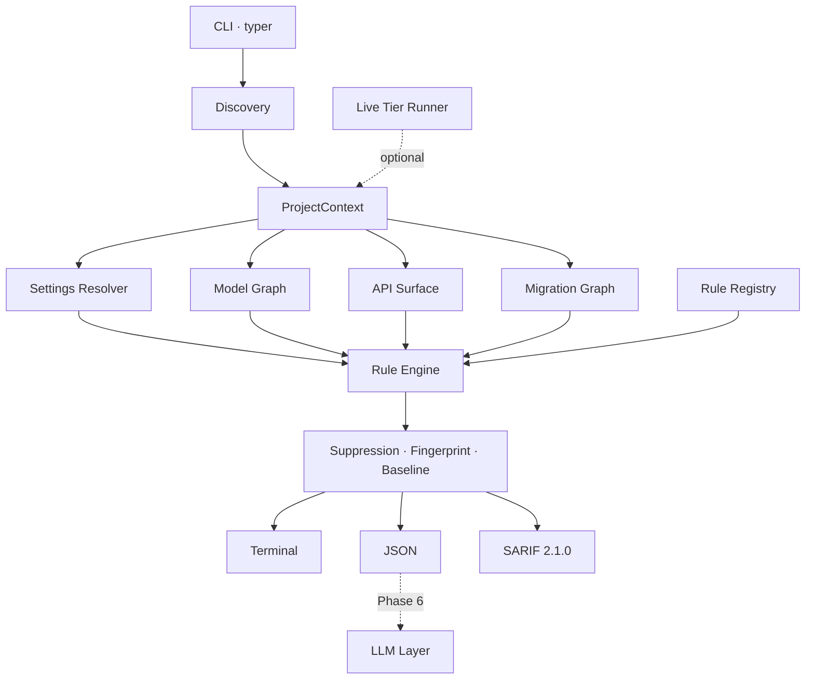

# djaudit — Full Project Plan

**Project:** `ByteForgeDevs/Django_AI_Model`
**Artefact:** `djaudit`, a Django-aware static analysis engine
**Plan version:** 1.0 · 2 August 2026
**Status:** Phase 0 complete. Phase 1 next.

---

## 1. How to read this document

This is the single authoritative breakdown of the work. It decomposes the
project three levels deep:

```
Phase   →   a shippable increment. One git branch, one pull request.
  Step  →   a coherent body of work inside a phase.
    Substep → one commit. Self-contained, tested, leaves the tree green.
```

Substeps are numbered `PHASE.STEP.SUBSTEP` — for example `1.3.2`. Those
identifiers are stable and are referenced in commit messages, so any commit can
be traced back to the plan and any plan item back to its commit.

Every substep is sized deliberately: large enough to be a meaningful unit of
review, small enough that a reviewer can hold it in their head. If a substep
turns out to need more than roughly 400 lines of diff, it should be split and
this document amended in the same pull request.

---

## 2. What we are building, restated

A **deterministic, Django-aware static analysis engine** that audits an existing
Django codebase and emits ranked, evidence-backed findings across settings
hardening, DRF authorization, ORM performance, migration safety, injection, and
SQLite/Postgres divergence.

It is **not a trained model.** No weights, no embeddings, no inference in the
detection path. The "AI" is deferred to Phase 6, where a language model is added
as an *additive consumer* of the finding schema — triage, explanation, and patch
authoring — never as the detection mechanism.

The reason is not ideological. A model trained on today's Django is wrong the
moment Django 6.1 ships, and it cannot cite a line number. An AST rule can do
both, costs nothing to run, and is unit-testable. We reach for a model only
where determinism genuinely runs out.

### Support matrix

| Dimension | Supported |
|---|---|
| Django | 6.0 (current), 5.2 LTS |
| Python | 3.12+ (Django 6.0 floor) |
| Primary database | PostgreSQL via psycopg3 |
| Secondary database | SQLite, treated as a divergence source |
| API framework | Django REST Framework 3.17 |

### Non-goals for v1

Binding. Scope creep here is the single largest risk to the project.

- No LLM, embeddings, or RAG in the detection path (Phase 6 is additive and opt-in)
- No autofix or code rewriting before Phase 6
- No runtime monitoring, middleware, or APM
- No code generation or project scaffolding
- Not a replacement for ruff, bandit, or pip-audit — we orchestrate them
- No non-Django Python, no frontend or JavaScript analysis
- No template (DTL/Jinja) analysis before Phase 5

---

## 3. Working agreement

Agreed with the project owner on 2 August 2026.

### 3.1 Branching

One branch per phase, cut fresh from `main`:

```
zambagarrah-django-audit-engine    ← Phase 0 (named before this convention existed)
phase-1-settings-hardening
phase-2-model-graph-and-drf
phase-3-performance-and-injection
phase-4-migrations-and-live-tier
phase-5-portability-and-adapters
phase-6-llm-layer
phase-7-distribution
```

Phase 0's branch predates this document and keeps its original name rather than
being force-renamed after the fact; every subsequent phase follows the
`phase-N-slug` form.

A phase branch is cut only after the previous phase's pull request is merged.
Phases are not developed in parallel — each builds directly on the last, and
parallel development would guarantee conflicts in the rule registry and the
shared context objects.

### 3.2 Commits

One commit per substep. Pushed immediately, so the pull request grows visibly
rather than arriving as a single wall of diff.

Message format:

```
<type>(<scope>): <subject, imperative, <= 72 chars>

<body: what changed and, more importantly, why. Wrapped at 72 columns.
Explains the design decision, the alternative rejected, and any
non-obvious consequence.>

Substep: <N.N.N>
Refs: docs/PROJECT_PLAN.md

Co-authored-by: Copilot App <223556219+Copilot@users.noreply.github.com>
```

`type` is one of `feat`, `fix`, `refactor`, `test`, `docs`, `chore`, `perf`,
`ci`. `scope` is the rule family (`djs`, `dja`, `djp`, `dji`, `djm`, `djx`) or
the subsystem (`engine`, `discovery`, `cli`, `sarif`, `eval`, `live`).

### 3.3 Pull requests

At the end of each phase:

1. Push the branch.
2. Open a pull request titled `Phase N — <title>`.
3. Request **Copilot code review**.
4. Assign **@Zambagarrah**.
5. The project owner reviews and merges. Work does not proceed to the next
   phase before the merge.

The pull request body states: goal, substeps delivered, rules added, quality
gate results, benchmark deltas (precision and recall, before and after), and
anything deliberately deferred.

### 3.4 The green-tree rule

Every commit must independently pass:

```bash
uv run ruff check .
uv run mypy
uv run pytest
```

Not just the branch tip. A bisect that lands on a broken commit costs more than
the discipline of keeping each one green.

---

## 4. Quality gates

Four gates run in CI on every push. All are blocking.

| Gate | What it protects | Failure means |
|---|---|---|
| **Lint** — `ruff check .` | Consistency, common bug classes | Style or correctness lint violated |
| **Types** — `mypy --strict` | Interface integrity across 30+ modules | A contract was broken silently |
| **Tests** — `pytest` | Behaviour of every unit | A regression |
| **SARIF conformance** | The CI integration itself | Code scanning would silently stop ingesting findings |
| **Recall** — `djaudit eval` on fixtures | We still detect what we claim to | A rule stopped firing, or grading drifted |
| **Precision** — real-repo benchmark | We do not cry wolf | A new rule produces false positives |

### 4.1 The precision gate must be rebuilt in Phase 1

Today the precision gate asserts **zero findings** on Healthchecks and NetBox.
That is only tenable while we detect almost nothing. The moment the `DJS` corpus
lands, these mature repositories will legitimately produce findings — some true,
some false — and a zero-findings assertion will fail for the wrong reason and be
disabled, which is how precision benchmarks quietly die.

The replacement, built in Step 1.1, is a **triaged baseline per target**: every
finding on a benchmark repository is recorded with a human verdict of
`true_positive`, `false_positive`, or `accepted_risk`. The gate then fails when

- an untriaged finding appears (something changed and nobody looked at it), or
- the false-positive rate rises above the threshold for that family, or
- a finding previously triaged `true_positive` disappears (silent regression).

This turns the benchmark from a binary tripwire into a tracked metric, which is
what it needs to be for the next six phases.

### 4.2 Definition of done for a single rule

No rule is complete until every line is true:

- [ ] Unique ID matching `^(DJS|DJI|DJA|DJP|DJM|DJX)-\d{3}$`, prefix agrees with declared family
- [ ] `RuleMeta` carries title, severity, confidence, tier, and at least one authoritative reference (Django docs, OWASP, or CWE)
- [ ] Message states what is wrong *at this location*; rationale states why it matters; remediation is concrete enough to paste
- [ ] Emits at least one `Evidence` item — never an assertion without support
- [ ] Unit tests cover: a true positive, a true negative, a **near-miss** (the shape that looks similar but is correct), and a suppression
- [ ] Represented in a fixture manifest so the recall gate covers it
- [ ] Run against both benchmark repositories, every finding triaged
- [ ] Confidence honestly reflects certainty — `tentative` when the value cannot be statically resolved, not `certain` because it looks good in a demo

---

## 5. Architecture



Three properties are load-bearing:

**The static tier never imports or executes the target.** It parses with
`ast`. This means djaudit runs on a repository whose dependencies are not
installed, and it is safe against untrusted code. The live tier is opt-in and
clearly separated.

**Severity and confidence are independent axes.** A tentative critical is not
the same as a certain low, and collapsing them into one number is precisely how
static analysis tools earn a reputation for noise.

**Fingerprints exclude line numbers.** Adding an import at the top of a file
must not invalidate a committed baseline.

---

## 6. Rule ID taxonomy

| Prefix | Family | Phase |
|---|---|---|
| `DJS` | Settings and deployment hardening | 0–1 |
| `DJA` | API / DRF authorization and data exposure | 2 |
| `DJD` | Data model design | 2 |
| `DJP` | Performance and ORM efficiency | 3 |
| `DJI` | Injection and untrusted input | 3 |
| `DJM` | Migration safety | 4 |
| `DJX` | Cross-database portability and divergence | 5 |

`DJS`, `DJA`, `DJP`, `DJI`, `DJM`, and `DJX` are already enforced by
`RULE_ID_PATTERN`. `DJD` is added in substep 2.6.1.

---

# Phase 0 — Engine skeleton

**Branch:** `zambagarrah-django-audit-engine` · **Status: COMPLETE**

**Goal.** A walking skeleton: every architectural seam exists and one real rule
proves the pipeline end to end.

**Why first.** The finding schema is simultaneously the SARIF contract, the
baseline format, and the future LLM seam. It is the most expensive thing in the
project to get wrong, so it is built first and pinned by tests. Equally, the
evaluation harness must exist before the first rule — otherwise there is no way
to know whether rule number twelve broke rule number three.

**Exit criteria.** CLI runs end to end, emits SARIF, scores fixtures, and runs
clean against two production Django repositories.

### Step 0.1 — Packaging and toolchain

- **0.1.1** — `uv` + hatchling, `src/` layout, Python 3.12 floor, `typer` and `rich` dependencies. *Done when:* `uv sync` succeeds and `djaudit --help` runs.
- **0.1.2** — ruff and mypy strict configuration, pytest configuration, `.gitignore`. *Done when:* all three run clean on an empty package.

### Step 0.2 — Finding schema and identity

- **0.2.1** — `models.py`: `Severity`, `Confidence`, `Tier`, `Family`, `EvidenceKind`, `Evidence`, `Location`, `Finding`. Frozen, slotted, `SCHEMA_VERSION = 1`.
- **0.2.2** — Ranking and serialisation: `.rank`, `.security_severity`, `Finding.sort_key`, `to_dict()`.
- **0.2.3** — `fingerprint.py`: snippet normalisation, `compute`, `assign`, occurrence disambiguation.
- **0.2.4** — `baseline.py`: load, save, filter, plus version and fingerprint-scheme compatibility checks.
- **0.2.5** — `suppression.py`: `# noqa: DJS-001` and `# djaudit: ignore[...]`. Bare `# noqa` deliberately not honoured.

### Step 0.3 — Rule infrastructure

- **0.3.1** — `registry.py`: `RuleMeta`, `Rule` base class, `register` decorator with ID and family validation.
- **0.3.2** — Selection and lazy loading: `all_rules`, `get`, `select`, `pkgutil`-based auto-discovery so there is no central list to forget to update.

### Step 0.4 — Project discovery

- **0.4.1** — `astutils.py`: `UNKNOWN` sentinel, module-level assignment extraction descending into `if`/`try`/`with`, literal evaluation, dotted names, star-import targets.
- **0.4.2** — `context.py`: `SettingsRole`, `SettingsModule`, `ProjectContext` with cached parsing, snippets, and locations.
- **0.4.3** — `discovery.py`: file walking with `pyvenv.cfg`-based virtualenv detection, `manage.py` location, `DJANGO_SETTINGS_MODULE` resolution.
- **0.4.4** — Two-pass settings discovery: marker-confirmed candidates, then star-import descendants. Django version detection from requirement pins.

### Step 0.5 — Execution engine

- **0.5.1** — `engine.py`: rule selection, per-rule exception isolation, suppression, fingerprinting, baseline filtering, thresholds, deterministic sort.
- **0.5.2** — `RunResult` counters so silence is always explainable.

### Step 0.6 — Reporters

- **0.6.1** — JSON reporter.
- **0.6.2** — SARIF 2.1.0 with `partialFingerprints`, `security-severity`, `precision`, `originalUriBaseIds`, and `invocations`.
- **0.6.3** — Rich terminal reporter.

### Step 0.7 — CLI

- **0.7.1** — `run`, `rules`, `version` commands with exit codes 0/1/2.
- **0.7.2** — Baseline write mode, deliberately opening thresholds so lowering a threshold later does not resurface old findings as new.

### Step 0.8 — Evaluation harness

- **0.8.1** — `evaluation.py`: `Expectation`, `Manifest`, precision/recall/F1, `must_not_report` control cases.
- **0.8.2** — `djaudit eval` command.

### Step 0.9 — First rule

- **0.9.1** — `DJS-001` DEBUG enabled, graded by settings role.
- **0.9.2** — Split-settings override detection: a base module downgraded, not dropped, when production unconditionally disables DEBUG.
- **0.9.3** — Fixture projects `vulnerable_project` and `overridden_project` with manifests.

### Step 0.10 — CI and validation

- **0.10.1** — CI workflow: quality, recall, and precision jobs.
- **0.10.2** — Precision gate script; benchmark targets pinned by SHA and cloned rather than vendored.
- **0.10.3** — Validation run against Healthchecks and NetBox.

**Delivered:** 159 tests · ruff clean · mypy strict clean · 100% precision and
recall on fixtures · 0 findings, 0 crashes, 0 parse errors across 1,866 files of
production Django in under 60 ms per repository.

---

# Phase 1 — Settings and deployment hardening

**Branch:** `phase-1-settings-hardening`

**Goal.** Make djaudit genuinely useful on a real repository. Roughly 20 `DJS`
rules, backed by a settings resolver that can see through the environment
variable indirection every production Django project uses.

**Entry criteria.** Phase 0 merged to `main`.
**Exit criteria.** Real, triaged findings on both benchmark repositories; false
positive rate measured and below 10% for the family; recall gate covering every
new rule.

### Why this phase is not simply "write twenty rules"

Both benchmark repositories hide their settings behind indirection:

```python
DEBUG = envbool("DEBUG", "True")                    # Healthchecks
DEBUG = getattr(configuration, 'DEBUG', False)      # NetBox
```

Phase 0 correctly stays silent on both, because it cannot resolve the value. If
we write twenty rules on top of that foundation, they will also stay silent on
exactly the code that matters most, and we will have twenty rules that only fire
on toy projects.

Equally, `DJS-001` currently carries its own bespoke override logic
(`_debug_disabled_downstream`). Copying that pattern into twenty rules would
give us twenty subtly different implementations of settings inheritance.

So Phase 1 front-loads two pieces of infrastructure — a partial evaluator and a
settings resolver — and only then writes rules. Steps 1.1 to 1.3 are the phase's
real engineering; steps 1.4 to 1.9 are comparatively mechanical.

### Step 1.0 — Phase 0 review follow-ups

Three correctness defects raised by code review on the Phase 0 pull request.
Folded into this phase rather than a separate hotfix branch because all three
are small, verified, and block nothing — but each is a genuine bug, and two of
them fail in the direction of silently hiding findings, which is the failure
mode this project cares about most.

- **1.0.1** — `# djaudit: ignore[]` acted as a blanket suppression, because an empty code set was conflated with "no code list given". A mistyped bracket pair silently hid every rule on that line. Empty brackets now suppress nothing.
- **1.0.2** — SARIF `associatedRule` referenced rule IDs absent from `tool.driver.rules` when a rule crashed without producing findings, leaving a dangling reference some consumers reject. Descriptors are now built from `RuleMeta` and cover crashed rules too.
- **1.0.3** — `--output` with `--format terminal` did not create missing parent directories, unlike JSON and SARIF, so `-o reports/out.txt` failed on a fresh checkout.
- **1.0.4** — Found while verifying 1.0.2: the `$schema` URL emitted in every SARIF file returned 404, and nothing validated our SARIF against the spec. Points at the canonical OASIS URL now, with schema *and* reference-resolution checks wired into CI.

### Step 1.1 — Rebuild the precision benchmark

The current zero-findings gate stops working the moment this phase lands.

- **1.1.1** — Triage file format: per-target JSON mapping fingerprint to verdict (`true_positive` / `false_positive` / `accepted_risk`), with reviewer note and date. *Done when:* schema is defined and round-trips.

  *Amended 1.1.1: JSON, not YAML.* Reviewers edit these files by hand, which is
  the case for YAML, but the per-entry `note` field covers what comments would
  have carried and JSON keeps runtime dependencies at two packages. Also lets
  the module reuse the baseline's I/O shape rather than inventing a second one.
- **1.1.2** — `djaudit benchmark` command: run against a target, diff against its triage file, report new/resolved/untriaged counts.
- **1.1.3** — Gate logic: fail on untriaged findings, on family false-positive rate above threshold, or on the disappearance of a known true positive.
- **1.1.4** — Replace `scripts/check_precision.py` in CI; seed empty triage files for both targets.
- **1.1.5** — Precision and recall metrics written to the job summary so the trend is visible on every pull request.

### Step 1.2 — Partial evaluator for settings expressions

Static resolution of the expression forms that actually appear in Django settings.

- **1.2.1** — `Value` type: resolved literal, `UNKNOWN`, or `CONDITIONAL(branches)`. Tri-state, so "we could not tell" is a first-class answer rather than a silent `None`.
- **1.2.2** — Literals and containers: strings, numbers, booleans, lists, tuples, dicts, sets, f-strings with resolvable parts, concatenation, `%` and `.format()`.
- **1.2.3** — Environment access: `os.environ[...]`, `os.environ.get(k, default)`, `os.getenv`. Resolve to the *default*, tagged as environment-dependent — this is the key that unlocks both benchmark repositories.
- **1.2.4** — Third-party environment helpers: `django-environ` (`env(...)`, `env.bool`, `env.int`, `env.list`, `env.db`), `python-decouple` (`config(...)`), and local `envbool`-style helpers resolved by following the function definition.
- **1.2.5** — Attribute indirection: `getattr(module, "NAME", default)` where the module is a discovered settings or config module.
- **1.2.6** — Comprehensions, `if`/`else` expressions, and boolean operators, producing `CONDITIONAL` with both branch values.
- **1.2.7** — Call safety: a hard recursion and node budget so a pathological file cannot hang the evaluator.

*Done when:* the evaluator resolves a majority of real settings on both
benchmark targets. **Measured on completion: 93% of Healthchecks settings
(95/102) and 67% of NetBox settings (134/199), in 3ms per module.** Spot-checked
for correctness rather than count: Healthchecks resolves `DEBUG` to `True` and
`SECRET_KEY` to its `"---"` placeholder, NetBox resolves `DEBUG`,
`SESSION_COOKIE_SECURE`, `CSRF_COOKIE_SECURE` and `SECURE_SSL_REDIRECT` to
`False`, and NetBox's two `# Required` settings stay unresolved rather than
being guessed.

### Step 1.3 — Settings resolver with provenance

- **1.3.1** — `ResolvedSetting`: name, effective value, defining module, line, whether conditional, and the full override chain.
- **1.3.2** — Inheritance resolution across star imports, honouring definition order, so `production.py` overriding `base.py` is modelled once and correctly.
- **1.3.3** — Django defaults table for every setting we reason about, so "absent" is distinguishable from "explicitly set to the default" — the two deserve different confidence.
- **1.3.4** — Middleware and `INSTALLED_APPS` list resolution, including `+=` and `insert()` mutation.
- **1.3.5** — Confidence policy: a single, documented mapping from resolution quality to `Confidence`, applied uniformly by all rules.
- **1.3.6** — Migrate `DJS-001` onto the resolver; delete its bespoke override logic. *Done when:* existing tests pass unchanged and DJS-001 now fires on env-var-defaulted DEBUG at `tentative`.

*Step 1.3 done.* The resolver covers 93% of Healthchecks' settings and 67% of
NetBox's, and grades them 16/77/14 and 27/103/72 across
certain/firm/tentative — the bulk at `firm`, which is the default gate, and
`tentative` reserved for values that genuinely cannot be determined.

Two amendments, both from measuring rather than reasoning:

- **1.3.4 as written pruned too hard.** Taking only the branch whose guard
  resolves is right for `if False:` and wrong for `if os.getenv("DEBUG"):` —
  resolving a guard for our environment says nothing about the deployment's,
  and the discarded branch is the one a misconfigured deployment takes.
  Pruning now requires the guard to be provable from source alone, and a
  conditional assignment merges with the value it might not replace. Precision
  is protected by grading the result `tentative`, not by deleting it.
- **1.3.6's "existing tests pass unchanged" did not hold, and should not
  have.** One test changed: a base module enabling DEBUG whose production
  module only conditionally disables it now reports production as well. The
  old rule matched a literal `DEBUG = True` statement and there is none in
  that file, so it missed a module that really can deploy with DEBUG on.
  Detecting it is the reason for the migration.

### Step 1.4 — Secret management rules

Amendment: **1.4.0** was added while starting this step. Steps 1.4 to 1.8 add
twenty-six settings rules, and writing the fourth copy of the same
resolve-and-grade loop made it clear the copies would drift — most damagingly
in confidence, which CI gates on. Extracting it before the rules exist, rather
than after twenty-six of them disagree, is cheaper.

- **1.4.0** — `SettingsRule` base: the production-reachable module loop, resolution, shared grading and provenance evidence, with `DJS-001` migrated onto it as its first user.
- **1.4.1** — `DJS-002` hardcoded `SECRET_KEY` literal.
- **1.4.2** — `DJS-003` weak or placeholder `SECRET_KEY` (`django-insecure-` prefix, `changeme`, entropy below threshold).
- **1.4.3** — `DJS-004` credentials hardcoded in `DATABASES`.
- **1.4.4** — `DJS-005` secrets in other well-known settings (`AWS_SECRET_ACCESS_KEY`, `STRIPE_SECRET_KEY`, `EMAIL_HOST_PASSWORD`, `*_API_KEY`, `*_TOKEN`) by name pattern plus literal value.

### Step 1.5 — Transport and cookie security rules

- **1.5.1** — `DJS-006` `SECURE_SSL_REDIRECT` not enabled.
- **1.5.2** — `DJS-007` `SECURE_HSTS_SECONDS` absent or below one year.
- **1.5.3** — `DJS-008` `SECURE_HSTS_INCLUDE_SUBDOMAINS` disabled while HSTS is on.
- **1.5.4** — `DJS-009` `SESSION_COOKIE_SECURE` disabled.
- **1.5.5** — `DJS-010` `CSRF_COOKIE_SECURE` disabled.
- **1.5.6** — `DJS-011` `SESSION_COOKIE_HTTPONLY` disabled.
- **1.5.7** — `DJS-012` `SECURE_PROXY_SSL_HEADER` trusting a client-controllable header.

### Step 1.6 — Host, origin, and framing rules

- **1.6.1** — `DJS-013` `ALLOWED_HOSTS` wildcard or empty while DEBUG is off.
- **1.6.2** — `DJS-014` `CSRF_TRUSTED_ORIGINS` wildcard or scheme-less entry.
- **1.6.3** — `DJS-015` `CORS_ALLOW_ALL_ORIGINS` enabled.
- **1.6.4** — `DJS-016` CORS wildcard combined with `CORS_ALLOW_CREDENTIALS`.
- **1.6.5** — `DJS-017` `X_FRAME_OPTIONS` permissive or `XFrameOptionsMiddleware` absent.
- **1.6.6** — `DJS-018` `SECURE_CONTENT_TYPE_NOSNIFF` disabled.

### Step 1.7 — Authentication and database rules

- **1.7.1** — `DJS-019` weak `PASSWORD_HASHERS` (MD5, SHA1, or unsalted) in a production-reaching module.
- **1.7.2** — `DJS-020` `AUTH_PASSWORD_VALIDATORS` empty or absent.
- **1.7.3** — `DJS-021` `CONN_MAX_AGE` at the default of 0, forcing a new connection per request.
- **1.7.4** — `DJS-022` Postgres connection without `sslmode=require`.
- **1.7.5** — `DJS-023` `ATOMIC_REQUESTS` disabled where the project otherwise implies it — informational, low severity.

### Step 1.8 — Introspection exposure rules

- **1.8.1** — `DJS-024` debug tooling in production `INSTALLED_APPS` (`debug_toolbar`, `django_extensions`, `silk`).
- **1.8.2** — `DJS-025` debug tooling in the production dependency manifest.
- **1.8.3** — `DJS-026` `ADMIN` mounted at the default path with no additional protection — informational.
- **1.8.4** — `DJS-027` logging configuration that emits request bodies or `Authorization` headers.

### Step 1.9 — Harden, benchmark, and document

- **1.9.1** — Fixture expansion: extend the vulnerable project to plant every new rule; add a realistic `env_settings_project` fixture using `django-environ`.
- **1.9.2** — Near-miss fixtures: the correct-looking shapes each rule must *not* flag.
- **1.9.3** — Full triage pass over Healthchecks and NetBox; every finding classified with a written justification.
- **1.9.4** — Tune severity and confidence based on the triage; document every downgrade.
- **1.9.5** — `docs/rules/DJS.md` — one section per rule: what, why, remediation, references, and known limitations.
- **1.9.6** — Update README and this plan with measured precision and recall.

---

# Phase 2 — Model graph and DRF authorization

**Branch:** `phase-2-model-graph-and-drf`

**Goal.** Understand the application's data model and its API surface, then find
authorization defects. Roughly 15 `DJA` rules.

**Entry criteria.** Phase 1 merged. Settings resolver available — DRF
configuration lives in `REST_FRAMEWORK` settings.

**Exit criteria.** Model graph correctly reconstructed for both benchmark
repositories; `DJA` findings triaged; IDOR detection demonstrated on fixtures.

**Why now.** Authorization defects are the highest-severity class in a typical
Django API, and unlike settings they cannot be found by grepping. They need a
model of what the endpoint returns and who is allowed to see it. That model — the
model graph — is also a hard prerequisite for the N+1 work in Phase 3, so
building it here pays for itself twice.

### Step 2.1 — Model graph construction

- **2.1.1** — `ModelNode`: name, app label, abstract/proxy/swappable flags, source location, base classes.
- **2.1.2** — Field extraction with parameters (`null`, `blank`, `unique`, `db_index`, `max_length`, `default`, `choices`).
- **2.1.3** — Relationship edges: `ForeignKey`, `OneToOneField`, `ManyToManyField`, including string references, `self`, and `settings.AUTH_USER_MODEL`.
- **2.1.4** — Reverse relation naming: `related_name`, `related_query_name`, and Django's default `_set` accessor.
- **2.1.5** — `Meta` handling: `ordering`, `indexes`, `constraints`, `unique_together`, `abstract`, `db_table`.
- **2.1.6** — Inheritance resolution: abstract bases, multi-table inheritance, mixins.
- **2.1.7** — Custom managers and `QuerySet` subclasses, so `Model.objects` resolves to the right class.
- **2.1.8** — Graph queries: `is_user_owned(model)` (path to the user model within N hops), `relation_path`, `reachable_fields`. This is what the authorization rules consume.

### Step 2.2 — API surface discovery

- **2.2.1** — Serializer discovery: `Serializer`, `ModelSerializer`, declared fields, `Meta.model`, `Meta.fields`, `Meta.exclude`, `read_only_fields`.
- **2.2.2** — View discovery: `APIView`, generics, `ViewSet`, `ModelViewSet`, plus function views decorated with `@api_view`.
- **2.2.3** — Router and URL graph: `DefaultRouter.register`, `path`, `re_path`, `include`, resolving view to route to HTTP methods.
- **2.2.4** — Permission and authentication resolution: class attributes, `get_permissions` overrides, `@permission_classes`, falling back to `REST_FRAMEWORK` defaults via the settings resolver.
- **2.2.5** — Queryset resolution: the `queryset` attribute and `get_queryset` return expressions, including filters applied.

### Step 2.3 — Authorization rules

- **2.3.1** — `DJA-001` `DEFAULT_PERMISSION_CLASSES` set to `AllowAny`, or absent (DRF's own default is `AllowAny`).
- **2.3.2** — `DJA-002` view with no explicit permission classes under a permissive default.
- **2.3.3** — `DJA-003` `AllowAny` on a view exposing write methods.
- **2.3.4** — `DJA-004` **IDOR** — `get_queryset` on a user-owned model not scoped to `request.user`. The flagship rule of this phase.
- **2.3.5** — `DJA-005` object-level permissions declared but `check_object_permissions` never reached on a custom `get_object`.
- **2.3.6** — `DJA-006` `@api_view` function view with no permission decorator.
- **2.3.7** — `DJA-007` authentication classes permitting session auth only on an endpoint routed as a public API.

### Step 2.4 — Data exposure rules

- **2.4.1** — `DJA-008` `ModelSerializer` using `fields = '__all__'`.
- **2.4.2** — `DJA-009` serializer using `exclude`, which silently exposes every field added later.
- **2.4.3** — `DJA-010` serializer exposing sensitive fields (`password`, `is_staff`, `is_superuser`, `token`, `secret`).
- **2.4.4** — `DJA-011` writable field that should be read-only (`id`, `user`, `owner`, `created_by`) — mass assignment.
- **2.4.5** — `DJA-012` nested serializer reaching a sensitive field through a relation.

### Step 2.5 — Availability rules

- **2.5.1** — `DJA-013` list endpoint with no pagination and no bounded queryset.
- **2.5.2** — `DJA-014` filter backend permitting arbitrary field lookups (`filterset_fields = '__all__'`).
- **2.5.3** — `DJA-015` no throttling on authentication or password-reset endpoints.

### Step 2.6 — Model correctness rules

These are data-model design defects, not settings, so they need a family of
their own. Substep 2.6.1 extends `RULE_ID_PATTERN` to admit `DJD`.

- **2.6.1** — Register the `DJD` family (data model design) in `Family` and the ID pattern.
- **2.6.2** — `DJD-001` `ForeignKey` with `on_delete=CASCADE` to the user model on financial or audit records — informational, high value in review.
- **2.6.3** — `DJD-002` `CharField` with `null=True`, which creates two representations of empty.
- **2.6.4** — `DJD-003` `Meta.ordering` absent on a model that is paginated, producing unstable pagination.

### Step 2.7 — Benchmark and document

- **2.7.1** — DRF fixture project: viewsets, serializers, routers, planted IDOR and mass-assignment defects.
- **2.7.2** — Near-miss fixtures: correctly scoped querysets, correct read-only fields.
- **2.7.3** — Validate the model graph against NetBox, which has hundreds of models — a strong correctness test.
- **2.7.4** — Triage pass on both benchmarks.
- **2.7.5** — `docs/rules/DJA.md`, plus an architecture note on the model graph.

---

# Phase 3 — Performance and injection

**Branch:** `phase-3-performance-and-injection`

**Goal.** The flagship capability. Roughly 10 `DJP` and 10 `DJI` rules built on
local dataflow analysis.

**Entry criteria.** Phase 2 merged. Model graph available.

**Exit criteria.** N+1 detection demonstrated with a measured false-positive
rate; injection rules triaged on both benchmarks.

**Why this is the hardest phase.** N+1 detection is where a naive implementation
produces noise so bad the tool gets uninstalled. Flagging every attribute access
inside every loop would "detect" every N+1 and bury them in hundreds of false
positives. The rule is only worth shipping if it reasons about whether the
queryset was actually prefetched, which requires tracking a value through
assignment, function boundaries, and method chains.

We therefore build the dataflow foundation first, and we default this family to
`firm` confidence and above in the terminal reporter.

### Step 3.1 — Dataflow foundation

- **3.1.1** — Scope model: module, class, function, comprehension, with proper name shadowing.
- **3.1.2** — Definition–use chains within a function body.
- **3.1.3** — QuerySet value tracking: recognise a queryset origin (`Model.objects...`, a related manager, a custom manager) and follow it through assignment.
- **3.1.4** — Method chain analysis: accumulate `filter`, `exclude`, `select_related`, `prefetch_related`, `only`, `defer`, `annotate`, `values`, and slicing across a chain.
- **3.1.5** — Loop model: `for`, comprehensions, and nested loops, recording which variable binds the iteration element.
- **3.1.6** — Cross-function propagation limited to one hop within a module, with an explicit budget. Deliberately not whole-program — unbounded interprocedural analysis on a large repository is slow and produces confident nonsense.

### Step 3.2 — N+1 detection

- **3.2.1** — `DJP-001` forward relation accessed on a loop variable whose queryset lacks `select_related` for that path.
- **3.2.2** — `DJP-002` reverse relation or many-to-many accessed in a loop without `prefetch_related`.
- **3.2.3** — `DJP-003` relation traversal inside a `SerializerMethodField` or serializer property, where the queryset is defined in the view — the most common real-world N+1 and the one existing tools miss.
- **3.2.4** — `DJP-004` query executed inside a loop body (`.get`, `.filter().first()`, `.count`, `.exists`).
- **3.2.5** — Prefetch-awareness refinement: honour `Prefetch(...)` objects, nested lookups, and `to_attr`. *Done when:* the false-positive rate on NetBox is measured and documented.

### Step 3.3 — Query efficiency rules

- **3.3.1** — `DJP-005` `len(queryset)` where `.count()` is intended.
- **3.3.2** — `DJP-006` `.count() > 0` where `.exists()` is intended.
- **3.3.3** — `DJP-007` `.save()` inside a loop where `bulk_update` or `bulk_create` applies.
- **3.3.4** — `DJP-008` unbounded `.all()` materialised into a list.
- **3.3.5** — `DJP-009` field accessed after being excluded by `.only()` or `.defer()`, causing a per-row refetch.
- **3.3.6** — `DJP-010` filtering or ordering on an unindexed field, using the model graph.

### Step 3.4 — SQL and ORM injection

- **3.4.1** — `DJI-001` `cursor.execute` with an interpolated string (f-string, `%`, `+`, `.format`).
- **3.4.2** — `DJI-002` `Model.objects.raw` with interpolation.
- **3.4.3** — `DJI-003` `.extra()` with untrusted input.
- **3.4.4** — `DJI-004` `RawSQL` or `Func` with an interpolated template.
- **3.4.5** — `DJI-005` queryset kwargs expanded from request data (`filter(**request.GET)`).
- **3.4.6** — `DJI-006` `order_by` driven by a request parameter with no allowlist.

### Step 3.5 — Untrusted input rules

- **3.5.1** — Taint source model: `request.GET`, `POST`, `data`, `body`, `headers`, `COOKIES`, `FILES`, and view kwargs.
- **3.5.2** — `DJI-007` `eval`, `exec`, `pickle.loads`, or `yaml.load` on tainted data.
- **3.5.3** — `DJI-008` `subprocess` with `shell=True` or `os.system` on tainted data.
- **3.5.4** — `DJI-009` **SSRF** — outbound HTTP request to a tainted URL.
- **3.5.5** — `DJI-010` open redirect — `redirect()` or `HttpResponseRedirect` with a tainted target.
- **3.5.6** — `DJI-011` `mark_safe` or `format_html` applied to tainted data (XSS).
- **3.5.7** — `DJI-012` path traversal — file open or `FileResponse` on a tainted path.

### Step 3.6 — Benchmark and document

- **3.6.1** — N+1 fixture project with true positives, correctly prefetched near-misses, and `Prefetch`-object cases.
- **3.6.2** — Injection fixture project including sanitised near-misses.
- **3.6.3** — Performance profiling: dataflow analysis must not push a NetBox-scale run beyond 10 seconds.
- **3.6.4** — Triage pass; publish the N+1 false-positive rate honestly, including in the README.
- **3.6.5** — `docs/rules/DJP.md` and `docs/rules/DJI.md`, plus a dataflow design note stating the analysis limits explicitly.

---

# Phase 4 — Migration safety and the live tier

**Branch:** `phase-4-migrations-and-live-tier`

**Goal.** Catch migrations that will lock a production table, and introduce the
optional live tier that runs inside the target's environment.

**Entry criteria.** Phase 3 merged.

**Exit criteria.** Lock classification verified against real Postgres DDL; live
tier degrades cleanly to static when unavailable.

**Why the live tier belongs here.** Migration analysis is the one area where
static analysis genuinely runs out. Whether `AlterField` rewrites a table
depends on the actual column types in the database and the Postgres version.
`manage.py sqlmigrate` answers the question exactly. This is the first capability
that justifies the cost of executing code in the target environment — and that
cost is real, so it stays opt-in, sandboxed, and time-limited.

### Step 4.1 — Live tier runner

- **4.1.1** — Environment detection: locate the target's interpreter (`.venv`, `poetry`, `uv`, `pipenv`, system).
- **4.1.2** — Subprocess runner with hard timeout, output capture, and no inherited secrets.
- **4.1.3** — `LiveContext`: Django version, resolved settings, database engine, migration state.
- **4.1.4** — Graceful degradation — every live rule declares a static fallback, and absence of the live tier is reported, never silently ignored.
- **4.1.5** — `--live` / `--no-live` CLI flags, defaulting to off, with a clear consent message explaining that target code will be executed.

### Step 4.2 — Migration graph

- **4.2.1** — Parse migration files: `dependencies`, `operations`, `atomic`, `initial`.
- **4.2.2** — Build the dependency graph; detect multiple leaf nodes and conflicts.
- **4.2.3** — Classify operations: schema, data, index, constraint, `RunPython`, `RunSQL`, `SeparateDatabaseAndState`.

### Step 4.3 — Static migration rules

- **4.3.1** — `DJM-001` `AddField` non-nullable with a default, rewriting the table.
- **4.3.2** — `DJM-002` `AlterField` changing type or nullability on a large table.
- **4.3.3** — `DJM-003` `AddIndex` without `CONCURRENTLY` (`AddIndexConcurrently`).
- **4.3.4** — `DJM-004` `RemoveField` deployed alongside code still referencing it, breaking rolling deploys.
- **4.3.5** — `DJM-005` `RenameField` or `RenameModel`, which cannot be rolled out without downtime.
- **4.3.6** — `DJM-006` `RunPython` with no reverse, blocking rollback.
- **4.3.7** — `DJM-007` `RunPython` iterating an unbounded queryset.
- **4.3.8** — `DJM-008` schema and data operations in one atomic migration, holding a lock during a backfill.
- **4.3.9** — `DJM-009` `AddConstraint` validated immediately rather than `NOT VALID` then validated.

### Step 4.4 — Live lock classification

- **4.4.1** — `sqlmigrate` adapter capturing real emitted SQL per migration.
- **4.4.2** — SQL lock classifier: map each DDL statement to its Postgres lock mode.
- **4.4.3** — `DJM-010` migration acquiring `ACCESS EXCLUSIVE` on a table, with the emitted SQL as evidence. Upgrades the static rules above from `tentative` to `certain`.
- **4.4.4** — Table size estimation from `pg_class.reltuples` when a database connection is available, so severity scales with actual row count.

### Step 4.5 — Deployment check adapter

- **4.5.1** — `manage.py check --deploy` adapter, normalising Django's own warnings into our schema.
- **4.5.2** — Deduplication against our static `DJS` findings — when Django and djaudit agree, report once with both as evidence.
- **4.5.3** — `DJS-028` gap report: settings Django flags that our static tier missed. A self-auditing rule that measures our own recall.

### Step 4.6 — Benchmark and document

- **4.6.1** — Migration fixture project with unsafe and safe migration pairs.
- **4.6.2** — Live tier integration test using a real Postgres service container in CI.
- **4.6.3** — Verify lock classification against actual Postgres `pg_locks` output.
- **4.6.4** — `docs/rules/DJM.md` and `docs/live-tier.md`, including the security model for executing target code.

---

# Phase 5 — Portability and external adapters

**Branch:** `phase-5-portability-and-adapters`

**Goal.** Treat dev/prod database divergence as its own bug class, and stop
reinventing what ruff, bandit, and pip-audit already do well.

**Entry criteria.** Phase 4 merged.

**Exit criteria.** Divergence rules validated on Healthchecks, which genuinely
supports both SQLite and Postgres; external findings normalised and deduplicated.

### Step 5.1 — Database configuration model

- **5.1.1** — Per-settings-module engine detection, using the settings resolver.
- **5.1.2** — Divergence detection across roles — SQLite in development, Postgres in production.
- **5.1.3** — `DJX-001` the meta-finding: development and production use different engines, which makes every rule below relevant.

### Step 5.2 — Divergence rules

- **5.2.1** — `DJX-002` `JSONField` querying with semantics that differ between backends.
- **5.2.2** — `DJX-003` `distinct('field')`, which is Postgres-only.
- **5.2.3** — `DJX-004` case-sensitivity and collation divergence in `iexact`, `icontains`, and ordering.
- **5.2.4** — `DJX-005` Postgres-only fields (`ArrayField`, `HStoreField`, `JSONField` operators, ranges) in a project that runs SQLite in development.
- **5.2.5** — `DJX-006` deferred constraint and transaction semantics differences.
- **5.2.6** — `DJX-007` foreign keys unenforced by default under SQLite.
- **5.2.7** — `DJX-008` date and time truncation with timezone handling that differs by backend.
- **5.2.8** — `DJX-009` `max_length` enforced by Postgres but not SQLite.

### Step 5.3 — External tool adapters

- **5.3.1** — Adapter interface and availability probing.
- **5.3.2** — ruff adapter: run with Django-relevant rule sets, map into our schema.
- **5.3.3** — bandit adapter, with the Django-specific noise filtered out.
- **5.3.4** — pip-audit adapter for dependency CVEs against the resolved requirements.
- **5.3.5** — Deduplication: same file, same line, same underlying issue reported by two tools collapses to one finding with both as evidence.
- **5.3.6** — `--with-external` / `--without-external` flags; external tools never block a run when absent.

### Step 5.4 — Benchmark and document

- **5.4.1** — Dual-database fixture project.
- **5.4.2** — Validate against Healthchecks, which is the ideal target for this family.
- **5.4.3** — `docs/rules/DJX.md` and `docs/adapters.md`.

---

# Phase 6 — LLM layer

**Branch:** `phase-6-llm-layer`

**Goal.** Add the language model as a consumer of findings — triage, explanation,
and patch authoring. Nothing in the detection path changes.

**Entry criteria.** Phase 5 merged, and the finding corpus is large enough that
triage is genuinely a burden. If it is not, this phase is premature and should
wait.

**Exit criteria.** Every LLM output is either verifiable (a patch that compiles
and passes tests) or clearly labelled as advisory. No finding is ever created or
suppressed by a model without a deterministic rule behind it.

**The constraint that makes this safe.** The model never decides whether
something is a defect. It explains, prioritises, and proposes fixes for findings
that a deterministic rule already produced, with the evidence already attached.
That keeps the failure mode at "unhelpful" rather than "confidently wrong about
your security posture".

### Step 6.1 — Provider abstraction

- **6.1.1** — Provider interface with structured output support; no vendor lock-in.
- **6.1.2** — Configuration, credential handling, and an explicit offline mode.
- **6.1.3** — Response caching keyed by finding fingerprint plus prompt version, so cost is bounded and results are reproducible.
- **6.1.4** — Token budget, rate limiting, and graceful degradation to deterministic output.

### Step 6.2 — Triage

- **6.2.1** — Prompt construction from a finding plus its evidence and surrounding code.
- **6.2.2** — `djaudit triage`: rank findings by exploitability in this codebase's context.
- **6.2.3** — False-positive suggestion — proposes suppressions, never applies them.
- **6.2.4** — Grouping of related findings into a single reviewable theme.

### Step 6.3 — Explanation

- **6.3.1** — `djaudit explain <fingerprint>` — a contextual explanation citing this code, not the generic rule text.
- **6.3.2** — Business-impact framing for non-specialist reviewers.

### Step 6.4 — Patch generation

- **6.4.1** — `libcst` integration for structure-preserving rewrites.
- **6.4.2** — `djaudit fix --dry-run` producing a unified diff.
- **6.4.3** — Verification loop: apply to a scratch copy, re-run djaudit and the target's own test suite, and discard any patch that fails either.
- **6.4.4** — Deterministic fixes for the mechanical rules, with no model involved — most `DJS` settings fixes need no intelligence at all.

### Step 6.5 — Guardrails

- **6.5.1** — Provenance labelling: every model-authored artefact marked as such in output and SARIF.
- **6.5.2** — Evaluation set for triage quality, measured against human triage from Phases 1–5.
- **6.5.3** — Documented failure modes and a written statement of what the model is never permitted to do.

---

# Phase 7 — Distribution

**Branch:** `phase-7-distribution`

**Goal.** Make djaudit installable and adoptable by someone who was not in this
conversation.

### Step 7.1 — Packaging and release

- **7.1.1** — PyPI release workflow with trusted publishing.
- **7.1.2** — Semantic versioning policy, including what constitutes a breaking change to the finding schema.
- **7.1.3** — Changelog generation from the commit trail.

### Step 7.2 — Integrations

- **7.2.1** — A composite GitHub Action wrapping the CLI with SARIF upload.
- **7.2.2** — `pre-commit` hook definition.
- **7.2.3** — Container image for non-Python CI environments.

### Step 7.3 — Documentation

- **7.3.1** — Getting-started guide and adoption path for a legacy codebase.
- **7.3.2** — Complete rule reference, generated from `RuleMeta` so it cannot drift.
- **7.3.3** — Rule authoring guide for external contributors.
- **7.3.4** — Configuration reference: `pyproject.toml` settings, per-rule severity overrides, per-path exclusions.

---

## 7. Risk register

| # | Risk | Likelihood | Impact | Mitigation |
|---|---|---|---|---|
| 1 | N+1 false positives make the tool untrusted | High | High | Dataflow before rules; default output to `firm`+; publish the measured FP rate |
| 2 | Settings hidden behind env vars keep rules silent | Certain | High | Step 1.2 partial evaluator, resolving defaults at `tentative`; live tier escalates |
| 3 | Precision gate disabled once it starts failing | High | High | Step 1.1 replaces the binary gate with tracked triage before it becomes a problem |
| 4 | Scope creep into build/monitor/debug | Medium | High | The non-goals list is binding; changes require a plan amendment |
| 5 | Django 6.0 vs 5.2 behavioural drift | Medium | Medium | Version-aware rule gating from the detected version |
| 6 | Live tier executes hostile code | Low | Critical | Opt-in, sandboxed, timed out, no inherited secrets, explicit consent message |
| 7 | Model graph wrong on unusual patterns | Medium | Medium | Validated against NetBox's several hundred models |
| 8 | Analysis too slow on large repositories | Medium | Medium | 10 s budget on NetBox enforced in CI from Phase 3 |
| 9 | LLM layer erodes determinism | Medium | High | Model may never create or suppress a finding; all output labelled |
| 10 | Benchmark repositories drift | Low | Low | Pinned by commit SHA; updated deliberately |

---

## 8. Progress tracking

| Phase | Title | Steps | Substeps | Status |
|---|---|---|---|---|
| 0 | Engine skeleton | 10 | 28 | **Complete** (PR #1) |
| 1 | Settings and deployment hardening | 10 | 55 | In progress — Steps 1.0–1.3 done |
| 2 | Model graph and DRF authorization | 7 | 37 | Not started |
| 3 | Performance and injection | 6 | 35 | Not started |
| 4 | Migration safety and live tier | 6 | 28 | Not started |
| 5 | Portability and external adapters | 4 | 20 | Not started |
| 6 | LLM layer | 5 | 17 | Not started |
| 7 | Distribution | 3 | 10 | Not started |
| | **Total** | **51** | **230** | |

Rule count on completion: **87 rules** across seven families — `DJS` 28,
`DJA` 15, `DJI` 12, `DJM` 10, `DJP` 10, `DJX` 9, `DJD` 3.

These counts are verified against the document itself, not asserted. Any
amendment that adds or removes a substep must update this table in the same
commit.

---

## 9. Amending this plan

This document is expected to change. Static analysis plans meet reality and
reality wins — a rule proves unimplementable, a false-positive rate forces a
redesign, a phase turns out to need splitting.

When that happens, amend this file **in the same pull request as the work that
caused the change**, and say so in the commit body. A plan quietly diverging from
the code is worse than no plan, because it is trusted and wrong.
