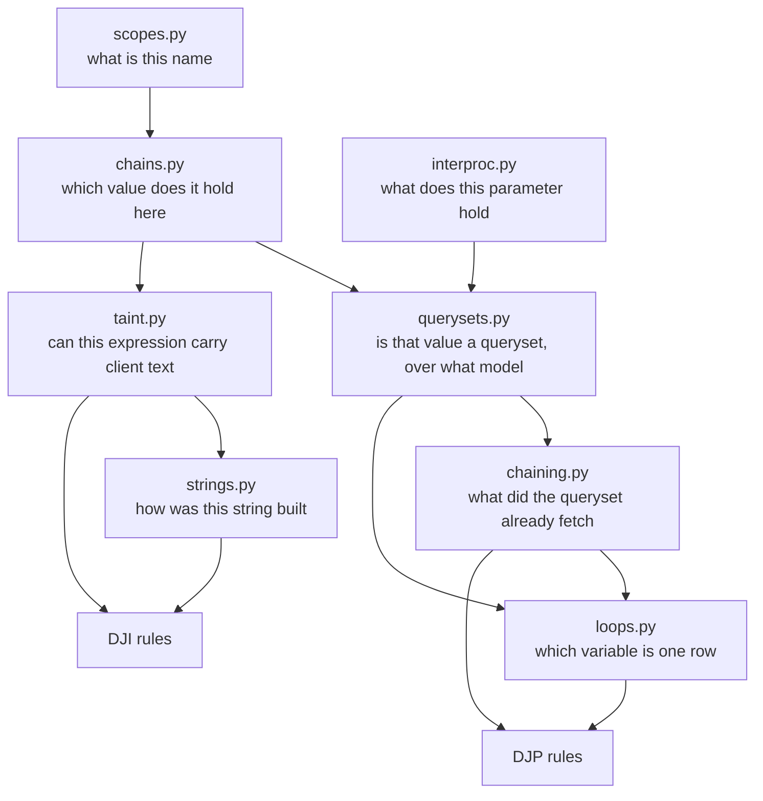

# Dataflow: what it knows, and what it does not

The `DJP` and `DJI` families both rest on the same nine modules under
`src/djaudit/dataflow/`. This note states what that analysis can establish and,
more importantly, what it cannot — because a static analyser's limits are the
part users discover by being lied to.

Every claim here is measured against the three benchmark targets (Healthchecks,
653 files; NetBox, 1213; pretix, 1225), not asserted.

## The shape of it



Each layer answers one question and hands a *typed* answer up. No layer guesses
to keep the next one happy.

## Three answers, never two

`Taint` is `SAFE`, `TAINTED` or `UNKNOWN`, and the third is not a rounding
error. A function parameter holds whatever the caller passed and we usually do
not know the caller.

Collapsing `UNKNOWN` either way destroys the analysis in a different direction
each time. Call it `SAFE` and the most common real defect disappears — a helper
that interpolates its own argument. Call it `TAINTED` and every string-building
function in the project is a SQL injection.

**`UNKNOWN` is never reported.** Not at a lower severity, not as a `tentative`
finding. It is the absence of evidence, and a finding is a claim about
evidence.

The same three-valued discipline is why the reaching-definitions layer returns
*every* definition that reaches a use rather than choosing one. Where control
flow forks, one path may prefetch and the other may not, and picking a branch
is a coin flip reported as fact. One reaching definition supports `firm`;
several support `tentative` at best.

In practice the `DJP` rules are stricter than that floor. Given

```python
qs = Book.objects.all()
if request.GET.get("full"):
    qs = qs.select_related("author")
for book in qs:
    book.author.name
```

`DJP-001` reports **nothing** — not a `tentative` finding. Two definitions
reach the loop, one of them prefetches, and the rule declines rather than
grading its own guess. That is a deliberate false negative: the branch that
does not prefetch really is an N+1 on that path.

Measured on reported findings, the analysis admits uncertainty on **26 of 245**
of them — 6 of 33 on Healthchecks, 10 of 71 on NetBox, 10 of 141 on pretix are
`tentative`, of which 8 are `DJP`. Those 26 sit below the default reporting
floor: `djaudit run` shows `firm` and above unless asked otherwise.

## What it does not do

These are design decisions with costs, not defects awaiting a fix.

**No path sensitivity.** The analysis does not evaluate conditions. Code
guarded by `if settings.DEBUG:` or `if request.user.is_superuser:` is analysed
exactly like unguarded code. Modelling it means deciding whether every path out
of a comparison rejects the request or substitutes a default, and a rule that
guessed wrong would call correct defensive code a vulnerability.

**One interprocedural hop, one module, and a budget.** A parameter is resolved
from its call sites only when the caller is in the same module. The chain is
not followed transitively and the work is capped. This matters more than it
sounds: loops whose iterable is a parameter number 15 / 118 / 221 across the
three targets, against 31 / 135 / 179 that resolve without help — on pretix the
unresolved population is the larger one. Following further buys progressively
less and costs progressively more, and an unbounded walk on a repository this
size produces confident nonsense faster than it produces findings.

**Disagreement is not a tie to be broken.** A function called twice with two
different models has no single answer, so the parameter stays unresolved. A
function with no call site in its module is likewise unknown, which is a
different thing from knowing it is not a queryset.

**No cross-module flow at all.** A queryset built in `services.py` and consumed
in `views.py` is two separate unknowns. Verified: an unprefetched queryset
returned by an imported helper and looped over in a view is silent, where the
same loop written inline reports `DJP-001`. This is the single largest source
of false negatives in `DJP`.

**No aliasing through containers or attributes.** Also verified silent, against
the same inline loop as a control: a queryset reached through `self.qs`, and one
reached through `box[0]`. A queryset stored in a dict, a list element or an
instance attribute is not followed.

**No inheritance of flow.** A base class method's parameters are not resolved
from subclass call sites.

**Sources are an allowlist, deliberately.** Only the attributes Django fills
from the wire count: `GET`, `POST`, `data`, `body`, `headers`, `COOKIES`,
`FILES`, `META`, `query_params`. The corpus is the argument — attribute reads
off `request` find `request.event` 1,727 times, `request.user` 1,400 and
`request.organizer` 782, all objects middleware attached and none of them
client text. "Anything reached through `request`" would treat a model instance
as an injection vector. The cost is a real miss: a project that attaches client
text to `request` in its own middleware is invisible to us.

**Sanitisers are narrow, and checked per value.** `int(x)` cannot return
something injectable, so it launders taint. A call we cannot resolve does not,
even if it is named `escape`. A sanitiser applied to one value does not clear
another value in the same expression.

**Opaque calls do not launder.** A tainted value passed through a function we
cannot read stays tainted rather than becoming `UNKNOWN`, because the common
case is a formatting helper that returns its argument.

**Loop bodies, not call graphs.** `DJP-001` reports a relation read inside a
loop over rows. A relation read in a function *called from* that loop is
outside what we claim to see — verified silent for `for b in Book.objects.all():
show(b)` where `show` reads `b.author`, which is the shape refactoring produces.

## What follows from all this

The families default to `firm` because the layers above disagree often enough
that `tentative` findings are noise for most users, and they are suppressed by
default rather than deleted because they are the right answer when you are
auditing rather than gating.

Two consequences worth stating plainly:

- **Recall is not measured on real code and cannot be.** A mature project
  cannot tell us what we walked past. Recall comes from
  `tests/fixtures/orm_project` and `tests/fixtures/injection_project`, where we
  planted the defects, and it is 100% there by construction of the manifest.
- **Precision on real code is measured, and published with its caveats** — see
  the README's N+1 section, which states the 3.6% redundant-report rate rather
  than netting it off.

Per-rule limits, written for each rule individually, are in
[`docs/rules/`](../rules/README.md). Those are the authority for what a specific rule
misses; this note is the authority for what the substrate underneath them all
cannot see.
