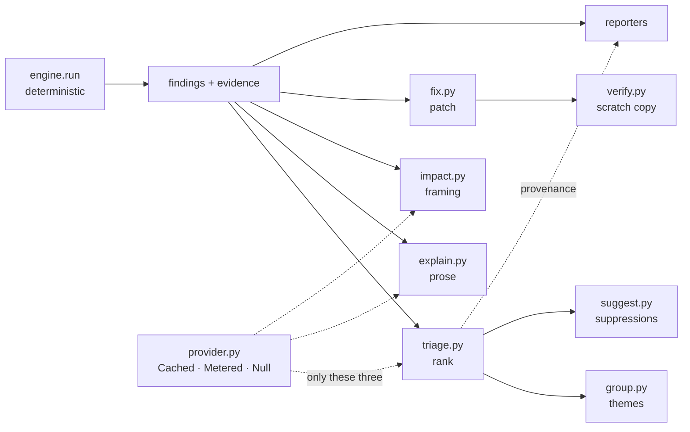

# The LLM layer: what it may do, and what it structurally cannot

This note is the argument behind `src/djaudit/llm/`. The short version is on
the package's first line — *a consumer of findings, never a producer of them* —
and the rest of this file is why that sentence is a shape rather than a promise.

Every number here is measured. Where a claim rests on a test, the test is
named, so a reader can check that the guarantee is enforced rather than
described.

## Why the layer exists at all

The deterministic engine answers "what is wrong here". It does not answer
"which of these findings should I read first", "what will this cost my
team", or "what does the fixed version look like". Those are judgement calls,
and a static rule that tried to make them would be guessing with the authority
of a compiler.

So the split is: rules decide *what is true*, the model layer decides *what is
worth your attention*. The first is checkable; the second is not, which is
exactly why it must be labelled and exactly why it is kept out of the finding
list.

## The structural guarantee

**No code path in `djaudit/llm/` can add a finding to a run or remove one from
it.** Not "does not" — *cannot*, in the sense that there is no function to call.

Three things make that true rather than aspirational:

1. **The engine finishes before the layer starts.** `engine.run()` returns a
   `RunResult`, and every function under `llm/` takes findings as input. There
   is no hook, no callback, no registry a model can enter through.

2. **`ResponseSchema.validate` raises on an undeclared field.** A caller
   declares the shape of the answer before asking. A reply carrying
   `{"is_defect": false}` when nobody asked about `is_defect` is refused
   loudly, rather than having the key dropped — dropping it would keep it out
   of the finding list *and* leave nothing behind, so a provider that started
   returning it would go unnoticed.

3. **Suppression requires a model verdict, and even then only proposes.**
   `suggest` will draft a `# djaudit: ignore` comment, and `fix` will draft a
   patch, but neither writes to disk. The operator applies it, or does not.

`tests/llm/test_hostile_provider.py` attacks all three by driving the layer
with a provider engineered to lie, and requires the finding list to come out
byte-identical.

## The pipeline

The dotted edges matter: **only `triage`, `explain` and `impact` ever touch a
provider.** `fix`, `edit` and `verify` do not, and cannot — see
*Fixes need no model*, below.

## The provider stack

`Cached(Metered(inner))`, in that order and for a reason. The cache is
outermost so a repeat question never reaches the meter at all. `Metered` also
refuses to charge for a cached answer, but not consulting the budget is cheaper
than consulting it and then forgiving it, and it leaves the cache free to tag
each entry with its finding's fingerprint.

`inner` is a `NullProvider` in every configuration that ships today. **No
third-party API is ever called from tests or from CI**, and there is no
implemented adapter that could be. `NullProvider` *declines*, which is a return
value rather than an exception, because a stack that silently does nothing is
indistinguishable from one that is broken.

## What the model is never permitted to do

This list is binding. Each entry names what enforces it.

| The model may not | Enforced by |
|---|---|
| Create a finding | No API accepts one; `test_hostile_provider.py` |
| Delete or hide a finding | `suggest` only drafts text; nothing writes to disk |
| Change a severity, confidence or fingerprint | Findings are frozen before the layer sees them |
| Return a field nobody asked for | `ResponseSchema.validate` raises |
| Author a code change | `FIXERS` values come from rule remediation text; `tests/llm/test_fixes_need_no_model.py` |
| Be consulted without the operator opting in | `LLMConfig.usable`; off unless both `--llm` and `[tool.djaudit.llm]` agree |
| Spend without a ceiling | `Budget(max_tokens, max_calls)`, checked before each call |
| Have its output mistaken for a rule's | `provenance.py`; every result carries `authorship` |
| Cause the target's code to be executed | The test command is never auto-detected; `verify.py` |

## Fixes need no model

`djaudit fix` writes four settings and no others: `DJS-001`, `DJS-008`,
`DJS-011`, `DJS-018`. Those are the only rules of 27 whose correct value is
decided by the rule rather than by the project — `DEBUG = False` is not a
judgement call.

Every fixer must write a value its own rule's `remediation` text names
verbatim. That is the **agreement gate**, and it is necessary but not
sufficient: `DJS-007` names `31536000` outright and would pass it, yet the same
remediation says to ramp HSTS up rather than jump, because `max-age` is sticky.
It is excluded deliberately, and `test_hsts_is_deliberately_not_fixable` pins
the reasoning so a later reader does not "fix the gap".

That no model is involved is enforced three ways, in
`tests/llm/test_fixes_need_no_model.py`: a transitive walk of the import graph
from `fix`, `edit` and `verify`; the CLI's provider factory replaced with one
that raises; and the socket layer closed while the whole path runs. The socket
closure is the strong one, because it assumes nothing about *how* a model would
be reached.

## Failure modes

These are the ways this layer can be wrong. They are documented because the
alternative is users discovering them by being misled.

### The corpus prior is small

`CORPUS_PRIOR` settles findings from 6 rules over 116 human-reviewed findings,
and only where the review was unanimous across at least
`MINIMUM_OBSERVATIONS = 5` findings. That is a genuine record, and it is three
projects' worth. A rule not in the table is not settled, and the honest answer
for it is `abstained` — which is the default, offline, for everything the table
does not cover.

**Consequence:** the corpus generalises from Healthchecks, NetBox and pretix.
A codebase unlike all three may be settled wrongly. `scripts/triage_baselines.py`
exists to keep the prior honest: it fails if any reading-free baseline (always
true-positive, always accepted-risk, coin-flip) clears 75% in both directions,
which would mean the prior is not carrying information.

### Verification is static unless told otherwise

`--verify` establishes four things: the patch applies, the result parses, the
targeted finding is gone, and no new finding appeared. That is a real claim and
it is **not** "safe to merge" — nothing has been executed.

The test command is **never auto-detected**. Detecting `manage.py test` and
running it would mean executing the audited project, which the static tier
exists not to do: importing a settings module runs whatever that module runs.
`Level.STATIC` and `Level.TESTED` are separate values so a static pass can
never be printed as a tested one.

**Consequence:** a `--verify` pass with no `--test-command` says nothing about
runtime behaviour. A patch can be structurally perfect and still break the
application.

### Explanations cannot see the code

`explain` never reads the target's source. It works from the finding and its
evidence, which is what keeps it from re-describing code the engine already
summarised, and what keeps a redacted snippet redacted.

**Consequence:** an explanation cannot notice project-specific context that
makes a finding irrelevant. It explains the *rule*, grounded in this
occurrence.

### Impact framing counts; it does not estimate

`impact` templates contain **no digits**. Only numbers counted from the run may
appear. There is no cost model, no breach-probability figure, no
industry-average anything — those would be invented, and an invented number in
a security report is worse than no number.

**Consequence:** the framing tells you who is affected and what class of cost
applies. It will not tell you the cost.

### Secrets can leak through a diff's context

A patch's *context* lines are code the fixer did not change and never looked
at. A live `SECRET_KEY` two lines above a `DEBUG` fix was republished in full
by an early version. `safe_context` narrows the context window rather than
masking, because a masked line makes the patch unappliable.

**Consequence:** the window narrows from 3 lines to as few as 1 near a secret.
The patch stays valid; the diff is harder to read. That trade is deliberate.

### Ranged edits are unavailable 0.21% of the time

Across 3,159 files and 86,783 assignment values in the benchmark corpus,
slicing a value by its `ast` position and re-parsing it reproduced the tree
exactly **86,601 times (99.790%)**. All 182 failures share one shape: a
parenthesised multi-line expression whose enclosing parens `ast` excludes.

That failure is detectable from inside — parse the slice, compare `ast.dump` —
so `verified_span` returns `None` rather than a wrong range. The edit is not
"99.79% safe"; it is safe, and *available* 99.79% of the time.

**Consequence:** a small number of otherwise-fixable findings will be refused
with a reason rather than patched. That is the correct trade.

### Grouping can hide a disagreement

`group` collapses findings of one rule in one file into a theme. When the
verdicts within a theme disagree, the theme reports `None` rather than a
majority — but a reader skimming themes still sees fewer rows than there are
findings.

**Consequence:** themes are a reading aid, not a work list. The ranked view is
the work list.

## What has not been checked

Stated plainly, because the sections above would otherwise imply more coverage
than exists:

- `ResponseSchema.as_json_schema()` renders to the dialect OpenAI's structured
  outputs and Anthropic's tool inputs both document. It has been checked
  against those **documents**, not against a live endpoint. No adapter exists.
- The corpus prior has been measured on three projects. Three is enough to
  refute "any rule can be settled" and not enough to claim generality.
- Everything here runs offline. The layer's behaviour under a *slow* or
  *partially failing* real provider is modelled by `NullProvider` and the
  hostile provider, which is not the same as having seen one.
